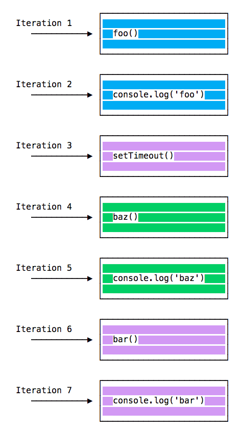

Node.js Learn<br>
自主學習Node.js的觀念和指令後做的統整&學習筆記
===

## 目錄
- [自主學習Node.js的觀念和指令後做的統整&學習筆記](#自主學習nodejs的觀念和指令後做的統整學習筆記)
  - [目錄](#目錄)
    - [安裝方式](#安裝方式)
      - [Windows 系統](#windows-系統)
      - [MacOS 系統](#macos-系統)
      - [Linux 系統 (以 Ubuntu 為例)](#linux-系統-以-ubuntu-為例)
    - [Node.js 核心觀念](#nodejs-核心觀念)
      - [Introduction to Node.js](#introduction-to-nodejs)
      - [A brief history of Node.js](#a-brief-history-of-nodejs)
      - [How to install Node.js?](#how-to-install-nodejs)
      - [How much JavaScript do you need to know to use Node.js?](#how-much-javascript-do-you-need-to-know-to-use-nodejs)
      - [Differences between Node.js and the Browser](#differences-between-nodejs-and-the-browser)
      - [The V8 JavaScript Engine](#the-v8-javascript-engine)
      - [Run Node.js scripts from the command line](#run-nodejs-scripts-from-the-command-line)
      - [How to exit from a Node.js program?](#how-to-exit-from-a-nodejs-program)
      - [How to read environment variables from Node.js?](#how-to-read-environment-variables-from-nodejs)
      - [How to use the Node.js REPL?](#how-to-use-the-nodejs-repl)
      - [Node.js, accept arguments from the command line](#nodejs-accept-arguments-from-the-command-line)
      - [Output to the command line using Node.js](#output-to-the-command-line-using-nodejs)
      - [Accept input from the command line in Node.js](#accept-input-from-the-command-line-in-nodejs)
      - [Expose functionality from a Node.js file using exports](#expose-functionality-from-a-nodejs-file-using-exports)
      - [An introduction to the npm package manager](#an-introduction-to-the-npm-package-manager)
      - [Where does npm install the packages?](#where-does-npm-install-the-packages)
      - [How to use or execute a package installed using npm?](#how-to-use-or-execute-a-package-installed-using-npm)
      - [The package.json guide](#the-packagejson-guide)
      - [The package-lock.json file](#the-package-lockjson-file)
      - [Find the installed version of an npm package](#find-the-installed-version-of-an-npm-package)
      - [Install an older version of an npm package](#install-an-older-version-of-an-npm-package)
      - [Update all the Node.js dependencies to their latest version](#update-all-the-nodejs-dependencies-to-their-latest-version)
      - [Semantic Versioning using npm](#semantic-versioning-using-npm)
      - [Uninstalling npm packages](#uninstalling-npm-packages)
      - [npm global or local packages](#npm-global-or-local-packages)
      - [npm dependencies and devDependencies](#npm-dependencies-and-devdependencies)
      - [The npx Node.js Package Runner](#the-npx-nodejs-package-runner)
      - [The Node.js Event Loop](#the-nodejs-event-loop)
      - [Understanding process.nextTick()](#understanding-processnexttick)
      - [Understanding setImmediate()](#understanding-setimmediate)
      - [Discover JavaScript Timers](#discover-javascript-timers)
      - [JavaScript Asynchronous Programming and Callbacks](#javascript-asynchronous-programming-and-callbacks)
      - [Understanding JavaScript Promises](#understanding-javascript-promises)
      - [Modern Asynchronous JavaScript with Async and Await](#modern-asynchronous-javascript-with-async-and-await)
      - [The Node.js Event emitter](#the-nodejs-event-emitter)
      - [Build an HTTP Server](#build-an-http-server)
      - [Making HTTP requests with Node.js](#making-http-requests-with-nodejs)
      - [Make an HTTP POST request using Node.js](#make-an-http-post-request-using-nodejs)
      - [Get HTTP request body data using Node.js](#get-http-request-body-data-using-nodejs)
      - [Working with file descriptors in Node.js](#working-with-file-descriptors-in-nodejs)
      - [Node.js file stats](#nodejs-file-stats)
      - [Node.js File Paths](#nodejs-file-paths)
      - [Reading files with Node.js](#reading-files-with-nodejs)
      - [Writing files with Node.js](#writing-files-with-nodejs)
    - [Node.js 核心模組](#nodejs-核心模組)
      - [HTTP](#http)
      - [Process](#process)
      - [Console](#console)
      - [Readline](#readline)
      - [CommonJS modules](#commonjs-modules)
      - [Timers](#timers)
      - [Events](#events)
    - [參考資料來源](#參考資料來源)
      - [官方文件](#官方文件)
      - [網路文章](#網路文章)
      - [網路影片](#網路影片)


---
### 安裝方式
- 官方網站會先分成LTS.Current兩個版本
  + `LTS`(Long-term support): Recommended for most users
  + `Current`: Latest features
- 安裝Node.js之後,也會自動安裝NPM
- 若想要安裝指定版本的Node.js,可以輸入以下指令
  + $ `brew install node@<specific version>`
    * 例: `brew install node@10`
  + 可參考[How to install specific NodeJS version](https://medium.com/@katopz/how-to-install-specific-nodejs-version-c6e1cec8aa11)
- 若想要安裝指定版本的NPM(Node Package Manager),可以輸入以下指令
  + 升級到Latest version: `npm install -g npm@latest`
  + 升級到Most recent release version: `npm install -g npm@next`
  + 可參考[Try the latest stable version of npm](https://docs.npmjs.com/try-the-latest-stable-version-of-npm)
- 如果想要在同一台電腦上面,切換Node的版本,可以安裝NVM(Node Version Manager)
  + **MacOS**
    * $ `brew install nvm`
  + **Linux**
    * $ `curl -o- https://raw.githubusercontent.com/nvm-sh/nvm/v0.37.2/install.sh | bash`
  + 接下來要到(~/.bash_profile, ~/.zshrc, ~/.profile, or ~/.bashrc)的其中一個檔案,新增以下3行指令**到該檔案的最下面**
    * `export NVM_DIR="$HOME/.nvm"`<br
      `[ -s "$NVM_DIR/nvm.sh" ] && \. "$NVM_DIR/nvm.sh"`  # This loads nvm<br>
      `[ -s "$NVM_DIR/bash_completion" ] && \. "$NVM_DIR/bash_completion"`  # This loads nvm bash_completion<br>
  + 檢查是否正常安裝NVM
    * $ `command -v nvm`: 如果有成功安裝NVM的話,應該要回傳`nvm`
  + 檢查安裝的NVM版本
    * $ `nvm --version` 
  + 可參考[Node Version Manager](https://github.com/nvm-sh/nvm#troubleshooting-on-macos)


#### Windows 系統
  + 連結: https://nodejs.org/en/download/
  + 安裝完成後,可以用CLI指令檢查 **Node** & **NPM**的版本
    * $ `node --version` 
    * $ `npm --version`
#### MacOS 系統
  + 連結: https://nodejs.org/en/download/package-manager/#macos
    * 指令: `brew install node`
  + 安裝完成後,可以用CLI指令檢查 **Node** & **NPM**的版本
    * $ `node --version` 
    * $ `npm --version`
#### Linux 系統 (以 Ubuntu 為例)
  + 連結: https://github.com/nodesource/distributions/blob/master/README.md
  + 指令: 
    * $ `sudo apt-get install -y nodejs`

---
### Node.js 核心觀念
#### Introduction to Node.js
`先備知識`
> `One process`: 一個全域的Object,可以在任何地方被執行,並保有執行時的資料<br>
> `One thread`: single-thread,在一個`process`中只能執行一件事<br>
> `One event loop`: 一個事件迴圈,因為它使Node可以是非同步(asynchronous) & 非阻塞I/O(non-blocking I/O); 因為Node是single-thread的,透過callback.Promise.async/await能將工作分散給system kernel<br>
> `One JS Engine Instance`: 一個Javascript實例,用來執行Javascript的程式碼<br>
> `One Node.js Instance`: 一個Node實例,用來執行Node的程式碼<br>

- Node是一個免費.開源.跨平台的Javascript執行環境,讓開發者可以在瀏覽器以外也能使用Javascript
  + 也因此讓廣大的前端開發者們,可以加入後端開發的行列,並且不用因此需要多學一門程式語言 
- Node是基於Chrome瀏覽器的V8引擎來建立出的執行環境,因此能有非常好的效能
- Node是由開源社群來共同維護,並且能使用最新的ECMAScript標準
  + 因此不必等待所有用戶更新他們的瀏覽器,就可以選擇要使用的Node版本來達到來決定要使用哪個ECMAScript版本
  + 可參考官方文件[ECMAScript 2015 (ES6) and beyond](https://nodejs.org/en/docs/es6/) 
- Node應用程式在單個進程(single process)中運行,無需為每個請求建立新線程(thread),能處理數千個併發連接(concurrent connections),也不會因此而增加管理線程(thread)上的負擔
  + 同時Node也在其標準函式庫中提供了一組非同步I/O原語(asynchronous I/O primitives)來防止Javascript的程式碼被阻塞住,因此在Node中使用非阻塞式語法(non-blocking paradigms)來開發是正常且普遍的
  + 當Node執行會有I/O的操作(e.g. 從網路上讀取資料.存取資料庫or檔案系統)時,Node會自動在response回傳時才恢復操作,而不是無效地阻擋住線程和浪費CPU週期等待時間
- 受惠於npm的簡單結構,其促使Node生態系可以蓬勃地發展,目前在npm上已經有超過1,000,000個開源軟體&工具可供使用
- Node.js算是一個低階的平台,然而在社群(community)上有數千個函式庫與好用的框架建構於Node.js之上
- 範例程式碼
  + ```javascript
      const http = require('http');

      const hostname = '127.0.0.1';
      const port = process.env.PORT;

      const server = http.createServer((req, res) => {
        res.statusCode = 200
        res.setHeader('Content-Type', 'text/plain')
        res.end('Hello World!\n')
      });

      server.listen(port, hostname, () => {
        console.log(`Server running at http://${hostname}:${port}/`)
      });
    ```
  + 以上程式碼會建立一個新的http server並回傳,同時這個server也會監聽指定的port & host name
  + 當server準備就緒時,將執行callback function,在這時也會通知我們server正在運行中
  + 每當收到一個新的request時,都會呼叫該request event,並提供兩個物件(objects)
    * 請求物件(request): `http.IncomingMessage`
      * 它會提供request details 
    * 回應物件(response): `http.ServerResponse`
      * 它會用來將data回傳給呼叫request event的那方
  + 在這種狀況下, 我們會將狀態碼設定為200,以表示該request成功<br>
    => `res.statusCode = 200`
  + 並設定Content-Type標頭<br>
    => `res.setHeader('Content-Type', 'text/plain')`
  + 最後,會關閉response,並將內容作為參數添加到res.end()中<br>
    => `res.end('Hello World\n')`

#### A brief history of Node.js
- Node.js最初是由Ryan Lienhart Dahl,於2010/05月初次發表,相比於Javascript(1995/12月)與網際網路的誕生(1989年)來說,在技術領域中,並不算是很長的時間,但目前看來Node會持續存在下去
  + <br>
  + <br>
- 受惠於[瀏覽器的效能競爭戰](https://zh.wikipedia.org/wiki/%E6%B5%8F%E8%A7%88%E5%99%A8%E5%A4%A7%E6%88%98#Google_Chrome%E7%9A%84%E5%B4%9B%E8%B5%B7%E8%88%87Internet_Explorer%E7%9A%84%E8%A1%B0%E8%90%BD)(2003~2008年)後的結果,各家瀏覽器供應商爭相為用戶提供最佳性能,Javscript engine的運行效能也越來越好,而Node使用的Chrome瀏覽器的Javascript engine---V8,在性能上也有卓越的提升
- 另一個使Node快速崛起的關鍵因素是[Web2.0](https://zh.wikipedia.org/wiki/Web_2.0)的誕生,例如Flickr.Gmail等,讓Javascript開始被視為一個更為重要的程式語言
- Node恰巧是在正確的時間和正確的時間構建的,它為JavaScript服務器端開發引入了許多創新思維和方法,這些方法和方法已經為許多開發人員提供了幫助,這就是為什麼它開始流行的原因
- Node.js 簡史(Change log)
  + 西元2009年
    * [Node.js](https://nodejs.org/en/)誕生
    * 最初版[npm](https://www.npmjs.com/)問世
  + 西元2010年
    * [Express.js](https://expressjs.com/)框架 誕生
    * [socket.io](https://socket.io/) 誕生
  + 西元2011年
    * npm 發布1.0版本
    * 許多大型公司開始採用Node.js,例:LinkedIn.Uber等
  + 西元2012年
    * 越來越多人開始採用Node.js
  + 西元2013年
    * 第一個使用Node.js的大型部落格平台: [Ghost](https://ghost.org/)
    * [koa](https://koajs.com/)框架 誕生
  + 西元2014年
    * 重大事件: [io.js](https://socket.io/)誕生,是Node.js的主要Fork出來的專案,目的是為了加入Javascript的ES6語法支援並提升了效能 
  + 西元2015年
    * [Node.js基金會](https://openjsf.org/)誕生 (目前隸屬於OpenJS Foundation旗下的其中一個專案)
    * io.js合併回Node.js專案中
    * npm開始推出私有模組(private modules)
    * Node.js 4發布(直接跳過Node.js 1,2,3)
      * 可參考[Node_changelog](https://github.com/nodejs/node/blob/master/CHANGELOG.md)
  + 西元2016年
    * kik模組的left-pad事件爆發,引起開源社群的一陣騷動
    * [Yarn](https://classic.yarnpkg.com/en/)套件管理包工具 誕生
    * Node.js 6發布
  + 西元2017年
    * npm開始更加注重安全性
    * Node.js 8發布
    * [HTTP/2 核心模組](https://nodejs.org/api/http2.html) 發布
    * V8將Node加入它的測試套件中,使Node成為繼Chrome之後的Javascript engine正式目標
    * 達成30億次/週的下載流量紀錄
  + 西元2018年
    * Node.js 10發布
    * [ES modules.mjs](https://nodejs.org/api/esm.html)開始加入實驗性支援(experimental support)
    * Node.js 11發布
  + 西元2019年
    * Node.js 12發布  
    * Node.js 13發布
  + 西元2020年
    * Node.js 14發布
    * Node.js 15發布

#### How to install Node.js?
- Node有很多種安裝方式,最常見的方式是透過套件管理包(package manager)下載,在這種情況下,每個作業系統有自己的安裝方式
  + 可參考[安裝方式](#安裝方式)的章節
- NVM(Node Version Manager)是一種執行Node.js的流行方法
  + nvm讓我們可以輕鬆切換Node版本
  + 假如碰到錯誤時,可以安裝新版本以嘗試輕鬆地回滾(rollback)
  + nvm也是個有效的工具讓我們可以輕鬆地使用Node的舊版本來測試我們的程式碼
  + 可參考[Node Version Manager(nvm)](https://github.com/nvm-sh/nvm)
- 如果使用macOS,推薦使用[Homebrew](https://brew.sh/)來安裝Node
- 當安裝完Node之後,就可以使用`$ node xxx.js`在CLI中執行Node程式

#### How much JavaScript do you need to know to use Node.js?
- 身為一個初學者,我們常常難以判斷要到什麼樣的程度才是對程式設計的能力足夠有自信的
- 當我們剛開始學習Javascript,我們可能會對Javascript的結束位置,以及Node的起始位置與結束位置感到很困惑
- 建議先理解Javascript的主要觀念後,在開始投入於Node的研究中
- 以下是Javascript目前的主要觀念
  + 詞彙結構(Lexcial Structure)
  + 運算式(Expressions)
  + 型別(Types)
  + 變數(Variables)
  + 函式(Functions)
  + `this` 關鍵字
  + 箭頭函式(Arrow Functions)
  + 迴圈(Loops)
  + 範圍(Scopes)
  + 陣列(Arrays)
  + 模板文字(Template Literals)
  + 分號(Semicolons)
  + 嚴謹模式(Strict Mode)
  + ECMAScript 6,7,8 (手稿語言規範)
- 如果能將以上的Javascript主要觀念都掌握到的話,無論是在瀏覽器還是在Node中,您都將成為一名熟練的JavaScript開發人員
- 以下是理解**非同步程式設計**的(asynchronous programming),這也是Node.js的基本觀念之一
  + [非同步程式設計](https://developer.mozilla.org/en-US/docs/Learn/JavaScript/Asynchronous)與[回呼](https://developer.mozilla.org/zh-TW/docs/Glossary/Callback_function) (Asynchronous programming and callbacks)
  + [計時器](https://developer.mozilla.org/en-US/docs/Learn/JavaScript/Asynchronous/Timeouts_and_intervals) (Timers)
  + [Promise物件](https://developer.mozilla.org/zh-TW/docs/Web/JavaScript/Reference/Global_Objects/Promise) (ES6以後開始加入的語法)
  + [Async & Await](https://developer.mozilla.org/zh-TW/docs/Learn/JavaScript/Asynchronous/Async_await)
  + [閉包](https://developer.mozilla.org/zh-TW/docs/Web/JavaScript/Closures)(Closures)
  + [事件迴圈](https://developer.mozilla.org/zh-TW/docs/Web/JavaScript/EventLoop) (The Event Loop)

#### Differences between Node.js and the Browser
- 瀏覽器與Node.js都是使用Javascript程式語言來開發的
- 建構出一個運行在瀏覽器的應用程式與建構出一個運行在Node的應用程式完全不同; 儘管都是使用Javascript程式語言來開發,卻仍存在一些關鍵差異,使體驗完全不同
- Node改變的是整個生態系統(ecosystem),因為它讓我們可以使用一種程式語言-Javascript,就可以完成我們所有的網頁開發工作(包含前端 & 後端),這是一個獨特的優勢地位
- 在瀏覽器中,我們花費大多數的時間在與[DOM](https://developer.mozilla.org/zh-TW/docs/Glossary/DOM)或是其他網頁平台的APIs(例: Cookies)。 當然,這些東西並不存在於Node之中。Node也不會有[Document物件](https://developer.mozilla.org/zh-TW/docs/Web/API/document)與[Window物件](https://developer.mozilla.org/zh-TW/docs/Web/API/Window)以及其他所有透過瀏覽器提供的物件們
- 在瀏覽器中,我們沒有那些Node透過其內建模組所提供的實用APIs(例: [文件系統訪問功能](https://nodejs.org/api/fs.html) (filesystem access functionality))
- 另一個比較大的差異是在Node中,我們控制的是**環境**,除非您構建一個任何人都可以在任何地方部署的開源應用程式,否則我們通常會知道應該在哪個版本的Node上運行該應用程式; 但是在瀏覽器的環境中,我們無法選擇使用者會使用的瀏覽器,這點非常不方便
  + 這也意味著我們可以使用該Node版本可支援的所有ECMAScript 6-7-8-9的現代化Javascript語法
- 由於Javascript的變化如此之快,但是瀏覽器與使用者所使用的瀏覽器並沒有這麼迅速的升級,因此我們不得不使用較舊的JavaScript/ECMAScript版本
  + 這時我們可以使用[Babel](https://babeljs.io/)來將程式碼轉換成可與ES5可相容的語法,然後再交給瀏覽器
  + 然而在Node中,我們並不需要這樣做
- 還有一個重大的差異是在Node中,我們使用的是CommonJS模組系統; 但是在瀏覽器中,我們會依照ECMAScript的模組標準來實作Javascipt語法
  + 實際上,這代表我們會分別使用
    * require() => 在Node.js中
    * import => 在瀏覽器中

#### The V8 JavaScript Engine
- [V8](https://v8.dev/)是用來支持Google Chrome瀏覽器的Javascript engine。當我們使用Chrome瀏覽器時,它需要我們的Javascript程式碼並執行它們 
- V8負責提供Javascript執行時所需要的執行環境(runtime)。`DOM`和其他的Web APIs則由瀏覽器負責提供
- Javascript engine是能獨立運作的,並不一定需要跟隨著託管(hosted)它的瀏覽器,這也促使Node的興起
- 西元2009年時,V8被選為用來作為Node.js的Javascript engine,並且隨者Node的爆炸性成長,V8成為了現在為大量使用Javascript編寫伺服器端程式碼(server-side code)的engine
- Node生態系非常龐大,受惠於此,V8也支援桌面應用程式(例: [Electron](https://www.electronjs.org/))
- 其他瀏覽器使用的Javascript engine
  + Firefox: [SpiderMonkey](https://developer.mozilla.org/en-US/docs/Mozilla/Projects/SpiderMonkey)
  + Safari: [JavaScriptCore(也被稱為Nitro)](https://developer.apple.com/documentation/javascriptcore)
  + Microsoft Edge: 最初是基於[ChakraCore](https://github.com/Microsoft/ChakraCore)開發的,後來轉由基於[Chromium](https://www.chromium.org/) & V8 engine來重構
    * 可參考[Download the new Microsoft Edge based on Chromium](https://support.microsoft.com/en-us/microsoft-edge/download-the-new-microsoft-edge-based-on-chromium-0f4a3dd7-55df-60f5-739f-00010dba52cf)  
- V8引擎是由C++程式語言所編寫。它是可攜帶式的(portable),可提供跨平台支援(on macOS &Windows & Linux ...等等)
  + V8也與其他的Javascript engine一樣,V8也在持續改進中,也加速了Web和Node生態系的快速發展; 多年來,在網路上有很多關於性能調校的競賽,身為開發者和使用者的我們也受惠於此,讓我們能擁有更快.效能更好的機器(machines)可以使用
- Javascript通常被認為是一種直譯式語言(interpreted language),但是在現代化的Javascript engine中,已不再只是直譯Javascript,它們也編譯Javascript
  + 從西元2009年開始,當SpiderMonkey JavaScript compiler被加入到Firefox瀏覽器 v3.5之中以後,每個人都開始追隨這種做法
  + Javascript會被V8 engine進行內部即時編譯(just-in-time compilation, JIT)以加快執行速度; 這可能是一種違反直覺的方式,但是從2004年引入Google Maps以來,Javascript已經從一種通常用來執行幾十行程式碼的小型應用程式的程式語言,逐漸發展成可以在瀏覽器中執行成千上萬行的大型.完整的應用程式的程式語言
  + 演變至今,我們的應用程式已經可以在瀏覽器持續執行數小時,而這也不僅限於單純的表單驗證規則(a few form validation rules)或是簡單的程式碼(simple scripts)
  + 在現代的新世界中,"編譯"Javascript是非常有意義的,因為雖然編寫Javascript仍然需要花費很多時間,但是一旦開發完成後,它將比起純直譯程式碼來的擁有更好的效能

#### Run Node.js scripts from the command line
- 當我們安裝好Node.js後,通常我們會用可在全域執行的`node`指令,接著傳遞要執行的檔名作為參數到CLI上
  + 假設我們的主要Node應用程式的檔名叫做`app.js` 
  + 例: $ `node app.js`
  + 提醒: 要在包含`app.js`的檔案路徑下執行該指令才行

#### How to exit from a Node.js program?
- 有多種方法可以終止Node應用程式
  + CLI: $ `ctrl-C`
  + 程式碼: `process.exit()`
  + 程式碼: `process.on('SIGTERM', callback function)`
- Node的核心模組-[Process](https://nodejs.org/api/process.html)提供了一個簡便的方法,讓我們可以從一個Node應用程式退出,可執行以下的command
  + $ `process.exit()`
  + 當Node執行到這邊時,該進程(process)就會被立即強致終止。這代表任何處於`pending狀態`的`callback function`與任何網路請求(network request)仍然會被傳送出去; 然而任何訪問文件系統(`filesystem`)或是進程(`process`),例如: [process.stdout()](https://nodejs.org/api/process.html#process_process_stdout) 或是 [process.stderr](https://nodejs.org/api/process.html#process_process_stderr)都將立刻被不正常地終止(ungracefully terminated right away.)
  + 如果這樣是我們想要的結果,那我們可以傳遞一個整數,以此作為像作業系統發出的退出碼(exit code)
    * 例: $ `process.exit(1)`
    * 補充: 退出碼(exit code)
      * 預設值: 0 (代表成功) 
      * 當`exit code` <= 0 時,表示指令執行成功
      * 當`exit code` > 0 時,表示指令執行失敗
    * 不同的退出碼具有不同的意義,我們可以利用這些退出碼來讓我們系統中的"程式與程式"之間能互相溝通
    * 可參考[Node核心模組-Process的 Exit codes 章節](https://nodejs.org/api/process.html#process_exit_codes)
  + 我們也可以設定process.exitCode屬性來指定當Node應用程式退出時,要回傳什麼退出碼
    * 使用process.exitCode的情境,需滿足以下條件
      * 當使用process.exit([code]) -> 且未指定退出碼時
      * 進程(process)正常地終止(exits gracefully)時
    * 例: $ `process.exitCode = 1`
    * 當Node應用程式終止時,將會return該退出碼,在完成處理所有進程(process)後,Node應用程式將會正常地退出
    * 可以利用`process.exit([code])`來推翻掉(override)先前的`process.exitCode`的設定值
  + 另一種常見的情況是當我們啟動一個伺服器,例如: HTTP server
    * ```javascript
        const express = require('express')
        const app = express()

        app.get('/', (req, res) => {
          res.send('Hi!')
        })

        app.listen(3000, () => console.log('Server ready'))
      ```
    * 以上的程式永遠不會終止! 如果我們呼叫`process.exit()`,這時正在處理的pending與running request都將被終止,而這不是一個好的做法
    * 這時候比較好的解決方法是對該command發出`SIGTERM`信號(signal),並使用process模組的signal handler來進行處理
      * 可參考[Signal events](https://nodejs.org/api/process.html#process_signal_events)
    * ```javascript
        const express = require('express')
        const app = express()
        app.get('/', (req, res) => {
          res.send('Hi!')
        })

        const server = app.listen(3000, () => console.log('Server ready'))

        process.on('SIGTERM', () => {
          server.close(() => {
            console.log('Process terminated')
          })
        })
      ``` 
    > Q: 什麼是信號(signals)?<br>
      A: 信號是[POSIX](https://zh.wikipedia.org/wiki/%E5%8F%AF%E7%A7%BB%E6%A4%8D%E6%93%8D%E4%BD%9C%E7%B3%BB%E7%BB%9F%E6%8E%A5%E5%8F%A3)的相互通訊系統: 當通知(notification)被發送到一個進程(process),以便將發生的事件(event)通知給進程(process)
    * `SIGKILL`是告訴進程(process)立即中止的信號
    * `SIGTERM`是告訴進程(process)正常終止的信號。這是從例如[upstart](http://upstart.ubuntu.com/) & [supervisored](http://supervisord.org/)等其他流程管理工具發出的信號
    * 我們也可以在應用程式中的另一個函式中,發出這個信號
      * $ `process.kill(process.pid, 'SIGTERM')`
      * 也可以從其他執行中的Node應用程式or其他在我們的作業系統中正在執行的應用程式,來得知我們想要終止的應用程式的ID(process ID, pid)

#### How to read environment variables from Node.js?
- `process`核心模組提供了`env`屬性,`process.env`屬性會託管當啟動Node進程(process)的時候的所有Node環境變數
- 以下是一個預設在`development`環境下,存取`NODE_ENV`這個環境變數的範例
  + 提醒: 因為它是Node的核心模組,所以`process`模組不需要事先匯入(`require()`),可以直接開始使用
  + ```javascript
      process.env.NODE_ENV // "development"
    ```
- 當在腳本(script)執行之前,可以先將該屬性設定為`production`,來告訴Node這是一個`production`的生產環境
  + ```javascript
      process.env.NODE_ENV // "production"
    ```
- 當然我們也可以利用上述的方式再設定我們需要的自定義環境變數

#### How to use the Node.js REPL?
- 我們可以利用$ `node`指令來執行我們寫好的Node腳本(script)
  + 例: $ `node script.js`
- 如果我們省略要執行的腳本名稱這個參數的話,就會進入`REPL模式`
  > 補充: `REPL`又被稱為Read Evaluate Print Loop(讀取-求值-輸出循環的互動式介面, REPL),是一種程式語言的環境(主要是在CLI console畫面中)。他會使用單個表達式作為使用者輸入,並在執行後將結果回傳到CLI console畫面上<br>
  > 補充: `REPL模式`因為是互動式介面,所以支援可利用`Tab`鍵做自動補全(autocomplete)的功能,它會嘗試自動完成所寫的內容,以匹配已定義的變量或預定義的變量
  + node `REPL模式`範例情境
    * ```console
        ❯ node
        >
      ```
    * 該指令會停留在閒置模式(idle mode),並等待我們輸入些什麼東西。更精確地說是`REPL模式`正在等待我們輸入一些Javascript的程式碼
  + 我們從簡單的範例開始看看
    * ```console
        > console.log('test')
        test
        undefined
        >
      ```
    * 第一個值`test`是要告訴CLI console要打印(print)出什麼值,接著我們收到`undefined`,它是執行中(running)的`console.log()`
    * 接著我們可以開始輸入一行新的Javascript的程式碼
- 探索Javascript物件(Objects)
  + 我們可以試著輸入Javascript的類別(Class),像是`Number`,並在後面加上一個`.` ,再接著按下`Tab`按鈕來自動補全
  + 
- 探索Javascript的全域物件(global)
  + 我們可以試著輸入Javascript的類別(Class),像是`global`,並在後面加上一個`.` ,再接著按下`Tab`按鈕來自動補全
  + .png)
- 探索特殊變數(`_`)
  + 如果在某些程式碼後面輸入`_`,則將回傳上一個操作的結果
- 探索點命令(Dot commands)
  + REPL模式有一些特別的指令,這些指令都是由`.`為開頭的
  + 舉例來說
    * `.help`: 顯示所有的點命令(dot commands)的幫助(help)
    * `.editor`: 啟用編輯模式,可以輕鬆地開始寫多行Javascript程式碼。一旦進入這個模式,我們將要使用`ctrl-D`的組合鍵來執行我們寫的Javascript多行程式碼
    * `.break`: 當輸入多行表達式(multi-line expression)時,輸入`.break`指令將終止進一步的輸入(abort further input)。與`ctrl-C`組合鍵的功能是一樣的
    * `.clear`: 將`REPL`模式的內文重新設定(reset)為一個空物件,並清除當前正在輸入的任何多行表達式
    * `.load`: 讀取當前工作目錄路徑下的Javascript檔案
    * `.save`: 將我們在`REPL連線`(session)中的所有對指定檔案的輸入儲存起來
    * `.exit`: 退出`REPL模式`。與連續按下`ctrl-C`組合鍵**兩次**的功能是一樣的
  + 其實`REPL模式`會知道什麼時候要輸入多行表達式,而不需要呼叫`.editor`
    * 以下是範例程式碼 
      * ```javascript
          [1, 2, 3].forEach(num => {
        ```
    * 這時候當我們按下`enter`鍵時,`REPL模式`會到新的下一行,並以`...`作為開頭,表示我們現在可以繼續在該區塊(block)工作
      * 情境說明
      * ```javacript
          ... console.log(num)
          ... })
        ``` 
    * 如果我們這時候在一行的句尾加上`.break`時,該多行表達式的模式將會停止並不會被執行

#### Node.js, accept arguments from the command line
- 我們可以將不限制數量的參數(arguments)傳遞給Node應用程式,參數的形式可以使用以下2種形式
  + 獨立的參數值(standalone)
    * $ `node app.js joe`
  + 鍵->值形式的參數值(key and value)
    * $ `node app.js name=joe`
- 這也將改變我們在Node應用程式的程式碼中,如何得到此值的方式,我們可以透過Node內建的核心模組`process`來得到此值,該模組的[process.argv](https://nodejs.org/dist/latest-v15.x/docs/api/process.html#process_process_argv)屬性會公開(exposes)出一個陣列(array),其中包含當啟動Node應用程式的進程的時候,整個命令列(command-line)要傳遞的所有參數
  + 第1個元素是node指令的完整路徑(= [process.execPath](https://nodejs.org/api/process.html#process_process_execpath))
  + 第2個元素會是正在被執行的Javascript檔案的路徑位置
  + 剩下的元素就是任何其他的命令列參數(command-line arguments)
- 範例程式碼
  + 以下的範例程式碼會利用一個迴圈來遍歷(iterate over)所有的參數們(也包括node指令的完整路徑與正在被執行的Javascript檔案的路徑位置)
  + ```javascript
      process.argv.forEach((val, index) => {
        console.log(`${index}: ${val}`)
      })
      ```
- 我們可以透過建立一個新的陣列並切片(`array.slice()`方法)來獲得額外的參數(不包含前兩個參數)
  + ```javascript
      const args = process.argv.slice(2)
    ```
- 如果我們的參數沒有索引名稱的話(without index name)
  + 例: $ `node app.js joe`
    * ```javascript
        const args = process.argv.slice(2)
        console.log(args[0])
      ```
    * 我們可以透過以上的範例程式碼來存取命令列參數(command-line arguments)
- 另一種情況是,我們會以鍵值(key-value)形式來傳遞命令列參數
  + 例: $ `node app.js name=joe`
  + ```javascript
      const args = require('minimist')(process.argv.slice(2))
      args['name'] //joe
      ```
    * 以上述範例程式碼為例,`args[0]`是`name=joe`,這種情況我們就會需要來解析(parse)它,最佳的做法是,我們可以利用npm上面的[minimist](https://www.npmjs.com/package/minimist)套件來處理這些**鍵值形式的參數**
  + 這次我們就要在每個參數的鍵(key)之前使用雙破折號(double dashes)
    * 例: $ `node app.js --name=joe`

#### Output to the command line using Node.js
> npm的[chalk](https://github.com/chalk/chalk)套件---可設定終端機輸出文字的樣式與顏色<br>
> npm的[progress](https://www.npmjs.com/package/progress)套件---可以在`CLI console`畫面上創造進度條的套件<br>

- 利用[console](https://nodejs.org/api/console.html#console_console)核心模組的基本輸出(basic output)
  + Node有一個`console`核心模組,該模組提供了許多與`CLI`有用的互動方法
  + 它基本上跟我們在瀏覽器上看到的`console`物件是一樣的
  + 最基本與最有用的方法是[console.log([data][, ...args])](https://nodejs.org/api/console.html#console_console_log_data_args),這個方法會打印出(print)我們傳遞給console的字串
    * 如果我們傳遞物件,該方法會自動幫我們轉換成字串
    * 我們也可以傳遞多個變數給`console.log()`
    * 範例程式碼
    * ```javascript
        const x = 'x'
        const y = 'y'
        console.log(x, y)
      ```
      * 以上的程式碼,Node會將兩個變數都打印出來(print)
    * 我們也可以傳遞變數給模板字串
    * 範例程式碼
    * ```javascript
        console.log('My %s has %d years', 'cat', 2)
      ```
      * `%s`: 將變數格式化為字串
      * `%d`: 將變數格式化為數字
      * `%i`: 將變數格式化為其整數部分
      * `%o`: 將變數格式化為物件
    * 範例程式碼
    * ```javascript
        console.log('%o', Number)
      ```
- 清除後台(console)-[console.clear()](https://nodejs.org/api/console.html#console_console_clear)
  + 範例程式碼
  + ```javascript
      console.clear()
      ```
    * 該方法會將後台清空(註: 該方法的行為也會取決於我們是使用哪種後台)
- 計算元素數量-[console.count([label])](https://nodejs.org/api/console.html#console_console_count_label)
  + `console.count()`是一個方便的方法
  + 範例程式碼
  + ```javascript
      const x = 1
      const y = 2
      const z = 3
      console.count(
        'The value of x is ' + x + 
        ' and has been checked .. how many times?'
      )
      console.count(
        'The value of x is ' + x + 
        ' and has been checked .. how many times?'
      )
      console.count(
        'The value of y is ' + y + 
        ' and has been checked .. how many times?'
      )
      ```
    * 以上的程式碼會計算該字串被打印出(print)幾次了,並將其次打印在旁邊
  + 範例程式碼
    * 我們也可以只計算蘋果和橘子的數量
    * ```javascript
        const oranges = ['orange', 'orange']
        const apples = ['just one apple']
        oranges.forEach(fruit => {
          console.count(fruit)
        })
        apples.forEach(fruit => {
          console.count(fruit)
        })
      ```
- 打印出堆棧追蹤(print stack trace)-[console.trace([message][, ...args])](https://nodejs.org/dist/latest-v15.x/docs/api/console.html#console_console_trace_message_args)
  + 在某些情況下,打印出函數的堆棧調用情況是很有用的,這也許就能回答我們的一個問題---我們該如何到達程式碼的其中一個部分?
  + 我們可以利用`console.trace()`方法來完成
  + 範例程式碼
    * ```javascript
        const function2 = () => console.trace()
        const function1 = () => function2()
        function1()
      ```
      * 以上的範例程式碼會打印出堆棧追蹤(stack trace)
      * 如果我們在Node的`REPL模式`中嘗試以上的範例程式碼,會得到以下的回傳資訊
      * ```javascript
          Trace
            at function2 (repl:1:33)
            at function1 (repl:1:25)
            at repl:1:1
            at ContextifyScript.Script.runInThisContext (vm.js:44:33)
            at REPLServer.defaultEval (repl.js:239:29)
            at bound (domain.js:301:14)
            at REPLServer.runBound [as eval] (domain.js:314:12)
            at REPLServer.onLine (repl.js:440:10)
            at emitOne (events.js:120:20)
            at REPLServer.emit (events.js:210:7)
        ```
- 計算執行Node程式碼所花費的時間-[console.time([label])](https://nodejs.org/dist/latest-v15.x/docs/api/console.html#console_console_time_label) & [console.timeEnd([label])](https://nodejs.org/dist/latest-v15.x/docs/api/console.html#console_console_timeend_label)
  + 我們可以使用`console.time()` & `console.timeEnd()`
  + 範例程式碼
  + ```javascript
      const doSomething = () => console.log('test')
      const measureDoingSomething = () => {
        console.time('doSomething()')
        //do something, and measure the time it takes
        doSomething()
        console.timeEnd('doSomething()')
      }
      measureDoingSomething()
    ```
- 標準輸出 & 標準錯誤-[console.log([data][, ...args])](https://nodejs.org/dist/latest-v15.x/docs/api/console.html#console_console_log_data_args) & [console.error([data][, ...args])](https://nodejs.org/dist/latest-v15.x/docs/api/console.html#console_console_error_data_args)
  + 如我們所見,`console.log()`非常適合在後台(Console)打印出訊息,這也就是所謂的標準輸出(standard output, `stdout`)
  + 反之,`console.error()`則會將訊息打印到標準錯誤(standard error, `stderr`)流(stream)上面
    + `stderr`流不會出現在後台(Console)上,但是它會出現在錯誤日誌上(error log)
- 為文字輸出上色-[跳脫序列(escape sequences)](https://gist.github.com/iamnewton/8754917) & npm的[chalk](https://github.com/chalk/chalk) package
  + 我們可以利用跳脫序列(escape sequence)將文字輸出上色
  + 跳脫序列是一組字符代表一種顏色
  + 範例程式碼
    * ```javascript
        console.log('\x1b[33m%s\x1b[0m', 'hi!')
      ```
    * 在`CLI`上進入Node的`REPL模式`中,執行以上的程式碼會看到`hi`變成黃色的字體
    * 
    * 然而這樣做其實是一種低階(low-level)方法,最簡單的做法是利用套件(library)來將文字輸出上色
  + 我們可以利用npm上面的`chalk`套件,該套件不僅可以為文字輸出上色,也可以將文字輸出的字體變成**粗體**or*斜體*or帶有下劃線
    * 我們可以透過`CLI`指令來安裝`chalk`這個套件,安裝完後就可以立即使用它
      * $ `npm install chalk`
    * 範例程式碼
    * ```javascript
        const chalk = require('chalk')
        console.log(chalk.yellow('hi!'))
      ```
      * 從上面的範例程式碼可以看出我們可以使用`chalk.yellow()`這個方法會比起跳脫序列(escape sequences)來得更好記與更好閱讀
    * 更多相關功能可以參考[chalk]((https://github.com/chalk/chalk))
- 建立進度條-npm的[progress](https://www.npmjs.com/package/progress) package
  + `progress`是一個非常棒的套件在CLI console畫面上創造**進度條**的套件
  + 可以先利用npm來安裝`progress`這個套件
    * $ `npm install progress`
  + 範例程式碼
  + ```javascript
      const ProgressBar = require('progress')

      const bar = new ProgressBar(':bar', { total: 10 })
      const timer = setInterval(() => {
        bar.tick()
        if (bar.complete) {
          clearInterval(timer)
        }
      }, 100)
      ```
    * 以上的範例程式碼會建立一個含有10個步驟(steps)的進度條(progress bar),每100毫秒就會執行一次
    * 當進度條完成時,就會清除這個間隔(clear the interval)

#### Accept input from the command line in Node.js
> npm的[readline-sync](https://www.npmjs.com/package/readline-sync)套件---提供一個能透過console(TTY)與使用者進行對話的互動式執行地同步讀取行(synchronous readline for interactively running)<br>
> npm的[inquirer](https://www.npmjs.com/package/inquirer)---收集了常見的`CLI`指令<br>

- 如何讓Node應用程式的`CLI console`成為互動性(interactive)的控制台
- 自從Node`v7.0.0`版本之後,Node提供了`readline`這個內建核心模組來確切地執行以下這件事情
  + 從一個可讀取的流(readable stream),例如: `process.stdin`流(stream)獲得輸入(get input)
  + 補充: `process.stdin`是在執行Node.js應用程式期間時,終端機輸入的流,一次僅一行
  + 範例程式碼
  + ```javascript
      const readline = require('readline').createInterface({
        input: process.stdin,
        output: process.stdout
      })

      readline.question(`What's your name?`, name => {
        console.log(`Hi ${name}!`)
        readline.close()
      })
      ```
    * 以上片段(piece)的程式碼會詢問使用者名稱,一旦使用者輸入文字並按下`enter`鍵後,我們就會發送一個問候(greeting)
    * 說明: [readline.question()](https://nodejs.org/api/readline.html#readline_rl_question_query_callback)方法顯示第一個參數(例: 一個問句),並等待使用者輸入。一旦使用者輸入文字並按下`enter`鍵後,就會呼叫該方法的第二個參數---回呼函式(callback function)
    * 在上述的範例程式碼中,我們的回呼函式會關閉讀取行介面(readline interface)---([readline.close()](https://nodejs.org/api/readline.html#readline_rl_close))
  + `readline`模組提供了許多其他的方法,接下來將會在套件的名稱上設定超連結來讓我們可以去查看該套件的文件
  + 如果我們要求輸入密碼,我們會希望最好不要以明碼顯示回傳的密碼,而是使用`*`符號來替換顯示使用者輸入的密碼
    * 這時最簡單的方式是使用就API而言非常類似的,npm上的[readline-sync](https://www.npmjs.com/package/readline-sync)套件,並立即對其進行處理
  + npm的[inquirer](https://www.npmjs.com/package/inquirer)套件提供了一個更完整且更抽象的解決方案
    * 我們需要先透過npm安裝`inquirer`套件
      * $ `npm install inquirer`
  + 情境說明
  + ```javascript
      const inquirer = require('inquirer')

      var questions = [
        {
          type: 'input',
          name: 'name',
          message: "What's your name?"
        }
      ]

      inquirer.prompt(questions).then(answers => {
        console.log(`Hi ${answers['name']}!`)
      })
      ```
    * `inquirer`這個套件讓我們可以做許多事情像是詢問選擇題(multiple choices),提供單選按鈕(radio button),確認(confirmation),...等等
    * 值得一提的是所有的替代方案(alternatives),尤其是那些Node提供的內建替代方案還不錯。但如果我們想要將`CLI`互動式輸入提供到另一個更高的水平上時,`inquirer.js`是一個最理想(optimal)的選擇

#### Expose functionality from a Node.js file using exports
- Node擁有內建的模組系統,並能透過匯入(import)來使用由其它Node.js的檔案公開(exposed)出來的功能
- 假如我們想要匯入某些我們想使用的東西
  + 範例程式碼
  + ```javascript
      const library = require('./library')
      ```
    * 可以利用以上的程式碼來匯入存在於(resides)當前檔案目錄下的`library.js`所公開(exposed)出來的功能
    * 在`library.js`檔案的程式碼中的最下面,需要事先公開(exposed)=> (使用`module.exports`物件的API)出來該檔案的功能,才能在其他需要使用時,直接匯入`library.js`就可以使用
      * 因為在預設情況下,所有在`library.js`中定義的物件or變數都是私有的(private)並且沒有對外(to outer world)公開(exposed)
      * 而這也就是[CommonJS modules](https://nodejs.org/api/modules.html#modules_modules_commonjs_modules)模組提供的[module.exports](https://nodejs.org/api/modules.html#modules_module_exports) API,所允許我們這麼做的
- 當我們指派(assign)一個物件或是一個函式成為`exports`的新屬性時,而這就是我們要公開(exposed)的東西,因此我們就可以在我們的Node應用程式中的其它部分中或甚至是在其它的Node應用程式中也可以使用
  + 我們可以透過以下2種方式來操作
  + 方法一: 指派(assign)一個物件給`module.exports`,也就是指派給由Node的`CommonJS modules`核心模組所提供的物件,如此就能將我們的檔案僅對外匯出(export)那個物件
    * 範例程式碼
    * ```javascript
        const car = {
          brand: 'Ford',
          model: 'Fiesta'
        }

        module.exports = car

        //..in the other file

        const car = require('./car')
      ```
  + 方法二: 將想要匯出(exported)物件新增(add)為[exports](https://nodejs.org/api/modules.html#modules_exports)的屬性(property),這個方法讓我們能夠匯出多個物件(objects),函式(functions),資料(data)
    * 範例程式碼
    * ```javascript
        const car = {
          brand: 'Ford',
          model: 'Fiesta'
        }

        exports.car = car
      ```
    * 或是也可以直接這樣匯出(export)
    * 範例程式碼
    * ```javascript
        exports.car = {
          brand: 'Ford',
          model: 'Fiesta'
        }
      ```
    * 接著,我們在另一個檔案中就可以匯入(import)並引用(referencing)這個屬性
    * 我們可以透過以下2種方式來引用它
      * 方法一:
      * ```javascript
          const items = require('./items')
          items.car
          ```
      * 方法二:
      * ```javascript
          const car = require('./items').car
        ```
- [module.exports](https://nodejs.org/api/modules.html#modules_module_exports)與[exports](https://nodejs.org/api/modules.html#modules_exports)之間有什麼區別呢?
  + `module.exports`會公開(exposes)它指向(points to)的對象(object)
  + `exports`會公開(exposes)它所指向(points to)的對象(object)的屬性(properties)

#### An introduction to the npm package manager
> [npm install](https://docs.npmjs.com/cli/v7/commands/npm-install) - Install a package<br>

- `npm`介紹
  + [npm](https://www.npmjs.com/)是Node標準的套件管理工具(standard package manager)
  + 在2017年1月,根據報告顯示`npm registry`列表上已有超過350,000個套件(packages),也使其成為地球上單一語言程式碼儲存庫,並且我們可以確定在`npm`上有幾乎所有的東西
  + `npm`起初是用來下載和管理Node套件(package)的相依性(dependencies)的方式,但它此後已經成為前端(frontend) Javascript的工具
  + `npm`幫助我們完成很多事情,另外`Yarn`是一個`npm`的替代方案(alternative),可以到[Yarn](https://classic.yarnpkg.com/en/)的官方網站去瞧瞧
- 下載
  + `npm`會管理我們專案的套件相依性(dependencies)
  + 安裝所有該專案的套件與其相依的套件(all dependencies)
    * 如果我們的專案有一個`package.json`檔案的話,只要在終端機執行以下指令
      * $ `npm install`
      * 如果我們的專案中不存在`node_modules/`這個資料夾的話,該指令就會安裝所有這個專案會需要的套件,並將這些東西放在`node_modules/`的資料夾
  + 安裝單一個套件(package)
    * 我們只想安裝指定的套件的話,可以執行以下指令
      * $ `npm install <package-name>`
      * 通常,我們會看到關於這個指令的更多選項,例如以下兩種選項
        * [--save](https://docs.npmjs.com/cli/v7/configuring-npm/package-json#dependencies): 安裝該套件並新增到`package.json`的`dependencies`鍵中
        * [--save-dev](https://docs.npmjs.com/cli/v7/configuring-npm/package-json#devdependencies): 安裝該套件並新增到`package.json`的`devDependencies`鍵中
      * 以上兩種安裝選項的區別主要是`devDependencies`通常是開發工具(development tools),像是測試套件(testing library); 而`dependencies`在生產環境中與應用程式本身綁定在一起
  + 更新套件(Updating packages)
    * 使用`npm`也讓更新套件更容易,可以透過執行以下指令
      * `npm update`
    * `npm`將檢查所有套件是否有能滿足我們專案中的`package.json`檔案版本限制(constraints)的最新版本
    * 我們也可以指定要更新單一個套件
      * $ `npm update <package-name>`
- 套件的版本控制
  + 除了單純的下載之外,`npm`也能管理套件的版本,因此我們可以在我們專案中的`package.json`檔案中,對套件指定任何一個特定的版本,或是要求安裝的版本需要高於 or 低於我們所需要的特定版本
  + 很多時候會發現一個函式庫(library)僅與另一個函式庫的主要版本(major release)所相容(compatible); 或是最新發布的函式庫的版本之中有`bug`,仍然未修復,並造成了一些問題(issue)
  + 指定一個明確的函式庫(library)版本也可以幫助每個人都使用確定相同的套件(package)版本,因此整個團隊都使用相同的版本來運行程式,直到`package.json`檔案被更新為止
  + 在以上的情況中,套件的版本管理都非常有用,`npm`也遵循了語意化版本控制的標準(semantic versioning (semver) standard)
    * [npm Docs---semver](https://docs.npmjs.com/cli/v7/using-npm/semver): `npm`的語意化版本控制工具
    * [Semantic Versioning 2.0.0](https://semver.org/): 語意化版本的官方網站
- 執行任務(Running Tasks)
  + `package.json`支援透過指定格式的命令來執行Node應用程式,可以透過以下指令
    * $ `npm run <task-name>`
    * 範例程式碼
      * ```javascript
          {
            "scripts": {
              "start-dev": "node lib/server-development",
              "start": "node lib/server-production"
            },
          }
        ```
    * 以下範例程式碼是利用此功能執行**Webpack**常見的方式
      * ```javascript
          {
            "scripts": {
              "watch": "webpack --watch --progress --colors --config webpack.conf.js",
              "dev": "webpack --progress --colors --config webpack.conf.js",
              "prod": "NODE_ENV=production webpack -p --config webpack.conf.js",
            },
          }
        ```
  + 因此,我們不用再去記那些容易忘記or輸入錯誤的長指令,而可以像是如下簡潔的方式來執行Node應用程式
    * $ `npm run watch`
    * $ `npm run dev`
    * $ `npm run prod`
    
#### Where does npm install the packages?
- 當我們利用`npm`套件管理工具來安裝一個套件時,可以選擇執行以下2種類型的安裝方式
  + 本地端安裝(a local install)
  + 全域安裝(a global install)
- 在預設情況下,我們可以輸入以下指令來安裝套件(=> 本地端安裝)
  + 例: $ `npm install lodash`
  + 這樣`npm`就會在當前專案的目錄裡面的`node_modules/`資料夾中安裝該套件
  + 這時,`npm`也會新增`lodash`這個項目(entry)到當前專案目錄裡的`package.json`檔案中的`dependencies`屬性中
- 我們也可以使用`-g`選項來執行全域安裝
  + 例: $ `npm install -g lodash`
  + 這時,`npm`就不會在當前的資料夾安裝該套件,而是會安裝到一個全域的位置上(global location)
  + 具體來說,全域安裝的路徑位置在哪裡呢? A: 會依據本地端電腦的作業系統不同而定
    * 在Windows作業系統中會是`C:\Users\YOU\AppData\Roaming\npm\node_modules`
    * 在macOS & Linux作業系統中會是`/usr/local/lib/node_modules`
      * 
  + 然而,如果我們使用`nvm`來管理Node版本的話,全域安裝的路徑位置就會有所不同
  + 以我使用`nvm`的情況來說,我的套件會被全域安裝在`/Users/joe/.nvm/versions/node/v8.9.0/lib/node_modules`

#### How to use or execute a package installed using npm?
> npm的[cowsay](https://www.npmjs.com/package/cowsay)套件---是一個由`Perl`語言所開發的套件,能提供一個終端機介面的程式,並以母牛(cow)的方式說話<br>

- 當我們透過`npm`安裝套件到`node_modules/`資料夾時,或是全域安裝時,我們可以透過`require('<package name>')`的語法來引用該套件(package)
  + 假設我們安裝了`lodash`這個Javascript世界中流行且實用的函式庫(library)
    * 例: $ `npm install lodash`
  + 這樣`npm`將會把`lodash`函式庫安裝到當前專案目錄中的`node_modules/`資料夾中
  + 當我們想要使用`lodash`函式庫在我們的程式碼時,可以利用以下的指令
    * 例: $ `const _ = require('lodash')`
    * 以這個範例為例**會將可執行的檔案(executable file)放在`node_modules/.bin/`資料夾下面**
- 以上的觀念,我們可以利用`npm`上的[cowsay](https://www.npmjs.com/package/cowsay)套件來做個展示
  + [cowsay](https://www.npmjs.com/package/cowsay)套件能提供一個終端機介面的程式,並以母牛(cow)的方式說話
  + 當我們透過`npm`安裝`cowsay`套件時,**該套件就會安裝它自己本身** & **其所有相依的套件(dependencies)在`node_modules/`資料夾中**
    * 
  + 在`node_modules/`資料夾中會有一個隱藏目錄`.bin/`,裡面包含指向`cowsay`套件的二進制文件(binaries)
    * 
  + 我們可以透過`npx`來執行`cowsay`套件來試試看,`npx`會自動去找到該套件的路徑位置
    * 例: $ `npx cowsay`
    * 

#### The package.json guide
- 如果您有使用過Javascript,或是曾經有和Javascript專案互動(interacted)過,或是您是一位Node.js後端開發人員,或是前端開發人員,您肯定認識`package.json`這個檔案
- 接下來我們會討論`package.json`這個檔案的
  + 有什麼用途呢?
  + 我們應該要對於這個檔案有什麼認知呢?
  + 我們能用它做什麼特別的事情呢?
- `package.json`有點像是我們專案的清單(manifest),它可以用來做很多事情。它是安裝工具(configuration for tools)的一個中央儲存庫(central repository)
  + 例如: `npm` & `yarn`都會將套件(package)的名稱(names)與對應版本(versions)都儲存在這裡
- `package.json`的檔案結構(file structure)
  + 以下是一個`package.json`檔案的範例
    * `{}`
  + 我們可以看到原始的`package.json`檔案內容是空的,對於應用程式來說,它沒有什麼固定的要求,唯一的要求就是需要是`JSON`的資料格式; 否則程式將無法透過程式的方式(programmatically)來讀取它
  + 如果我們在建構(build)一個Node套件,並透過`npm`來分發(distribute over)它,將發生根本性的變化(things change radically),並且必須有一組屬性來幫助其他人來使用這個套件
    * 這是另一個`package.json`檔案的範例
    * ```javascript
        {
            "name": "test-project"
          }
      ```
    * 它定義了一個`name`屬性(property),該屬性會告訴應用程式(application)或是套件(package),其屬性也會包含於該`package.json`檔案所屬的專案目錄中
  + 以下是一個更複雜的範例,這個範例是從Vue.js的應用程式所提取出來的一部分
    * ```javascript
        {
          "name": "test-project",
          "version": "1.0.0",
          "description": "A Vue.js project",
          "main": "src/main.js",
          "private": true,
          "scripts": {
            "dev": "webpack-dev-server --inline --progress --config build/webpack.dev.conf.js",
            "start": "npm run dev",
            "unit": "jest --config test/unit/jest.conf.js --coverage",
            "test": "npm run unit",
            "lint": "eslint --ext .js,.vue src test/unit",
            "build": "node build/build.js"
          },
          "dependencies": {
            "vue": "^2.5.2"
          },
          "devDependencies": {
            "autoprefixer": "^7.1.2",
            "babel-core": "^6.22.1",
            "babel-eslint": "^8.2.1",
            "babel-helper-vue-jsx-merge-props": "^2.0.3",
            "babel-jest": "^21.0.2",
            "babel-loader": "^7.1.1",
            "babel-plugin-dynamic-import-node": "^1.2.0",
            "babel-plugin-syntax-jsx": "^6.18.0",
            "babel-plugin-transform-es2015-modules-commonjs": "^6.26.0",
            "babel-plugin-transform-runtime": "^6.22.0",
            "babel-plugin-transform-vue-jsx": "^3.5.0",
            "babel-preset-env": "^1.3.2",
            "babel-preset-stage-2": "^6.22.0",
            "chalk": "^2.0.1",
            "copy-webpack-plugin": "^4.0.1",
            "css-loader": "^0.28.0",
            "eslint": "^4.15.0",
            "eslint-config-airbnb-base": "^11.3.0",
            "eslint-friendly-formatter": "^3.0.0",
            "eslint-import-resolver-webpack": "^0.8.3",
            "eslint-loader": "^1.7.1",
            "eslint-plugin-import": "^2.7.0",
            "eslint-plugin-vue": "^4.0.0",
            "extract-text-webpack-plugin": "^3.0.0",
            "file-loader": "^1.1.4",
            "friendly-errors-webpack-plugin": "^1.6.1",
            "html-webpack-plugin": "^2.30.1",
            "jest": "^22.0.4",
            "jest-serializer-vue": "^0.3.0",
            "node-notifier": "^5.1.2",
            "optimize-css-assets-webpack-plugin": "^3.2.0",
            "ora": "^1.2.0",
            "portfinder": "^1.0.13",
            "postcss-import": "^11.0.0",
            "postcss-loader": "^2.0.8",
            "postcss-url": "^7.2.1",
            "rimraf": "^2.6.0",
            "semver": "^5.3.0",
            "shelljs": "^0.7.6",
            "uglifyjs-webpack-plugin": "^1.1.1",
            "url-loader": "^0.5.8",
            "vue-jest": "^1.0.2",
            "vue-loader": "^13.3.0",
            "vue-style-loader": "^3.0.1",
            "vue-template-compiler": "^2.5.2",
            "webpack": "^3.6.0",
            "webpack-bundle-analyzer": "^2.9.0",
            "webpack-dev-server": "^2.9.1",
            "webpack-merge": "^4.1.0"
          },
          "engines": {
            "node": ">= 6.0.0",
            "npm": ">= 3.0.0"
          },
          "browserslist": ["> 1%", "last 2 versions", "not ie <= 8"]
        }
      ```
    * 這裡有幾個重要的屬性要說明
      * `version`: 表示目前的版本號
      * `name`: 設定應用程式(application)/套件(package)的名稱
      * `description`: 簡單的描述該應用程式(application)/套件(package)
      * `main`: 設定應用程式的入口點(entry point)
      * `private`: 如果設定為`true`,`npm`就會拒絕發布該應用程式(application)/套件(package),此屬性是用來防止我們不小心公開地發布這個應用程式(application)/套件(package)
      * `scripts`: 定義一組`node`的`CLI`腳本(scripts)指令
      * `dependencies`: 設定一個`npm`需要安裝的相依性套件清單(list)
      * `devDependencies`: 設定一個在開發環境(development)中`npm`需要安裝的相依性套件清單(list)
      * `engines`: 設定要用哪個Node的版本來運行該應用程式(application)/套件(package)
      * `browserslist`: 用來聲明該應用程式(application)/套件(package)有支援哪些瀏覽器 & 其瀏覽器的版本
      * 以上的所有屬性,都可以被`npm`或是其他可以讀取`package.json`的檔案所使用
- `package.json`的屬性分類(properties breakdown)
  + 本章節會開始詳細描述我們可以使用的`package.json`檔案的屬性細節。在這裡我們主要討論的是套件(package),但是同樣的道理也適用於我們本地端(local)的應用程式
  + 這些屬性大多數僅會在[npm](https://www.npmjs.com/)官網上所用到。另外,其他屬性則會與我們的程式碼(code)互動(interact with),像是`npm`或是其他的套件管理包工具
  + 以下列舉`package.json`中的幾個常用且重要的屬性
    * `name`: 設定套件(package)名稱
      * ```javascript
          "name": "test-project"
          ```
      * `name`屬性的命名規則有以下幾項
        * 必須小於214字元(characters)的長度限制
        * 不能含有空格(spaces)
        * 僅能使用**小寫**英文字母
        * 可以使用連字號(hyphens) & 底線(underscores)
      * 這是因為當該套件(package)被發布(publish)到`npm`上時,它會基於`name`屬性的值來取得一段自己的(own) URL
      * 如果我們要發布一個套件(package)到`GitHub`上時,此`name`屬性就是一個作為GitHub上儲存庫(repository)的名稱
    * `author`: 列出該套件的作者的相關資訊,可以用以下2種形式來表示(直接列舉 or 物件(object))
      * ```javascript
          {
            "author": "Joe <joe@whatever.com> (https://whatever.com)"
          }
          ```
      * ```javascript
          {
            "author": {
              "name": "Joe",
              "email": "joe@whatever.com",
              "url": "https://whatever.com"
            }
          }
          ```
      * 作者(author)為一個人,可以用物件(object)的形式來表示,會有一個`name`的鍵(key)值(value),並且通常會有`url`與`email`的鍵值
    * `contributors`: 除了作者(author)以外,該應用程式(application)/套件(package)可以另外有1~多個貢獻者(contributors),可以用陣列(array)的形式來表示
      * ```javascript
          {
            "contributors": ["Joe <joe@whatever.com> (https://whatever.com)"]
          }
          ```
      * ```javascript
          {
            "contributors": [
              {
                "name": "Joe",
                "email": "joe@whatever.com",
                "url": "https://whatever.com"
              }
            ]
          }
          ```
    * `bug`: 連結到該套件(package)的問題追蹤區,大多數情況下會是一個`GitHub`的問題討論頁面(issue page)
      * ```javascript
          {
            "bugs": "https://github.com/whatever/package/issues"
          }
        ```
    * `homepage`: 設定一個該套件(package)的主頁(homepage)畫面連結
      * ```javascript
          {
            "homepage": "https://whatever.com/package"
          }
        ```
    * `version`: 表示當前的(current)套件版本號
      * ```javascript
          "version": "1.0.0"
          ```
      * 該屬性會遵從語意化版本標記(semantic versioning notation)規則,也就是所有`npm`上的套件版本號都會是**x.x.x**的數字形式
      * 語意化版本標記(semantic versioning notation)規則
        * 第一個數字代表主要版本號(major version)
          * `使用情境`: 當您進行不兼容的API更改時的主要版本 => 也就是當該套件版本**含有重大更改**時
        * 第二個數字代表次要版本號(minor version)
          * `使用情境`: 以向下兼容的方式添加功能時的MINOR版本 => 也就是**僅引入(introduces)與過去相容的套件功能**時
        * 第三個數字代表修補版本號(patch version)
          * 向後兼容的bug修復程序時的PATCH版本 => 也就是**僅修改錯誤**(only fixes bugs)時
        * 可參考`npm`上的[semver](https://www.npmjs.com/package/semver)套件(package)
        * 另外,也可以[Semantic Versioning 2.0.0](https://semver.org/)的官方網站
    * `license`: 表示一個套件的授權(license)範圍
      * ```javascript
          "license": "MIT"
          ```
      * 可參考[常見的五個開源專案授權條款,使用軟體更自由](https://noob.tw/open-source-licenses/)
    * `keywords`: 包含與該套件(package)相關的關鍵字的陣列(array)
      * ```javascript
          "keywords": [
            "email",
            "machine learning",
            "ai"
          ]
          ```
      * 該屬性是用來幫助其他人在瀏覽[npm](https://www.npmjs.com/)官網上其他相似的套件時,能透過這些關鍵字更快導向(navigating)到我們的套件
    * `description`: 包含一段對該套件(package)的簡潔的描述
      * 該屬性是當我們在`npm`上公開發布(publish)我們的套件(package)時,能讓其他人了解這個套件的用途與使用方法,這是特別有用的
      * ```javascript
          "description": "A package to work with strings"
        ```
    * `repository`: 指定這個套件(package)的程式碼儲存庫在哪裡
      * ```javascript
          "repository": "github:whatever/testing",
          ```
      * 注意`github`前綴(prefix)字樣,我們也可以使用其它流行的程式碼儲存庫,像是`gitlab` or `bitbucket`
        * ```javascript
            "repository": "gitlab:whatever/testing",
          ```
        * ```javascript
            "repository": "bitbucket:whatever/testing",
          ```
      * 我們也可以明確地設定一個版本控制系統(version control system)
        * ```javascript
            "repository": {
              "type": "git",
              "url": "https://github.com/whatever/testing.git"
            }
          ```
      * 也可以指定其它的版本控制系統,像是`svn`
        * ```javascript
            "repository": {
              "type": "svn",
              "url": "..."
            }
          ```
    * `main`: 設定一個此套件的進入點(entry point)
      * 當我們在應用程式中匯入(import)此套件時,該屬性就會從我們應用程式的這個進入點(entry point)路徑裡面,搜尋(search)並匯出(export)模組
      * ```javascript
          "main": "src/main.js"
        ```
    * `private`: 用來防止我們將此套件不小心公開地發布到`npm`上
      * 可以將該屬性值設定為`true`,來防止我們將此套件不小心公開地發布到`npm`上
      * ```javascript
          "private": true
        ```
    * `scripts`: 可用來定義一組可以給Node執行的腳本(scripts)指令
      * ```javascript
          "scripts": {
            "dev": "webpack-dev-server --inline --progress --config build/webpack.dev.conf.js",
            "start": "npm run dev",
            "unit": "jest --config test/unit/jest.conf.js --coverage",
            "test": "npm run unit",
            "lint": "eslint --ext .js,.vue src test/unit",
            "build": "node build/build.js"
          }
          ```
      * 這些腳本(scripts)指令是用來在`CLI`終端機上執行的,我們可以透過以下指令的形式來執行
        * $ `npm run <script name>`
        * 例: $ `npm run dev` 或是 `yarn dev`
    * `dependencies`: 設定一個清單來表示該套件的相依套件名稱與其分別的版本號之間的對應關係
      * 可以用物件(object)的形式來表示,鍵=相依套件的名稱,值=對應的版本號
      * 我們可以使用`npm`或是`yarn`來安裝所有這些相依套件
        * 例: $ `npm install <PACKAGENAME>`
        * 例: $ `yarn add <PACKAGENAME>`
      * 當透過`npm`或是`yarn`來安裝這些相依套件後,`package.json`檔案的`dependencies`屬性就會自動地新增一條該套件(package)的相依套件(dependencies)的鍵值
      * ```javascript
          "dependencies": {
            "vue": "^2.5.2"
          }
        ```
    * `devDependencies`: 設定一個清單來表示**在開發環境(development)中**該套件的相依套件名稱與其分別的版本號之間的對應關係
      * 該屬性與前一個`dependencies`屬性的差別是,`devDependencies`屬性中所列出的相依套件需要**在開發環境(development)中**才會被安裝,並不會在生產環境(production)中被安裝
      * 我們可以使用`npm`或是`yarn`來安裝所有這些相依套件
        * 例: $ `npm install --save-dev <PACKAGENAME>`
        * 例: $ `yarn add --dev <PACKAGENAME>`
      * 當透過`npm`或是`yarn`來安裝這些相依套件後,`package.json`檔案的`dependencies`屬性就會自動地新增一條**在開發環境(development)中**該套件(package)的相依套件(devDependencies)的鍵值
      * ```javascript
          "devDependencies": {
            "autoprefixer": "^7.1.2",
            "babel-core": "^6.22.1"
          }
        ```
    * `engines`: 可設定此應用程式(application)/套件(package)想要用什麼版本的`Node`, `npm`, `yarn`來執行 or 安裝
      * 可指定一個明確的版本,或是給定一個版本區間的範圍
      * ```javascript
          "engines": {
            "node": ">= 6.0.0",
            "npm": ">= 3.0.0",
            "yarn": "^0.13.0"
          }
        ```
    * `browserslist`: 用來聲明這個套件(package)能支援哪些瀏覽器以及其瀏覽器的對應版本號
      * 該屬性通常是給[Babel](https://babeljs.io/), [Autoprefixer](https://www.npmjs.com/package/autoprefixer)以及其他的工具來讀取的
      * 僅會將`polyfills`與`fallbacks`新增到目標瀏覽器中
      * ```javascript
          "browserslist": [
            "> 1%",
            "last 2 versions",
            "not ie <= 8"
          ]
          ```
        * 以上的範例設定表示我們想要支援過去所有瀏覽器最新的2個主要版本,並且至少要有使用1%的使用率(依據[CanIUse.com](https://caniuse.com/)的統計數據為準)。另外,不支援IE8以及其更舊的版本
      * 可參考`npm`上的[browserslist](https://www.npmjs.com/package/browserslist)套件
    * 特殊命令的屬性(Command-specific properties)
      * 其實`package.json`檔案還可以託管(host)特殊命令(command-specific)的設定(configuration),像是[eslintConfig](https://eslint.org/docs/user-guide/configuring), [babel](https://babeljs.io/docs/en/configuration)...等等其它的設定
      * 這些都是特殊命令的屬性設定,我們可以到它們分別的官方文件中查詢該如何設定它們(例: `ESlint`, `Babel`)
- 套件的版本號(Package versions)
  + 我們可以從上面的`package.json`範例中看到像是`~3.0.0`或是`^0.13.0`的版本表示方式,這些前綴符號(symbol)代表該套件(package)的這些相依套件(dependencies)可以被更新(update)到哪個版本
  + 其版本號規則可參考[Semantic Versioning using npm](https://nodejs.dev/learn/semantic-versioning-using-npm)章節的說明
  + 我們可以使用組合範圍的版本表達方式
    * 例: `1.0.0 || >=1.1.0 <1.2.0`
    * 以上的組合範圍的版本表達方式就代表我們可以使用`1.0.0`以上 or 從`1.1.0`起,但低於`1.2.0`的版本

#### The package-lock.json file
- 從`npm` v5.0.0開始, 就開始引進(introduced)`package-lock.json`檔案
- `package-lock.json`檔案主要是用來追蹤(track)每個套件已安裝的確切(exact)版本,以便可以利用相同的方式來達到100%的複製出同樣的軟體產品,因此也不會受到套件維護者(maintainers)更新這些套件時而影響
- 這解決了一個`package.json`檔案尚未解決的一個具體的問題。在`package.json`中,我們可以利用[semver](https://docs.npmjs.com/cli/v6/using-npm/semver)來設定(set)我們要升級(upgrade)到的版本,像是次要(minor)或是修補(patch)版本
  + 範例說明
  + `~0.13.0`: 表示只想更新(update)修補版本,例如`0.13.1`可以,但是`0.14.0`就不行
  + `^0.13.0`: 表示只想更新次要(minor)以及修補(patch)版本,例如`0.13.0`和`0.14.0`...等等都是可以的
  + `0.13.0`: 表示我們將始終使用這個確切的版本號
- 正常來說,我們**不會提交**(commit)`node_modules/`資料夾,因為它通常很大。當我們想要複製出一份相同的專案,可以透過 $ `npm install` 指令,該指令就會參考`~`與`^`語法(syntax)來下載相應的版本號
  + 當然,我們有可以指定確切的版本號,像是`0.13.0`
- 因此,我們的原始專案與新初始化的專案實際上是不同的。即使次要(minor)或是修補(patch)版本不應該引入(introduce)重大更改(breaking changes),但是我們都知道仍然可能有`bug`埋藏在其中
- `package-lock.json`檔案會設定目前已安裝的套件的**確切版本號**,`npm`就會透過 $ `npm install` 指令來安裝; 其實這不是一個一個新觀念,如同`PHP`的`Composer`套件管理包工具就已經使用類似的系統很多年了
- 如果該專案是公開的,或是我們有其他協作者(collaborators),或者我們有使用Git作為用來部署的資源,`package-lock.json`檔案都需要被提交(commit)到`Git`的儲存庫中,使它能夠被其他人下載
- 所有的相依套件都會被`package-lock.json`更新(updated),當我們執行以下指令時
  + $ `npm update`
- 以下是在一個空資料夾,執行 $ `npm install cowsay` 來安裝`package-lock.json`所得到的範例檔案結構
  + ```javascript
      {
        "requires": true,
        "lockfileVersion": 1,
        "dependencies": {
          "ansi-regex": {
            "version": "3.0.0",
            "resolved": "https://registry.npmjs.org/ansi-regex/-/ansi-regex-3.
      0.0.tgz",
            "integrity": "sha1-7QMXwyIGT3lGbAKWa922Bas32Zg="
          },
          "cowsay": {
            "version": "1.3.1",
            "resolved": "https://registry.npmjs.org/cowsay/-/cowsay-1.3.1.tgz"
      ,
            "integrity": "sha512-3PVFe6FePVtPj1HTeLin9v8WyLl+VmM1l1H/5P+BTTDkM
      Ajufp+0F9eLjzRnOHzVAYeIYFF5po5NjRrgefnRMQ==",
            "requires": {
              "get-stdin": "^5.0.1",
              "optimist": "~0.6.1",
              "string-width": "~2.1.1",
              "strip-eof": "^1.0.0"
            }
          },
          "get-stdin": {
            "version": "5.0.1",
            "resolved": "https://registry.npmjs.org/get-stdin/-/get-stdin-5.0.
      1.tgz",
            "integrity": "sha1-Ei4WFZHiH/TFJTAwVpPyDmOTo5g="
          },
          "is-fullwidth-code-point": {
            "version": "2.0.0",
            "resolved": "https://registry.npmjs.org/is-fullwidth-code-point/-/
      is-fullwidth-code-point-2.0.0.tgz",
            "integrity": "sha1-o7MKXE8ZkYMWeqq5O+764937ZU8="
          },
          "minimist": {
            "version": "0.0.10",
            "resolved": "https://registry.npmjs.org/minimist/-/minimist-0.0.10
      .tgz",
            "integrity": "sha1-3j+YVD2/lggr5IrRoMfNqDYwHc8="
          },
          "optimist": {
            "version": "0.6.1",
            "resolved": "https://registry.npmjs.org/optimist/-/optimist-0.6.1.tgz",
            "integrity": "sha1-2j6nRob6IaGaERwybpDrFaAZZoY=",

            "requires": {
              "minimist": "~0.0.1",
              "wordwrap": "~0.0.2"
            }
          },
          "string-width": {
            "version": "2.1.1",
            "resolved": "https://registry.npmjs.org/string-width/-/string-width-2.1.1.tgz",
            "integrity": "sha512-nOqH59deCq9SRHlxq1Aw85Jnt4w6KvLKqWVik6oA9ZklXLNIOlqg4F2yrT1MVaTjAqvVwdfeZ7w7aCvJD7ugkw==",
            "requires": {
              "is-fullwidth-code-point": "^2.0.0",
              "strip-ansi": "^4.0.0"
            }
          },
          "strip-ansi": {
            "version": "4.0.0",
            "resolved": "https://registry.npmjs.org/strip-ansi/-/strip-ansi-4.0.0.tgz",
            "integrity": "sha1-qEeQIusaw2iocTibY1JixQXuNo8=",
            "requires": {
              "ansi-regex": "^3.0.0"
            }
          },
          "strip-eof": {
            "version": "1.0.0",
            "resolved": "https://registry.npmjs.org/strip-eof/-/strip-eof-1.0.0.tgz",
            "integrity": "sha1-u0P/VZim6wXYm1n80SnJgzE2Br8="
          },
          "wordwrap": {
            "version": "0.0.3",
            "resolved": "https://registry.npmjs.org/wordwrap/-/wordwrap-0.0.3.tgz",
            "integrity": "sha1-o9XabNXAvAAI03I0u68b7WMFkQc="
          }
        }
      }
      ```
  + `npm`會依據以下4點來安裝`cowsay`
    * get-stdin
    * optimist
    * string-width
    * strip-eof
  + 反過來說,以上那些套件也需要其它套件(packages),正如我們從`requires`屬性所看到的
    * ansi-regex
    * is-fullwidth-code-point
    * minimist
    * wordwrap
    * strip-eof
  + 它們都是按照英文字母順序來加入到`package-lock.json`檔案中的,每個套件都會有以下幾種欄位
    * `version`: 版本號
    * `resolved`: 指向該套件(package)的下載位置
    * `integrity`: 可以用來驗證(verify)該套件的一段文字(通常會是`SHA512`形式的值)

#### Find the installed version of an npm package
> [npm list](https://docs.npmjs.com/cli/v7/commands/npm-ls) - List installed packages<br>
> [npm view](https://docs.npmjs.com/cli/v7/commands/npm-view) - View registry info<br>

- 如果我們想要檢視所有已經安裝的套件的最新版本的話(也包含它們所相依的套件們),可以使用以下指令
  + $ `npm list`
    * `-g`: 列出所有已經安裝的全域套件的最新版本
  + 
- 我們也可以打開`package-lock.json`檔案來做一些視覺上的掃描(visual scanning)
  + 如果我們只想要列出第一(最高)階層的套件(基本上就是我們利用`npm`來安裝`package.json`中列出的那些套件們),我們可以使用以下指令
    * $ `npm list --depth=0`
      * `--depth`: 想要展示出的套件相依性樹狀圖的最大深度
    * 
  + 我們有可以透過指定套件名稱來得到其版本號
    * $ `npm list <package>`
    * 
  + 這也適用於我們安裝的套件(package)的相依套件(dependencies)
    * 
  + 我們也可以查看該套件在`npm`儲存庫(repository)上的**最新版本**
    * $ `npm view <package_name> version`
    * 

#### Install an older version of an npm package
- 我們可以透過`@`語法(syntax)來安裝較舊版本的`npm`套件(package)
  + $ `npm install <package>@<version>`
  + 例: $ `npm install cowsay@1.2.0`
  + 例: $ `npm install -g webpack@4.16.4`
- 我們可能會對某個套件的**所有版本**有興趣,我們可以透過以下指令來檢視
  + $ `npm view <package> versions`
  + 例: $ `npm view cowsay versions`
    * 


#### Update all the Node.js dependencies to their latest version
> [npm update](https://docs.npmjs.com/cli/v7/commands/npm-update) - Update a package<br>
> [npm outdated](https://docs.npmjs.com/cli/v7/commands/npm-outdated) - Check for outdated packages<br>
> npm的[check updates](https://www.npmjs.com/package/npm-check-updates)套件---upgrades your package.json dependencies to the latest versions, ignoring specified versions.<br>

- 當我們透過$ `npm install <package-name>`來安裝時,該套件的最新(latest)可用(available)版本就會被下載到`node_modules/`資料夾中,並且將相對應的(corresponding)項目(entry)新增到當前資料夾裡面的`package.json`檔案 & `package-lock.json`檔案中
- `npm`會自動計算(calculates)該套件的相依套件們(dependencies),並安裝最新可用的相依套件們
- 比如說,當我們安裝`cowsay`這個套件,它是一個可`CLI`介面的工具可以讓一隻牛說些話
  + 當我們使用$ `npm install`指令時,該項目(entry)就會被新增到`package.json`檔案中
    * ```javascript
        {
          "dependencies": {
            "cowsay": "^1.3.1"
          }
        }
      ```
  + 以下是從`package-lock.json`檔案中,提取(extract)出的片段。為了清楚起見,我們移除了巢狀相依套件的內容
    * ```javascript
        {
          "requires": true,
          "lockfileVersion": 1,
          "dependencies": {
            "cowsay": {
              "version": "1.3.1",
              "resolved": "https://registry.npmjs.org/cowsay/-/cowsay-1.3.1.tgz",
              "integrity": "sha512-3PVFe6FePVtPj1HTeLin9v8WyLl+VmM1l1H/5P+BTTDkMAjufp+0F9eLjzRnOHzVAYeIYFF5po5NjRrgefnRMQ==",
              "requires": {
                "get-stdin": "^5.0.1",
                "optimist": "~0.6.1",
                "string-width": "~2.1.1",
                "strip-eof": "^1.0.0"
              }
            }
          }
        }
      ```
  + 以上兩個檔案告訴我們要安裝`cowsay`套件的`v1.3.1`版本,並且我們的更新(updates規則是`^1.3.1`,這代表`npm`可以更新次要(minor)與修補(patch)版本,像是`v1.3.2`,`v1.4.0`, ...等等
    * 也就是說,當有次要(minor)與修補(patch)版本發布時,我們可以透過$ `npm update`來更新套件版本。這樣一來,我們已安裝的套件就會是最新版本
      * 同時`package-lock.json`檔案也會勤奮地(diligently)填上(filled with)新版本; 而`package.json`檔案維持不變
- 可以透過以下指令,發現(discover)是否有套件有發布新版本
  + $ `npm oudated`
    * 
      * 上述的部分套件需要更新主要版本(major),這時候如果我們執行$ `npm update`就**不會**更新到這些套件。若要更新套件的主要(major)版本,絕不會用這種方式,因為依據語意化版本規則的定義,主要版本的更新代表有重大更改(breaking changes),而`npm`想要幫我們省下麻煩
  + 如果我們確定想要更新套件的**主要(major)版本**的話,可以先**全域**安裝`check-updates`這個套件
    * $ `npm install -g npm-check-updates`
    * 接著執行它(該套件)
    * $ `ncu -u`
      * 這樣它就會升級(upgrade)所有在`package.json`檔案中`dependencies`與`devDependencies`的版本提示(version hints),因此`npm`就可以安裝套件新的主要版本
- 如果我們只是下載遠端儲存庫上的專案,而不包含其`node_modules/`資料夾中的相依套件的話,我們可以透過以下指令,來安裝最新的套件版本
  + $ `npm install`

#### Semantic Versioning using npm
> npm的[semver](https://docs.npmjs.com/cli/v7/using-npm/semver)套件---The semantic versioner for npm<br>

- 在Node.js套件的世界中,有一件很棒的事情,那就是它們皆同意使用語意化版本規則(using Semantic Versionin)來作為他們的版本編號
- 語意化版本規則的觀念其實很簡單--->所有的都由三個數字(digits)組合而成
  + 範例: `x.y.z`
    * 第1個數字`x`是主要版本(major)
    * 第2個數字`y`是次要版本(minor)
    * 第3個數字`z`是修補版本(patch)
- 當我們發布一個新的套件(package)版本時,我們不僅可以自己選擇要增加的數字之外,也仍須遵守以下規則
  + `major`: 當我們進行不兼容(incompatible)的API修改(changes)時,可以提升(up)主要版本號
  + `minor`: 當我們新增一個能向後兼容(backward-compatible, => 也就是能與過去相容)的功能時,可以提升(up)次要版本號
  + `patch`: 當我們修復(fix)一個能向後兼容(backward-compatible bug fixes)的錯誤(bug)時,可以提升(up)修補版本號
- 這樣的版本號慣例(convention)也被所有的程式語言所採用(adopted),而`npm`的每個套件(package)有都會遵守(adheres to)此版本號規範,所以此一版本號規範是非常重要的
- 因為`npm`設定了一些規則,讓我們可以透過`package.json`檔案來選擇當我們利用$ `npm update`指令來更新我們的套件時,要更新到的哪個版本號
  + 以下是`npm`設定給`package.json`檔案的版本號規範語法
    * `^`(Tilde Ranges)
      * 只會更新(updates),但不會更改最左邊(leftmost)非零(non-zero)的數字
      * 舉例來說,當我們執行$ `npm update`指令時
        * 例1: `^0.13.0` => 可以更新(update)到`0.13.1`或`0.13.2`...等等
        * 例2: `^1.13.0` => 可以更新(update)到`1.13.1`或`1.14.0`,但是**不能**更新到`2.0.0`或是再其更之上的版本
    * `~` (Caret Ranges)
      * 如果次要版本在`package.json`中已經指定了的話,允許修補層級的更改(patch-level changes); 若不允許修補層級的修改的話,則允許次要版本層級的修改(minor-level changes)
      * 舉例來說,當我們執行$ `npm update`指令時
        * 例1: `~0.13.0` => 可以更新到`0.13.1`,但是**不能**更新到`0.14.0`
    * `>`
      * 可以接受比我們指定的版本還要高的任何一個版本
    * `>=`
      * 可以接受與我們指定的版本相同or還要高的任何一個版本
    * `<`
      * 可以接受比我們指定的版本還要低的任何一個版本
    * `<=`
      * 可以接受與我們指定的版本相同or還要低的任何一個版本
    * `=`
      * 可以接受與我們指定的確切版本**完全相同**的版本
    * `-` (Hyphen Ranges)
      * 可以接受一個指定範圍內的所有版本號
      * 舉例來說,當我們執行$ `npm update`指令時
        * 例1: `1.2.3 - 2.3.4` => 表示可以更新到 `>=1.2.3 && <=2.3.4`的版本號
    * `||` (combine sets)
      * 可以接受一個組合的指定範圍內的所有版本號
      * 舉例來說,當我們執行$ `npm update`指令時
        * 例1: `1.0.0 || >=1.1.0 <1.2.0 ` => 可以更新為`1.0.0`的這個確切版本,或是也可以更新到`1.1.0`或是再其更之上的版本,但是**不能**更新為`1.2.0`或是再其更之上的版本
        * 例2: `1.2.7 || >=1.2.9 <2.0.0` => 可以更新為`1.2.7`的這個確切版本,或是也可以更新到`1.2.9`或是再其更之上的版本,但是**不能**更新為`1.2.8`或是`2.0.0`的版本
- 語意化版本規則也有其他特殊規則
  + 無任何符號(no symbol): 只能接受指定的該明確版本
    * 例: `1.2.1`
  + `latest`: 直接指定可用(available)且最新(latest)的該套件版本號

#### Uninstalling npm packages
> [npm uninstall](https://docs.npmjs.com/cli/v7/commands/npm-uninstall) - Remove a package<br>

- 要在本地環境(locally)解除安裝(uninstall)之前已安裝過,並且儲存在`node_modules/`資料夾中的套件(packages)。可以在該專案的根目錄(project root folder, => 也就是包含`node_modules/`資料夾的專案根目錄),並透過以下指令
  + $ `npm uninstall <package-name>`
- 若想要連同`package.json`檔案中的參考(reference)也刪除掉的話,可以使用`-S`或是`--save`選項
  + $ `npm uninstall --save <package-name>`
    * `--save`(=> `-S`): `npm`會將該套件(package)從`package.json`檔案中的`dependencies`鍵之中移除
- 若此套件(package)為開發環境所使用的套件的話,可以使用`-D`或是`--save-dev`選項
  + $ `npm uninstall --save-dev <package-name>`
    * `--save-dev`(=> `-D`): `npm`會將該套件(package)從`package.json`檔案中的`devDependencies`鍵之中移除
- 若此套件(package)是在全域環境安裝的話,可以使用`-g`或是`--global`選項
  + $ `npm uninstall -g <package-name>`
    * `--global`(=> `-g`): `npm`會將該套件(package)從全域環境移除掉,而這時候也無需在意我們是在系統上的哪個目錄下執行該指令,因為我們是要**全域**解除安裝此套件
  + 例: $ `npm uninstall -g webpack`

#### npm global or local packages
> [npx](https://docs.npmjs.com/cli/v7/commands/npx) - Run a command from a local or remote npm package<br>

- 本地(local)與全域(global)套件(package)的主要差別是
  + 本地(local)套件會安裝在我們執行$ `npm install <package-name>`指令時的那個目錄下,並將`node_modules/`資料夾放在這個資料夾的裡面
  + 全域(global)套件則會安裝在作業系統中的單一個路徑下(確切來說要視各作業系統而定),這時就不會管我們是在哪裡執行$ `npm install -g <package-name>`指令了
- 在我們的程式碼中,我們**僅能引入(require)本地(local)安裝的套件(package)**
  + 例: `require('package-name')`
- 所以什麼時候需要本地安裝,而什麼時候需要全域安裝套件呢?
  + 一般來說,所有的套件都應該要用**本地安裝**(locally)
    * 這樣可以確保在我們的電腦中有許多的(dozens of)應用程式(application),而這些套件也分別需要用到不同版本的相依套件時,不會混亂掉
  + 更新全域安裝的套件會讓我們整台電腦的所有專案都被迫需要用最新版本的套件。而這也讓我們可以想像到,對於維運面來說,這會是多大的一場惡夢。因為某些套件可能會破壞(break)與其他相依套件(dependencies)之間的相容性(compatibility)
- 所有的專案都有它們自己的本地安裝(local)的套件版本,即使這樣可能看似是一種浪費資源的行為,但與其可能造成的負面影響(negative consequences)相比,這樣算是非常小的"浪費"
- 只有在我們需要一個可執行(executable)在`CLI`介面上的指令(command),並且這個可執行命令是能跨專案之間(across project)能被重複使用的(reused),那這時候就會需要**全域安裝套件**(global)
  + 我們也可以本地(locally)安裝可執行命令(executable commands),並透過`npx`來執行。但是有些特定的套件(package),還是會建議用全域(globally)的方式來安裝
    * 以下是一些流行且建議需要全域安裝的套件
      * npm
      * create-react-app
      * vue-cli
      * grunt-cli
      * mocha
      * react-native-cli
      * gatsby-cli
      * forever
      * nodemon
  + 可參考官方文件---[npx VS npm exec](https://docs.npmjs.com/cli/v7/commands/npx#npx-vs-npm-exec)章節的說明
  + 如果我們想知道目前在我們系統中已經全域安裝的套件有哪些的話,可以透過執行以下的指令
    * $ `npm list -g --depth 0`
      * 

#### npm dependencies and devDependencies
- 當我們透過$ `npm install <package-name>`指令來安裝一個`npm`上的套件時,這就是將其安裝為相依套件(dependency)
  + 這個被安裝的相依套件會自動地被列出在`package.json`檔案中
  + 如果我們加上`-D`或是`--save-dev`選項的話,`npm`就會視為要安裝作為開發環境使用的相依套件(development dependency),同時也會自動地新增到`package.json`檔案中的`devDependencies`鍵中
- 開發環境的相依套件(development dependency)旨在僅用在開發環境所使用的套件(development-only packages),而這些套件也不會在生產環境(production)中所使用
  + 例: `testing packages` or `webpack` or `Babel`
- 當我們在生產環境(production)中,如果我們輸入$ `npm install`指令,並且在該目錄中已經有一個`package.json`檔案的話,則會安裝`package.json`檔案中`dependencies`屬性裡面的所有套件,因為`npm`預設會假定這是一個開發部署(development deploy)
  + 這時就必須要加上`--production`選項來避免安裝到那些開發環境的相依套件(development dependencies)
    * $ `npm install --production <package-name>`

#### The npx Node.js Package Runner
> npm的[npx](https://www.npmjs.com/package/npx)套件---execute npm package binaries<br>
> [nvm](https://github.com/nvm-sh/nvm)---nvm is a version manager for node.js, designed to be installed per-user, and invoked per-shell<br>

- `npx`是一個強大的工具,是從`npm`的`v5.2.0`(約於2017/06月)發布以後,就已經開始可以使用
  + 如果我們不想下載`npm`,可以透過[install npx as a standalone package](https://www.npmjs.com/package/npx)
  + `npx`讓我們可以在Node環境中執行程式碼,並透過`npm registry`來發布
- 輕鬆地執行本地指令(local commands)
  + 過去,Node的開發者們通常將可執行命令(executable commands)發布為一個全域套件(global package),以使它們立即位於路徑(path)中,並且是立即可以被執行的
    * 這樣其實很痛苦,因為我們確實無法在同一個指令中安裝不同的版本
  + 執行$ `npx <command-name>`指令會自動地找出在該專案目錄中的`node_modules/`資料夾中的此指令的確切參考位置(correct reference of the command),而無需知道確切的路徑,也不需要在全域(global)路徑和用戶路徑中(user's path)安裝套件
- 無需先安裝,就能直接執行的指令
  + `npx`套件的的另一個重要的功能是我們能直接執行指令(run commands),而不需要事先安裝它們
    * 這個功能是非常有用的,主要是因為
      * 我們不需要事先安裝該套件
      * 我們可以透過`syntax @version`的方式來執行同一個指令的不同版本
  + 我們用`npm`的`cowsay`套件來做個展示透過`npx`來呼叫`cowsay`套件的指令。該套件會打印(print)出一隻牛並說出我們在`CLI`介面上輸入的指令
    * 舉例來說,當我們在`CLI`介面上輸入$ `cowsay "Hello"`
      * 
      * 以上的方式,僅會在我們有透過`npm`全域(globally)安裝`cowsay`套件時才能使用,否則當我們執行該指令時,會得到錯誤(error)
    * `npx`可以使我們不必事先本地(locally)安裝,就能執行該指令
      * 例: $ `npx cowsay "Hello"`
  + 然而,這是一個有趣但沒有用的範,其他情境包括
    * 執行`vue CLI`工具
      * 例: $ `npx @vue/cli create my-vue-app`
    * 透過`npm`的`create-react-app`來建立一個新的React app
      * 例: $ `npx create-react-app my-react-app`
- 透過不同的Node版本來執行程式碼
  + 我們可以透過`@`語法來指定一個特定的Node版本,並與`npm`的[node](https://www.npmjs.com/package/node)套件一起搭配來使用
    * 例: $ `npx node@10 -v` #v10.18.1
    * 例: $ `npx node@12 -v` #v12.14.1
  + 這麼做能讓我們能不用特別去使用像是`nvm`或是其他Node的版本管理工具(Node.js version management tools)
- 可以直接從`URL`上執行一段程式碼的片段(snippets)
  + `npx`並不會限制我們使用`npm`上面發布的套件
  + 我們可以利用以下的方式來直接執行`GitHub gist`上的程式碼片段
    * 例: $ `npx https://gist.github.com/zkat/4bc19503fe9e9309e2bfaa2c58074d32`
    * 當我們需要執行我們無法控制的程式碼時,需要更小心地使用`npx`工具。因為越強大的功能,帶來越大的責任

#### The Node.js Event Loop
- 事件迴圈(Event loop)是要理解Node的其中一個最重要的層面
- 事件迴圈(Event loop)能解釋Node如何達到**非同步(=> asynchronous)**與**非阻塞I/O(=> non-blocking I/O)**。這也是讓Node能成為殺手級應用程式(killer app),並且能如此成功的原因
- Node是用**單執行緒(single thread)** 在執行Javascript的程式碼,在同一個時間只會發生一件事
  + 這個限制其實是很有用的,因為它能大大地簡化我們在開發程式的心力,而不用去擔心併發(concurrency)的問題(issues)
  + 我們只要專注在如何寫程式碼,並避免任何可能阻塞(block)線程(thread)的事情,像是以下2種情況
    * 同步網路呼叫(synchronous network calls)
    * 無限迴圈(infinite loops)
- 通常在大多數瀏覽器中,每個瀏覽器頁籤(browser tab)都會有一個事件循環,以使每個進程(process)都被隔離開,並避免網頁畫面落入無限迴圈(infinite loops)或是繁重的處理工作,以至於阻塞(block)整個瀏覽器
- 該環境管理多個併發事件迴圈(multiple concurrent event loops),以處理像是`API`呼叫的工作。網頁工作(Web Workers)也會在其自己的事件迴圈(event loops)中執行
- 我們最需要關心的是我們的程式碼會在單一事件迴圈(single event loop)上被執行,並且要牢記這一點在心中,以避免造成阻塞(blocking)
- 阻擋事件迴圈(Blocking the event loop)
  + 任何花費太多時間才將控制權交還(return back control )給事件迴圈(event loop)的Javascript程式碼,都將阻擋(block)任何該頁面上執行的Javascript程式碼,甚至是阻塞UI線程(UI thread),並且用戶無法點擊按鈕.滑動頁面...等等
  + 在Javascript中,幾乎所有的**I/O原語(=> I/O primitives)** 都是**非阻塞I/O(=> non-blocking I/O)** 的,例如以下2種情境
    * 網路請求(Network requests)
    * 檔案系統操作(filesystem operations)
    * ...等等
  + 被阻塞是一種例外,這也就是為什麼Javascript會有這麼多基於回呼函式(`callbacks`)的東西,而近年來也開始有`Promise`與`async/await`
- 呼叫堆疊(The call stack)
  + 呼叫堆疊是一種`LIFO`隊列(queue),也就是後進->先出(Last in, First out)的模式
  + 事件迴圈(event loop)會持續地檢查是否在呼叫堆疊(call stack)中仍有任何函式(function)需要被執行
  + 這樣做時,它會將任何所有能找到的函式都加入到呼叫堆疊(call stack)中,並依序執行每個函式
  + 我們會知道自己對於除錯器(debugger)或是瀏覽器控制台(browser console)中,會比較熟悉用哪個方式來追蹤錯誤堆疊(error stack trace)
    * 瀏覽器會在呼叫堆疊(call stack)中查詢函式(function)的名稱,以通知我們是哪個函式產生(originates)了當前的呼叫(current call)
    * 
- 一個簡單的事件迴圈說明範例
  + ```javascript
      const bar = () => console.log('bar')

      const baz = () => console.log('baz')

      const foo = () => {
        console.log('foo')
        bar()
        baz()
      }

      foo()
      ```
  + 當以上的程式碼被執行時
    * 首先,是`foo()`被呼叫
    * 接著,在`foo()`中,會呼叫`bar()`
    * 最後,會呼叫`baz()`
  + 此時,呼叫堆疊(call stack)會看起來如下圖所示
    * 
  + 每次迭代中的事件迴圈都會查看在呼叫堆疊(call stack)中是否有東西,並執行它,直到呼叫堆疊(call stack)變成空的(empty)為止
    * 
- 函式執行隊列(Queuing function execution)
  + 以上的範例看起來很正常,並沒有什麼特別之處。Javascript會尋找要執行的東西,並且依序執行它們
  + 讓我們來看看另一個範例,如何將函式(function)推遲(defer)到堆疊(stack)被清除掉之前
    * ```javascript
        const bar = () => console.log('bar')

          const baz = () => console.log('baz')

          const foo = () => {
            console.log('foo')
            setTimeout(bar, 0)
            baz()
          }

          foo()
      ```
    * 以上的範例程式碼中的`setTimeout(() => {}, 0)`會去呼叫一個函式(function),一旦這段程式碼中的每個其它函式執行一次,便會執行一次該函式
    * 這個範例打印(print)出來的結果也許會令我們非常驚訝
      * ```javascript
          foo
          baz
          bar
        ```
    * 說明: 當這段程式碼被執行時
      * 首先,是`foo()`被呼叫
      * 接著,在`foo()`內部會先呼叫`setTimeout()`,並將`bar`作為參數(argument),並指示(instruct)它盡快地執行,並傳遞`0`作為計時器(timer)
      * 最後,會呼叫`baz()`
    * 此時,呼叫堆疊(call stack)會看起來如下圖所示
      * 
    * 以下是程式(program)中的所有函式的執行順序
      * 
  + 為什麼會這樣呢? 我們接著看下去
- 訊息隊列(Message Queue)
  + 當`setTimeout()`函式被呼叫時,瀏覽器與Node會啟動一個計時器。當計時器到期時,也就是說在這個情況下,我們將延遲(delay)參數設定為`0`,此時"延遲(delay)"就會立即到期,也會將回呼函式(callback function)放入訊息隊列(Message Queue)中
  + 在訊息隊列(Message Queue)中,使用者初始化的事件(user-initiated events)像是滑鼠點擊(click),鍵盤事件(keyboard events),獲取回應(fetch responses)都將這此排隊(queued)。然後我們才有機會對其做出反應(react),或像是`DOM事件`--->`window.onLoad`
  + 事件迴圈(event loop)將會優先處理呼叫堆疊(call stack),並首先處理(processes)在呼叫堆疊中找到的所有內容。一旦呼叫堆疊中沒有任何內容了,它就會開始到訊息隊列(message queue)中處理內容
    * 我們不必等待像是`setTimeout()`函式,抓取資料(fetch),或是其它函式來完成它們自己的工作,因為它們是由瀏覽器所提供的,而且它們都位於自己的線程中(threads)
    * 舉例來說,如果將`setTimeout(function[, delay])`函式的`delay`(延遲)->這個參數設定為`2`秒,我們不需要真的去等待2秒,它會在其它地方發生
- ES6工作隊列(ES6 Job Queue)
  + ES6(= ECMAScript 2015)引進(introduced)了工作隊列(job queue)的觀念,並且透過`Promise`物件來使用工作隊列(job queue)
    * 補充: [Promise](https://developer.mozilla.org/zh-TW/docs/Web/JavaScript/Reference/Global_Objects/Promise)物件也是從ES6開始引進的
    * **Promise物件**是一種盡快地執行**非同步函式(async function)** 的一種方式,而不是(rather than)放在呼叫堆疊(call stack)的最後面
    * 那些在當前函式結束之前已經解決(resolve)的`Promise`物件,將在當前函式之後立即被執行
    * 我發現可以用遊樂園的過山車設施來做個比喻會更好,訊息隊列(message queue)會將我們放在隊列(queue)的後面,在所有其他人的後面,而我們會因此需要等到輪到我們為止。然而,工作隊列(job queue)就是快速通關券讓我們能夠搭乘完一個遊樂設施之後**緊接著**再搭乘下一個遊樂設施
    * 範例程式碼
      * ```javascript
          const bar = () => console.log('bar')

          const baz = () => console.log('baz')

          const foo = () => {
            console.log('foo')
            setTimeout(bar, 0)
            new Promise((resolve, reject) =>
              resolve('should be right after baz, before bar')
            ).then(resolve => console.log(resolve))
            baz()
          }

          foo()
          ```
    * 以上的範例程式碼將會回傳
      * ```javascript
          foo
          baz
          should be right after baz, before bar
          bar
        ```
  + 這是`Promises`(和基於`Promise`建構的`Async/ await`)<-->與透過`setTimeout()`或其它平台API的普通,舊的非同步函數(asynchronous functions)之間的巨大區別

#### Understanding process.nextTick()
> Node內建核心模組`Process`中的[process.nextTick(callback[, ...args])](https://nodejs.org/dist/latest-v15.x/docs/api/process.html#process_process_nexttick_callback_args)---process.nextTick() adds callback to the "next tick queue". This queue is fully drained after the current operation on the JavaScript stack runs to completion and before the event loop is allowed to continue. It's possible to create an infinite loop if one were to recursively call process.nextTick()<br>

- 當我們嘗試理解Node的事件迴圈(event loop)時,`process.nextTick()`方法就是它一個重要的部分
- 每次事件迴圈經過完整的一趟(full trip)時,我們稱其為`tick`
  + 當我們傳遞一個函式(function)給`process.nextTick()`方法時,會指示(instruct)引擎(engine)於當前操作結束之後,並且於下一個事件迴圈(event loop)`tick`開始之前,呼叫(invoke)此方法(`process.nextTick()`)
  + 範例程式碼
  + ```javascript
      process.nextTick(() => {
        //do something
      })
      ```
    * 該事件迴圈(event loop)正忙於處理當前的程式碼
    * 當該操作結束後,Javascript引擎(engine)會以非同步(asynchronouly)的方式來處理函式(function)
  + 呼叫`setTimeout(() => {}, 0)`方法會在下一個`tick`結束之後才執行函式,比起使用`nextTick()`方法需要在下一個`tick`開始之前,優先呼叫和執行它,相對慢很多
  + 建議使用`process.nextTick()`方法來確保在下一次事件迴圈(event loop)迭代(iteration)中,已經執行了程式碼

#### Understanding setImmediate()
> Node內建核心模組`Timers`中的[setImmediate(callback[, ...args])](https://nodejs.org/api/timers.html#timers_setimmediate_callback_args)---Schedules the "immediate" execution of the callback after I/O events' callbacks.<br>
> Node內建核心模組`Timers`中的[setTimeout(callback[, delay[, ...args]])](https://nodejs.org/api/timers.html#timers_settimeout_callback_delay_args)---Schedules execution of a one-time callback after delay milliseconds.<br>

- 當我們想要讓某個片段的程式碼立即被執行時,其中一個選擇是可以使用Node提供的`setImmediate()`方法
  + ```javascript
      setImmediate(() => {
        //run something
      })
      ```
    * 任何函式作為參數傳遞給`setImmediate()`方法,都會在下一次事件迴圈(event loop)迭代(iteration)被當作回呼函式(callback)執行
  + `setImmediate()`與`setTimeout(() => {}, 0)`與`process.nextTick()`三者有什麼不同呢?
    * 當傳遞一個函式(function)給`process.nextTick()`方法時,該函式會在當前操作(current operation)之後,並於當前事件迴圈(event loop)的迭代中(current iteration)被執行
    * 這也意味著`process.nextTick()`方法總是會在`setTimeout()`方法 & `setImmediate()`方法之前被執行
    * 當設定`setTimeout(callback[, delay[, ...args]])`方法的延遲(`delay`)參數為`0`毫秒時,這時該方法會非常類似於`setImmediate()`方法。執行順序將取決於不同的因素所影響,但它們都會在下一次事件迴圈(event loop)的迭代中(current iteration)被執行

#### Discover JavaScript Timers
> Node內建核心模組`Timers`中的[setTimeout(callback[, delay[, ...args]])](https://nodejs.org/dist/latest-v15.x/docs/api/timers.html#timers_settimeout_callback_delay_args)---Schedules execution of a one-time callback after delay milliseconds.<br>
> Node內建核心模組`Timers`中的[setInterval(callback[, delay[, ...args]])](https://nodejs.org/dist/latest-v15.x/docs/api/timers.html#timers_setinterval_callback_delay_args)---Schedules repeated execution of callback every delay milliseconds.<br>
> Node內建核心模組`Timers`中的[clearTimeout(timeout)](https://nodejs.org/dist/latest-v15.x/docs/api/timers.html#timers_cleartimeout_timeout)---Cancels a Timeout object created by setTimeout().<br>
> Node內建核心模組`Timers`中的[setImmediate(callback[, ...args])](https://nodejs.org/dist/latest-v15.x/docs/api/timers.html#timers_setimmediate_callback_args)---Schedules the "immediate" execution of the callback after I/O events' callbacks.<br>

- `setTimeout()`方法
  + 當我們在撰寫Javascript程式碼時,有時我們會希望延遲(delay)某些函式的執行
  + 這就是`setTimeout()`方法在做的事情。我們可以指定一個要延遲執行的回呼函式(callback function),並且指定一個想要延遲執行的時間(以毫秒為單位)
    * ```javascript
        setTimeout(() => {
          // runs after 2 seconds
        }, 2000)

        setTimeout(() => {
          // runs after 50 milliseconds
        }, 50)
      ```
      * 這個語法定義了一個新的函式,讓我們可以撰寫任何我們想要執行的函式,或是填入我們想要呼叫的函式並給一組參數(a set of parameters)
    * ```javascript
        const myFunction = (firstParam, secondParam) => {
          // do something
        }

        // runs after 2 seconds
        setTimeout(myFunction, 2000, firstParam, secondParam)
      ```
      * `setTimeout()`方法會回傳一個計時器ID(Timer ID),通常我們不會用到這個計時器ID,但是我們仍然可以將這個計時器ID記下來
    * ```javascript
        const id = setTimeout(() => {
          // should run after 2 seconds
        }, 2000)

        // I changed my mind
        clearTimeout(id)
      ```
      * 當我們想要將這個排定要執行的函式取消時,就會需要用到這個計時器ID
  + 零延遲執行(Zero delay)
    * 當我們指定要延遲的時間為`0`毫秒時,該回呼函式就會盡快地立即被執行,並且在當前的回呼函式(callback function)執行完後
    * ```javascript
        setTimeout(() => {
          console.log('after ')
        }, 0)

        console.log(' before ')
      ```
      * 以上的範例會打印(print)出`before after`
      * 這個做法(**將函式加入調度器(scheduler)的排隊(queuing)中**)對於在密集任務時,用來避免CPU資源的阻塞 or 對於要執行繁重的計算時,能讓其他函式先被執行是非常有用的
  + 有些瀏覽器(例如: `IE`或是`Edge`)會實作`setImmediate()`方法也能達到相同的功能,但那樣做不算是標準的,而且也無法在其它瀏覽器中使用。但是這算是Node的標準功能之一
    * 關於`setImmediate()`方法對於各瀏覽器的支援,可參考[Efficient Script Yielding: setImmediate()](https://caniuse.com/setimmediate)
- `setInterval()`方法
  + `setInterval()`方法與`setTimeout()`方法很類似,兩者的差別是
    * `setInterval()`方法會永遠執行下去,而不是只執行一次,並且我們可以指定想要的間隔執行時間(以毫秒為單位)
    * ```javascript
        setInterval(() => {
          // runs every 2 seconds
        }, 2000)
      ```
      * 以上的範例程式碼,會持續每2秒執行一次,直到我們利用`clearInterval()`方法來停止(stop)它
    * ```javascript
        const id = setInterval(() => {
          // runs every 2 seconds
        }, 2000)

        clearInterval(id)
      ```
      * 而要停止`clearInterval()`方法,需要傳遞給該方法間隔器ID(interval ID, => 由`setInterval()`方法所回傳的)
    * 常見的做法會是在`setInterval()`回呼函式中呼叫`clearInterval()`方法,來讓`setInterval()`方法自己自動地決定是否要再執行一次(again)或是停止(stop)
    * ```javascript
        const interval = setInterval(() => {
          if (App.somethingIWait === 'arrived') {
            clearInterval(interval)
            return
          }
          // otherwise do things
        }, 100)
      ```
      * 以上的範例程式碼,會在執行某些東西後,直到`App.somethingIWait`這個屬性的值等於`'arrived'`字串時,才會停止
  + 遞迴計時器(Recursive Timeout)
    * `setInterval()`方法會啟動一個每`n`豪秒執行一次的函式,而無須考慮該函式何時會執行完畢
    * 如果有一個函式,每次都會花相同的時間才會執行完畢,那就不會有問題
      * 
    * 也有可能該函式每次會因為網路速度的情況(network conditions),花費不同的時間才會執行完畢
      * 
    * 也因此只要任何一次需要花費比較長的時間才會執行完畢的回呼函式就會與下一次要執行的時間**重疊**(overlaps)
      * 
      * 為了避免上述**重疊**的情況,我們可以在回呼函式(callback function)執行完畢後,再安排一個遞迴計時器(recursive timeout)
        * ```javascript
            const myFunction = () => {
              // do something

              setTimeout(myFunction, 1000)
            }

            setTimeout(myFunction, 1000)
          ```
      * 當達成(achieve)這個遞迴計時器(recursive timeout)的情境(scenario),會如下圖所示
        * 
- `setTimeout()`與`setInterval()`皆為Node的內建核心模組[Timers](https://nodejs.org/dist/latest-v15.x/docs/api/timers.html#timers_timers)的方法
  + Node也提供`setImmediate()`方法,這個方法就相當於使用`setTimeout(() => {}, 0)`,主要用來搭配Node的事件迴圈(event loop)使用

#### JavaScript Asynchronous Programming and Callbacks
- 程式語言的非同步性(asynchronicity)
  + 電腦都是設計可以非同步的,非同步(asynchronous)意味著事件可以獨立於(independently)主程式流(the main program flow)發生(happen)
  + 在當前的消費者電腦(consumer computers)中,每個程式都會運行一個特定的時間段(time slot)後,然後停止運行,以讓其它程式可以繼續執行。這個循環運行得很快,以至於我們通常不會注意到,我們會以為是我們的電腦能同時(simultaneously)執行多個程式,事實上這只是一個幻覺(illusion)
  + 我們這邊不會深入探討這個觀念,但是我們必須要把這個觀念視為一個正常的情況,也就是程式可以是非同步(asynchronous)執行的,直到他們需要被注意時才會停止(halt),這也能讓電腦能同時(in the meantime)執行其它事情
    * 當程式正在等待來自網路的回應(response from the network)時,該程式是無法在請求完成之前停止(halt)處理器(processor)的
  + 正常來說,程式語言是同步的(synchronous),其中有些程式語言有提供方法來管理非同步性(asynchronicity)或是透過函式庫(library)來處理
    * 預設情況下,`C`、`Java`、`C#`、`PHP`、`Go`、`Ruby`、`Swift`、`Python`都是非同步(asynchronous)的
    * 其中一些程式語言**透過線程(thread)來處理非同步(async)行為,從而產生(spawning)一個新的進程(process)**
- Javascript
  + **Javascript程式語言,預設是同步(synchronous)且單執行緒(single threaded)的**。這意味著程式碼不能創造新的線程(threads),並平行(parallel)執行
  + ```javascript
      const a = 1
      const b = 2
      const c = a * b
      console.log(c)
      doSomething()
      ```
    * 雖然以上的範例程式碼"看起來"是依序執行的,但是Javascript這個程式語言,起初是誕生於瀏覽器(browser)的,它一開始的工作是用來回應(response)使用者的行為(user actions),像是`onClick`、`onMouseOver`、`OnChange`、`OnSubmit`...等等。該如何使用同步程式設計模型(synchronous programming model)來做到這些事情呢?
    * 答案是它的"環境"(environment)。瀏覽器(browser)會透過提供一組能夠處理這種功能的APIs來完成這一點
    * 最近,Node引進(introduced)了一個非阻塞I/O環境(non-blocking I/O environment)來將該概念(concept)延伸(extend)到文件存取(file access)、網路呼叫(network calls)...等等
- 回呼函式(Callbacks)
  + 因為我們無法得知使用者何時會點擊按鈕,所以我們可以對該點擊事件(click event)定義(define)一個事件處理器(event handler)。這個事件處理器(event handler)會接受(accepts)一個函式(function),而這個函式會在該事件被觸發(triggered)時呼叫
    * ```javascript
        document.getElementById('button').addEventListener('click', () => {
          //item clicked
        })
      ```
    * 而這也就是所謂的"回呼函式"(callback)
  + **回呼函式(callback function)是一個簡單的函式,能夠作為值傳遞給另一個函式,並且僅在事件被觸發時才會執行**
    * 我們可以這樣做的原因是,在Javascript這個程式語言中,有一級函式(first-class functions)這種東西,也就是函式能作為值並指派給變數,再傳遞給其他函式(=> 這種函式被稱作"高階函式", (higher-order functions))
    * 常見的做法是將客戶端的程式碼包裝在`window`物件的`load`事件監聽器(event listener),它只會在頁面準備好時才會執行回呼函式
      * ```javascript
          window.addEventListener('load', () => {
            //window loaded
            //do what you want
          })
        ```
    * 回呼函式(Callbacks)還有用在很多地方,而不只是在`DOM`事件中
    * 另一個常見的做法是使用計時器(timers)
      * ```javascript
          setTimeout(() => {
            // runs after 2 seconds
          }, 2000)
        ```
    * 另外,`XHR`請求(requests)也能接受回呼函式(callback function),在以下的範例程式碼中,透過指定一個函式給當一個特定的事件(particular event)發生(occur)時會呼叫的屬性(property)
      * 在這次的範例中,所謂特定的事件就是代表請求的狀態發生改變時(the state of the request changes)
      * ```javascript
          const xhr = new XMLHttpRequest()
          xhr.onreadystatechange = () => {
            if (xhr.readyState === 4) {
              xhr.status === 200 ? console.log(xhr.responseText) : console.error('error')
            }
          }
          xhr.open('GET', 'https://yoursite.com')
          xhr.send()
        ```
- 在回呼函式中處理錯誤(Handling errors in callbacks)
  + 我們平常會如何處理(handle)回呼函式(callbacks)的錯誤(errors)呢?
    * 一個很常見的策略(strategy)是利用Node所採取的方法,也就是在任何一個回呼函式中的第一個參數(first parameter)就是錯誤(`error`)物件: **error-first callbacks**
    * 如果沒有發生錯誤(`error`)的話,該物件的值就是`null`; 而如果有發生錯誤(`error`)的話,該錯誤(`error`)物件就會包括關於這個錯誤(`error`)的一些描述(description)以及其他資訊(information)
    * ```javascript
        fs.readFile('/file.json', (err, data) => {
          if (err !== null) {
            //handle error
            console.log(err)
            return
          }

          //no errors, process data
          console.log(data)
        })
      ```
- 回呼函式的問題(The problem with callbacks)
  + 回呼函式(Callbacks)很適合用於簡單的情境中
  + 然而每一個回呼函式都會增加一層巢狀(nesting),這時候如果我們有很多的回呼函式(callbacks),程式碼很快地就會開始變得複雜
    * ```javascript
        window.addEventListener('load', () => {
          document.getElementById('button').addEventListener('click', () => {
            setTimeout(() => {
              items.forEach(item => {
                //your code here
              })
            }, 2000)
          })
        })
      ```
      * 以上的範例程式碼只是4層的程式碼,但是可能會有更多層的程式碼,這樣就不好玩了
      * 那我們該怎麼解決這個問題呢?
- 回呼函式的替代方案(Alternatives to callbacks)
  + **從ES6開始**,Javascript程式語言開始引進(introduced)了許多能夠不涉及(do not involve)使用回呼函式(callbacks)來處理非同步(asynchronous)程式碼的功能,例如以下2種功能
    * `Promise`物件 (ES6)
    * `Async/Await`語法 (ES8)

#### Understanding JavaScript Promises
> [Promise物件 (by MDN官方文件)](https://developer.mozilla.org/zh-TW/docs/Web/JavaScript/Reference/Global_Objects/Promise) --- The Promise object represents the eventual completion (or failure) of an asynchronous operation and its resulting value.<br>
> [如何使用Promise物件 (by MDN官方文件)](https://developer.mozilla.org/zh-TW/docs/Web/JavaScript/Guide/Using_promises)<br>
> [Fetch API (by MDN官方文件)](https://developer.mozilla.org/zh-TW/docs/Web/API/Fetch_API) --- The Fetch API provides an interface for fetching resources (including across the network). It will seem familiar to anyone who has used XMLHttpRequest, but the new API provides a more powerful and flexible feature set.<br>

- Promise物件的介紹
  + ```javascript
      let done = true

      const isItDoneYet = new Promise((resolve, reject) => {
        if (done) {
          const workDone = 'Here is the thing I built'
          resolve(workDone)
        } else {
          const why = 'Still working on something else'
          reject(why)
        }
      })

      const checkIfItsDone = () => {
        isItDoneYet
          .then(ok => {
            console.log(ok)
          })
          .catch(err => {
            console.error(err)
          })
      }

      checkIfItsDone()
      ```
    * 以上的範例程式碼會打印出`Here is the thing I built`
  + **`Promise`物件通常會被定義為一個最終(eventually)將會變成一個可用的(available)代理值(a proxy for a value)**
  + `Promise`物件是一種能處理非同步(asynchronous)程式碼的方法,而不用陷入回呼地獄(callback hell)
    * 可參考[callback hell](http://callbackhell.com/)
  + 自從2015年(ES6的標準化與引入)開始後,`Promise`物件已經成為Javascript程式語言的一部分了,並且在近年來更與ES8的`Async/Await`語法整合得更好
    * 非同步函式(Async functions)會在背景中(behind the scenes)使用`Promise`物件,所以了解`Promise`物件運作的原理 & 理解`Async/Await`語法是如何作用的是非常重要的
  + `Promise`物件簡單來說是如何運作的呢?
    * 一旦`Promise`物件被呼叫後,它將會以待處理狀態(pending state)開始。這意味著被呼叫的函式(calling function)將會繼續執行,然而`Promise`物件仍然處於待處理狀態(`pending`),直到被解決(`resolves`)為止,進而將所請求到的任何數據傳遞給其呼叫的函式(calling function)
    * 建立出來的`Promise`物件最終(eventually)將會**已解決的狀態(resolved state)** 或是 **被拒絕的狀態(rejected state)** 結束(end in),並呼叫各自對應的(respective)回呼函式(callback functions),再傳遞給`then()`與`catch()`之後就會立即結束(upon finishing)
  + 有哪些Javascript的APIs會使用到`Promise`物件呢?
    * 在我們自己的程式碼或是函式庫(library)的程式碼中,標準的現代化Web APIs也會使用到`Promise`物件,像是以下3種Web APIs
      * [the Battery API](https://developer.mozilla.org/zh-TW/docs/Web/API/Battery_Status_API)
      * [the Fetch API](https://developer.mozilla.org/zh-TW/docs/Web/API/Fetch_API/Using_Fetch)
      * [Service Workers](https://developer.mozilla.org/en-US/docs/Web/API/ServiceWorker)
    * 在現代化的Javascript中,我們不太可能會發現自己沒有在使用`Promise`物件,所以讓我們開始深入鑽研它吧!
- 創造一個承諾物件
  + `Promise`物件API會公開(exposes)一個建構子(constructor),我們可以使用`new Promise()`的語法來初始化一個`Promise`物件
    * ```javascript
        let done = true

        const isItDoneYet = new Promise((resolve, reject) => {
          if (done) {
            const workDone = 'Here is the thing I built'
            resolve(workDone)
          } else {
            const why = 'Still working on something else'
            reject(why)
          }
        })
      ```
      * 如我們所見,這個`Promise`物件會檢查全域的`done`常數(global constant),而如果`done`這個全域常數的值為`true`的話,則`Promise`物件就會進入已解決的狀態(resolved state) (由於`resolve`回呼函式已經被呼叫); 否則,`reject`回呼函式就會被執行,並將`Promise`物件變成被拒絕的狀態(rejected state)
        * 而如果上述的2種函式(`resolve` callback function & `reject` callback function)都沒有被呼叫的話,`Promise`物件就會維持為待處理狀態(`pending` state)
      * 我們可以利用`resolve`與`reject`兩個語法來將`Promise`物件的結果狀態(resulting state) & 將如何處理的方法 回傳給呼叫方(caller)。在上述的範例程式碼中,我們僅回傳一個字串(string),但其實也可以回傳一個物件(object)或甚至是`null`
      * 因為我們已經在上述的範例程式碼摘錄(snippet)中,建立了一個`Promise`物件,**因此它已經開始執行了**。這將會有助於我們了解以下的"如何使用`Promise`物件"章節
  + 另一個我們可能會碰到的更常見做法是一種被稱為**Promisifying**的技術。這種技術是一個能夠使用古典的Javascript函式來接收(takes)一個回呼函式(callback),並使其回傳一個`Promise`物件
    * ```javascript
        const fs = require('fs')

        const getFile = (fileName) => {
          return new Promise((resolve, reject) => {
            fs.readFile(fileName, (err, data) => {
              if (err) {
                reject (err)  // calling `reject` will cause the promise to fail with or without the error passed as an argument
                return        // and we don't want to go any further
              }
              resolve(data)
            })
          })
        }

        getFile('/etc/passwd')
        .then(data => console.log(data))
        .catch(err => console.error(err))
      ```
    * 補充: 在最近的Node版本中,我們不需要為許多的API進行手動轉換(manual conversion)。假設我們要使用的**Promisifying**技術有正確的簽名(correct signature)的話,在Node的內建核心模組`Util`中有一個方法叫做[util.promisify(original)](https://nodejs.org/docs/latest-v11.x/api/util.html#util_util_promisify_original)可以使用,來幫助我們實現**Promisifying**技術
- 使用`Promise`物件
  + 在上一個章節中,我們介紹了一個`Promise`物件是如何被建立的?
  + 現在,我們要來看一個`Promise`物件是如何被使用的(used)
  + ```javascript
      const isItDoneYet = new Promise(/* ... as above ... */)
      //...

          //no errors, process data
          console.log(data)
        })
      ```
- 回呼函式的問題(The problem with callbacks)
  + 回呼函式(Callbacks)很適合用於簡單的情境中
  + 然而每一個回呼函式都會增加一層巢狀(nesting),這時候如果我們有很多的回呼函式(callbacks),程式碼很快地就會開始變得複雜
    * ```javascript
        window.addEventListener('load', () => {
          document.getElementById('button').addEventListener('click', () => {
            setTimeout(() => {
              items.forEach(item => {
                //your code here
              })
            }, 2000)
          })
        })
      ```
      * 以上的範例程式碼只是4層的程式碼,但是可能會有更多層的程式碼,這樣就不好玩了
      * 那我們該怎麼解決這個問題呢?
- 回呼函式的替代方案(Alternatives to callbacks)
  + **從ES6開始**,Javascript程式語言開始引進(introduced)了許多能夠不涉及(do not involve)使用回呼函式(callbacks)來處理非同步(asynchronous)程式碼的功能,例如以下2種功能
    * `Promise`物件 (ES6)
    * `Async/Await`語法 (ES8)

      const checkIfItsDone = () => {
        isItDoneYet
          .then(ok => {
            console.log(ok)
          })
          .catch(err => {
            console.error(err)
          })
      }
      ```
    * 執行`checkIfItsDone()`方法將會指定(specify),當`isItDoneYet`這個`Promise`物件在
      * 已解決的狀態(resolves)時,會執行`then()`方法裡面的函式
      * 或是
      * 被拒絕的狀態(rejects)時,會執行`catch()`方法裡面的函式
- 連鎖`Promise`物件(Chaining promises)
  + 一個`Promise`物件可以被回傳給另一個`Promise`物件,來創造出一串連鎖`Promise`物件(a chain of promises)
  + [Fetch API](https://developer.mozilla.org/zh-TW/docs/Web/API/Fetch_API)就是一個很好的連鎖`Promise`物件的例子。`Fetch API`能讓我們獲取資源(get a resource)並且當資源被獲取(fetched)時,將連鎖`Promise`物件(a chain of promises)排隊(queue)後執行(execute)
    * `Fetch API`是一個基於`Promise`物件的機制(mechanism),呼叫`fetch()`方法相當於透過`new Promise()`建構子來建立出一個屬於我們自定義的`Promise`物件
    * ```javascript
        const status = response => {
          if (response.status >= 200 && response.status < 300) {
            return Promise.resolve(response)
          }
          return Promise.reject(new Error(response.statusText))
        }

        const json = response => response.json()

        fetch('/todos.json')
          .then(status)    // note that the `status` function is actually **called** here, and that it **returns a promise***
          .then(json)      // likewise, the only difference here is that the `json` function here returns a promise that resolves with `data`
          .then(data => {  // ... which is why `data` shows up here as the first parameter to the anonymous function
            console.log('Request succeeded with JSON response', data)
          })
          .catch(error => {
            console.log('Request failed', error)
          })
      ```
      * 在以上的範例程式碼中,我們呼叫了`fetch()`方法,從根目錄中的`todos.json`這個檔案中來獲得一個待辦清單(a list of TODO items),接著我們就建立出一串連鎖`Promise`物件(a chain of promises)
      * 執行`fetch()`方法會回傳一個[response](https://fetch.spec.whatwg.org/#concept-response)物件,它具有許多屬性(properties),我們有參考(reference)的屬性有以下2種
        * `reponse.status`: 一個代表HTTP狀態碼(status code)的數值(numeric value)
        * `response.statusText`: 一個狀態訊息,如果是`'OK'`則表示該請求成功(request succeeded)
      * 自定義的: `response`物件也有`response.json()`方法,可以回傳一個`Promise`物件,這個方法可以用來處理內文(the content of the body),並轉換成`JSON`格式
      * 所以考慮到這些前提(premises),就會發生這種情況,一串連鎖`Promise`物件中的第一個`Promise`物件是我們定義的`status()`函式,該函式用來檢查回應的狀態(reponse status),若這個回應狀態碼不是成功的(= `200`~`299`),該函式就會拒絕(rejects)這個`Promise`物件
        * 此操作(operation)將會導致整個該`Promise`物件會跳過列出的(listed)所有連鎖`Promise`物件鏈,並直接跳到下面的`catch()`陳述句,該函式會記錄請求失敗(`Request failed`)的文本(text) & 錯誤訊息(error message)
      * 如果我們自定義的`status()`函式回傳的回應狀態碼是成功的話,它會呼叫我們自定義的`repsonse.json()`函式。由於前一個(previous)`Promise`物件在請求成功(successful)後會回傳一個`response`物件,我們會將這個`response`物件作為下一個`Promise`物件的輸入(input)
      * 在以上的範例程式碼中,我們會回傳一個經過`response.json()`函式處理過(`JSON` processed)的資料(data),因此第三個`Promise`物件就能直接收到(receives)這個`JSON`物件
        * ```javascript
            .then((data) => {
              console.log('Request succeeded with JSON response', data)
            })
          ```
        * 接下來,我們只要將這個記錄到控制台(console)即可
- 處理錯誤(Handling errors)
  + 在上一節的範例中,我們在連鎖`Promise`物件鏈中附加了`catch()`函式
    * ```javascript
        .catch(error => {
          console.log('Request failed', error)
        })
      ```
  + 如果在整個連鎖`Promise`物件鏈中有任何的失敗(fails)並引起(raises)一個錯誤(error)或是被拒絕的`Promise`物件,程式碼的流程控制權(control)將會轉移到整個連鎖`Promise`物件鏈下面且最近的(nearest)`catch()`陳述句
    * ```javascript
        new Promise((resolve, reject) => {
          throw new Error('Error')
        }).catch(err => {
          console.error(err)
        })

        // or

        new Promise((resolve, reject) => {
          reject('Error')
        }).catch(err => {
          console.error(err)
        })
      ```
  + 串鏈錯誤(Cascading errors)
    * 如果在`catch()`陳述句裡面,又引起(raises)了一個錯誤(error),我們可以再附加第2個`catch()`函式來處理該錯誤(error),以此類推
    * ```javascript
        new Promise((resolve, reject) => {
          throw new Error('Error')
        })
          .catch(err => {
            throw new Error('Error')
          })
          .catch(err => {
            console.error(err)
          })
      ```
- 編排`Promise`物件(Orchestrating promises)
  + [Promise.all(iterable)](https://developer.mozilla.org/en-US/docs/Web/JavaScript/Reference/Global_Objects/Promise/all)
    * **如果我們想要同步化(synchronize)不同的`Promise`物件,`Promise.all()`方法可以定義一個`Promise`物件的清單(list),並在全部的`Promise`物件都被解決(all resolved)後,執行一些操作**
      * ```javascript
          const f1 = fetch('/something.json')
          const f2 = fetch('/something2.json')

          Promise.all([f1, f2])
            .then(res => {
              console.log('Array of results', res)
            })
            .catch(err => {
              console.error(err)
            })
        ```
    * 我們可以使用ES6(= ES2015)引進的解構指派語法(destructuring assignment syntax)來這樣做
      * ```javascript
          Promise.all([f1, f2]).then(([res1, res2]) => {
            console.log('Results', res1, res2)
          })
        ```
    * 當然,我們也可以使用[fetch()](https://developer.mozilla.org/zh-TW/docs/Web/API/Fetch_API/Using_Fetch) API來實作,**任何`Promise`物件都可以使用`Promise.all()`方法**
  + [Promise.race(iterable)](https://developer.mozilla.org/en-US/docs/Web/JavaScript/Reference/Global_Objects/Promise/race)
    * **當我們將傳遞給`Promise.race()`方法的第1個`Promise`物件被解決(resolved)時,會執行該方法,並且它只會執行其附加的回呼函式(attached callback)"一次",並解決第1個`Promise`物件的結果**
      * ```javascript
          const first = new Promise((resolve, reject) => {
            setTimeout(resolve, 500, 'first')
          })
          const second = new Promise((resolve, reject) => {
            setTimeout(resolve, 100, 'second')
          })

          Promise.race([first, second]).then(result => {
            console.log(result) // second
          })
        ```
- 常見的錯誤(Common errors)
  + 未捕獲的型別錯誤: `undefined`不是一個`Promise`物件(Uncaught TypeError: undefined is not a promise)
    * 如果在控制台(console)得到此錯誤(error)時,可以去確認一下我們是使用`new Promise()`語法來建立一個新的`Promise`物件,而"不是"使用`Promise()`語法
  + 未處理的被拒絕的`Promise`物件警告(UnhandledPromiseRejectionWarning)
    * 這個錯誤表示我們呼叫的`Promise`物件被拒絕(rejected)了,但這時候找不到任何一個`catch()`陳述式來處理這個錯誤(error)。這時,我們可以新增一個`catch()`陳述式在引起問題(offending)的`then()`方法的後面來適當地(properly)處理這個錯誤(error)

#### Modern Asynchronous JavaScript with Async and Await
- 介紹
  + Javascript在很短的時間內從回呼函式(callbacks)發展成`Promise`物件(=> 從ES6引入的),再演變成`async/await`語法(=> 從ES8引入的),來使Javascript的非同步(asynchronous)語法更簡化了
  + 非同步函式(Async functions)是由`Promise`物件們 & 生成器(generators)的結合(combination)。基本上,它們算是一種更高階的`Promise`物件的抽象(abstraction)
  + 讓我再重複一次,**`async/await`語法是建立在`Promise`物件的基礎之上的**
- 為什麼`async/await`語法會被引進(introduced)呢?
  + `async/await`語法能減少關於`Promise`物件的樣板(boilerplate),並且可以打破(break) "不能破壞`Promise`物件鏈" 的這個限制(limitation)
  + 當`Promise`物件在ES6開始引入(introduced)時,它們旨在解決非同步程式碼(asynchronous code)的問題,當然`Promise`物件有完成這個目標了。但是在接下來的2年內(=> ES6~ES8),`Promise`物件很明顯地,不能作為最後的解決方案(final solution)
  + `Promise`物件的引入(introduced)是用來解決(solve)著名的回呼地獄(callback hell)問題。但是`Promise`物件自己本身也引入了複雜性與語法複雜性(syntax complexity)
    * 它們是很好的原語(primitives),可以向開發人員公開更好的語法。因此,當時機合適時,我們就能開始使用`async/await`語法
  + `async/await`語法能讓程式碼"看起來"是同步的(synchronous),**但是在背景中(behind the scenes)它們是非同步的(asynchronous)且非阻塞的(non-blocking)**
- 這是如何運作的呢?
  + 一個非同步函式(async function)會回傳一個`Promise`物件,如同以下的範例程式碼
    * ```javascript
        const doSomethingAsync = () => {
          return new Promise(resolve => {
            setTimeout(() => resolve('I did something'), 3000)
          })
        }
      ```
    * 如果我們想要呼叫以上的範例函式的話,就要前置(prepend) `await`語法來呼叫,並且呼叫的程式碼會直到當該`Promise`物件被解決(resolved)或是被拒絕(rejected)後才會停止
  + **警告(caveat): 客戶端函式(client function)必須定義為(defined as)非同步函式(async function)**
    * ```javascript
        const doSomething = async () => {
          console.log(await doSomethingAsync())
        }
      ```
- 一個快速的範例
  + 以下是一個關於`async/await`語法的快速範例,以非同步(asynchronous)的方式來執行函式(function)
  + ```javascript
      const doSomethingAsync = () => {
        return new Promise(resolve => {
          setTimeout(() => resolve('I did something'), 3000)
        })
      }

      const doSomething = async () => {
        console.log(await doSomethingAsync())
      }

      console.log('Before')
      doSomething()
      console.log('After')
      ```
    * 以上的範例程式碼會"依序"回傳
      * Before
      * After
      * I did something
- Promise all the things
  + 在任何函式前置(prepending) `async`關鍵字(keyword)表示該函式(function)會回傳一個`Promise`物件
    * 即使`async function`看起來沒有明確地這麼做,但是在其內部(internally)會回傳一個`Promise`物件
  + 這也就是為什麼以下的這段範例程式碼是有效的(valid)
    * ```javascript
        const aFunction = async () => {
          return 'test'
        }

        aFunction().then(alert) // This will alert 'test'
      ```
    * 以上的範例程式碼也相當於下面這段範例程式碼
    * ```javascript
        const aFunction = () => {
          return Promise.resolve('test')
        }

        aFunction().then(alert) // This will alert 'test'
      ```
- 程式碼也會變得更容易閱讀
  + 如同上一個章節的範例程式碼,這次的範例程式碼看起來非常簡單。從程式碼的比較中可以看出,使用`Promise`物件,並搭配`Promise`物件鏈與回呼函式(callback functions)可以讓程式碼變得更簡潔
  + 以下是2個非常簡單的範例程式碼的比較,當程式碼開始變得複雜的時候,使用`async/await`語法能帶來很多好處
    * 這是利用`Promise`物件獲得一個`JSON`資源,解析(parse)它
      * ```javascript
          const getFirstUserData = () => {
            return fetch('/users.json') // get users list
              .then(response => response.json()) // parse JSON
              .then(users => users[0]) // pick first user
              .then(user => fetch(`/users/${user.name}`)) // get user data
              .then(userResponse => userResponse.json()) // parse JSON
          }

          getFirstUserData()
        ```
    * 這是利用`async/await`語法提供的相同功能
      * ```javascript
          const getFirstUserData = async () => {
            const response = await fetch('/users.json') // get users list
            const users = await response.json() // parse JSON
            const user = users[0] // pick first user
            const userResponse = await fetch(`/users/${user.name}`) // get user data
            const userData = await userResponse.json() // parse JSON
            return userData
          }

          getFirstUserData()
        ```
- 多個非同步函式的串連(Multiple async functions in series)
  + 非同步函式(async function)可以很簡單地被串連,並且語法上比起單純的(plain)`Promise`物件的語法更容易閱讀(much more readable)
  + ```javascript
      const promiseToDoSomething = () => {
        return new Promise(resolve => {
          setTimeout(() => resolve('I did something'), 10000)
        })
      }

      const watchOverSomeoneDoingSomething = async () => {
        const something = await promiseToDoSomething()
        return something + '\nand I watched'
      }

      const watchOverSomeoneWatchingSomeoneDoingSomething = async () => {
        const something = await watchOverSomeoneDoingSomething()
        return something + '\nand I watched as well'
      }

      watchOverSomeoneWatchingSomeoneDoingSomething().then(res => {
        console.log(res)
      })
      ```
    * 以上的範例程式碼會"依序"回傳
      * I did something
      * and I watched
      * and I watched as well
- 更容易地除錯(Easier debugging)
  + 要除錯(debugging)`Promise`物件是困難的,因為除錯器(debugger)不會跳過(step over)非同步程式碼(asynchronous code)
  + `async/await`語法讓除錯(debug)變得更容易,因為對於編譯器(compiler)來說,這就像是同步程式碼(synchronous code)

#### The Node.js Event emitter
> Node內建核心模組[Events](https://nodejs.org/api/events.html#events_events)<br>

- 如果我們在瀏覽器使用Javascript工作,就會知道透過多少事件(through events)來跟使用者進行互動(interaction),像是`mouse click`, `keyboard button presses`, `reacting to mouse movements`, ...等等
- 在後端(backend),Node為我們提供(offer)了利用`Events`內建核心模組來建構出一個類似的系統(similar system)的選項(option)
  + 特別的是,這個模組提供了一個[EventEmitter Class](https://nodejs.org/api/events.html#events_class_eventemitter)類別,用來處理(handle)我們的事件(events)
- 我們初始化可以這樣使用
  + ```javascript
      const EventEmitter = require('events')
      const eventEmitter = new EventEmitter()
      ```
    * 這樣做的話,該`EventEmitter`物件,除了其他的東西之外,我們先介紹`eventEmitter.on()`方法與`eventEmitter.emit()`方法
      * [emitter.emit(eventName[, ...args])](https://nodejs.org/api/events.html#events_emitter_emit_eventname_args)方法: 可以被用來觸發(trigger)一個事件(event)
      * [emitter.on(eventName, listener)](https://nodejs.org/api/events.html#events_emitter_on_eventname_listener)方法: 可以被用來新增作為,當事件(event)被觸發(triggered)時,要執行的回呼函式(callback function)
  + 舉個例子來說,我們建立一個`start`事件(event),作為一個範例而言,我們對該事件的反應(react)就是把字串記錄(logging)到控制台(console)上
    * ```javascript
        eventEmitter.on('start', () => {
          console.log('started')
        })
      ```
  + 這時,當我們執行
    * ```javascript
        eventEmitter.emit('start')
      ```
    * 該事件的處理函式(the event handler function )就會被觸發(triggered),並且我們會得到控制台的記錄(console log)
    * 我們將以上的東西作為額外的參數(additional arguments),傳遞(passing)給事件處理器(event handler),也就是指傳遞給`emit()`方法
      * ```javascript
          eventEmitter.on('start', number => {
            console.log(`started ${number}`)
          })

          eventEmitter.emit('start', 23)
          ```
      * 多個參數(multiple arguments)的情況
      * ```javascript
          eventEmitter.on('start', (start, end) => {
            console.log(`started from ${start} to ${end}`)
          })

          eventEmitter.emit('start', 1, 100)
        ```
- `EventEmitter`物件(object)也公開(exposes)了許多其它的方法(method),來跟事件(events)做互動(interact),像是以下3種方法
  + [emitter.once(eventName, listener)](https://nodejs.org/api/events.html#events_emitter_once_eventname_listener): 新增(add)一個一次性(one-time)的事件監聽器(listener)
  + [emitter.removeListener(eventName, listener)](https://nodejs.org/api/events.html#events_emitter_removelistener_eventname_listener): 從指定的事件中移除指定的事件監聽器(remove an event listener from an event)
    * 等同於[emitter.off(eventName, listener)](https://nodejs.org/api/events.html#events_emitter_off_eventname_listener)
  + [emitter.removeAllListeners([eventName])](https://nodejs.org/api/events.html#events_emitter_removealllisteners_eventname): 刪除指定的事件中所有的事件監聽器(remove all listeners for an event)

#### Build an HTTP Server
> Node內建核心模組[HTTP](https://nodejs.org/api/http.html#http_http)<br>

- 這是一個Hello World範例的HTTP web server
  + ```javascript
      const http = require('http')

      const port = process.env.PORT

      const server = http.createServer((req, res) => {
        res.statusCode = 200
        res.setHeader('Content-Type', 'text/html')
        res.end('<h1>Hello, World!</h1>')
      })

      server.listen(port, () => {
        console.log(`Server running at port ${port}`)
      })
      ```
    * 以上的範例程式碼會打印出`Hello, World!`字串
  + 讓我們來簡單地分析一下這段範例程式碼,包括Node的`HTTP`內建核心模組
    * 我們可以利用`HTTP`模組(module)來建立一個HTTP 伺服器(server)
    * 這個`HTTP server`被設定用來監聽指定的`3000` port。當伺服器準備好後,就會呼叫[server.listen()](https://nodejs.org/api/http.html#http_server_listen)這個回呼函式(callback function)
    * 我們傳遞的回呼函式是將在收到每個請求(every request)時,立即(upon)要執行的回呼函式(callback function)
    * 每當(whenever)收到(received)一個新的請求(new request)時,就會呼叫[request事件(event)](https://nodejs.org/api/http.html#http_event_request),並提供2個物件(objects)
      * 請求物件(request): 會是一個[http.IncomingMessage](https://nodejs.org/api/http.html#http_class_http_incomingmessage)物件
        * 該物件會提供關於請求的細節(request details)。透過這個物件,我們可以用來存取(access)請求標頭(request headers)與請求資料(request data)
      * 回應物件(response): 會是一個[http.ServerResponse](https://nodejs.org/api/http.html#http_class_http_serverresponse)物件
        * 該物件是被用來產生(populate)出我們將要回傳給客戶端(client)的資料(data)
    * 在這次的範例程式碼中,我們有設定了回應物件(response)的狀態碼(statusCode)的屬性(property)值為`200`,來表示這是一個成功的請求(successful response)
      * ```javascript
          res.statusCode = 200
        ```
    * 在這次的範例程式碼中,我們也有設定了回應物件(response)的內文標題形式(`Content-Type header`)
      * ```javascript
          res.setHeader('Content-Type', 'text/plain')
        ```
    * 在這次範例程式碼的結尾,我們也關閉了回應物件(response),並將內容作為參數(argument)傳遞給`response.end()`方法
      * ```javascript
          res.end('Hello World\n')
        ```

#### Making HTTP requests with Node.js
> Node內建核心模組[HTTPS](https://nodejs.org/dist/latest-v15.x/docs/api/https.html#https_https)<br>

- 完成一個`GET`請求(Perform a `GET` Request)
  + ```javascript
      const https = require('https')
      const options = {
        hostname: 'whatever.com',
        port: 443,
        path: '/todos',
        method: 'GET'  // 完成一個GET請求
      }

      const req = https.request(options, res => {
        console.log(`statusCode: ${res.statusCode}`)

        res.on('data', d => {
          process.stdout.write(d)
        })
      })

      req.on('error', error => {
        console.error(error)
      })

      req.end()
    ```
- 完成一個`POST`請求(Perform a `POST` Request)
  + ```javascript
      const https = require('https')

      const data = JSON.stringify({
        todo: 'Buy the milk'
      })

      const options = {
        hostname: 'whatever.com',
        port: 443,
        path: '/todos',
        method: 'POST',  // 完成一個POST請求 
        headers: {
          'Content-Type': 'application/json',
          'Content-Length': data.length
        }
      }

      const req = https.request(options, res => {
        console.log(`statusCode: ${res.statusCode}`)

        res.on('data', d => {
          process.stdout.write(d)
        })
      })

      req.on('error', error => {
        console.error(error)
      })

      req.write(data)
      req.end()
    ```
- 完成一個`PUT`與`DELETE`請求(`PUT` and `DELETE`)
  + `PUT`與`DELETE`請求跟`POST`請求(request)的格式(format)相同,只要修改`options.method`這個屬性值就可以用了

#### Make an HTTP POST request using Node.js
> Node內建核心模組[HTTP](https://nodejs.org/api/http.html#http_http)<br>
> [Axios套件](https://github.com/axios/axios)-Make http requests from node.js<br>

- 根據(depending on)我們想要使用的抽象層級(abstraction level),有多種方法可以完成一個`HTTP`的`POST`請求(request)
- 最簡單的方式來完成一個`HTTP`請求(request)就是利用Node來搭配使用[Axios套件](https://github.com/axios/axios)
  + ```javascript
      const axios = require('axios')

      axios
        .post('https://whatever.com/todos', {
          todo: 'Buy the milk'
        })
        .then(res => {
          console.log(`statusCode: ${res.statusCode}`)
          console.log(res)
        })
        .catch(error => {
          console.error(error)
        })
      ```
  + `axios`套件要求(require)使用第三方函式庫(3rd party library)
- 其實一個`POST`請求(request)僅單純使用Node的內建標準函式庫(standard modules)是可行的,但會比先前(preceding)的2個選項(options)來的冗長(verbose)
  + ```javascript
      const https = require('https')

      const data = JSON.stringify({
        todo: 'Buy the milk'
      })

      const options = {
        hostname: 'whatever.com',
        port: 443,
        path: '/todos',
        method: 'POST',
        headers: {
          'Content-Type': 'application/json',
          'Content-Length': data.length
        }
      }

      const req = https.request(options, res => {
        console.log(`statusCode: ${res.statusCode}`)

        res.on('data', d => {
          process.stdout.write(d)
        })
      })

      req.on('error', error => {
        console.error(error)
      })

      req.write(data)
      req.end()
    ```

#### Get HTTP request body data using Node.js
> [Express框架](https://expressjs.com/)<br>

- 這是以`JSON`格式來提取(extract)請求內文(request body)的資料(data)的方式
  + 如果我們正在使用[Express框架](https://expressjs.com/),那很簡單,只要使用Node的`body-parser`模組
  + 舉例來說,假如我們想要獲得請求的內文(request body)
    * ```javascript
        const axios = require('axios')

        axios.post('https://whatever.com/todos', {
          todo: 'Buy the milk'
        })
      ```
  + 這會與伺服器端的程式碼(server-side code)相對應(matching)
    * ```javascript
        const express = require('express')
        const app = express()

        app.use(
          express.urlencoded({
            extended: true
          })
        )

        app.use(express.json())

        app.post('/todos', (req, res) => {
          console.log(req.body.todo)
        })
      ```
  + 如果我們沒有在使用`Express`框架,只想要使用普通的Node來完成此操作的話,那麼就會需要做更多的工作。當然,這是因為`Express`框架已經幫我們抽象(abstracts)了很多此類的東西了
    * 要理解的關鍵是,當我們利用`http.creatServer()`方法來初始化一個`HTTP`伺服器(server)的話,這時當伺服器獲得(get)所有的`HTTP`請求標頭(request headers)時,而不是請求正文(request body)
      * 請求物件(request object)傳遞給回呼函式(callback)的關係(connection)是一種串流(stream)
      * 因此我們必須監聽(listen)要處理(processed)的請求正文的內容(body content),並且這個請求正文的內容是成塊處理的(processed in chunks)
    * 首先,我們會透過監聽(listening)`data`這個事件流(event stream),然後當`data`這個事件流結束(`data` ends)時,就會呼叫`end`這個事件流(event stream)一次(once)
      * ```javascript
          const server = http.createServer((req, res) => {
            // we can access HTTP headers
            req.on('data', chunk => {
              console.log(`Data chunk available: ${chunk}`)
            })
            req.on('end', () => {
              //end of data
            })
          })
        ```
    * 因此,為了要存取資料(access data),假設我們預期(expect)會收到(receive)一個字串(string),我們必須將其放入(put into)陣列(array)中
      * ```javascript
          const server = http.createServer((req, res) => {
            let data = '';
            req.on('data', chunk => {
              data += chunk;
            })
            req.on('end', () => {
              JSON.parse(data).todo // 'Buy the milk'
            })
          })
        ```

#### Working with file descriptors in Node.js
> Node內建核心模組[File system](https://nodejs.org/dist/latest-v15.x/docs/api/fs.html#fs_file_system)<br>

- 在我們能夠代理(sits in)檔案系統(file system)來與檔案(file)互動(interact)之前,我們必須先獲得一個檔案描述符號(file descriptor)
- 一個檔案描述符號(file descriptor)就是透過Node內建的`File system`核心模組中的[fs.open()](https://nodejs.org/dist/latest-v15.x/docs/api/fs.html#fs_fs_open_path_flags_mode_callback)方法來開啟檔案(opening the file)時,所回傳(returned)的東西
  + ```javascript
      const fs = require('fs')

      fs.open('/Users/joe/test.txt', 'r', (err, fd) => {
        //fd is our file descriptor
      })
      ```
    * 注意到在`fs.open()`方法所使用的第2個參數,也就是`r`參數。這個旗幟(flag)意味著(means)我們是用讀取模式(reading)開啟(open)這個檔案(file),其它可能會常用到的旗幟(flags)會有以下幾種
      * `r+`: 以讀取(reading)+寫入(writing)模式來開啟這個檔案
      * `w+`: 以讀取(reading)+寫入(writing)模式來開啟這個檔案,並且將串流(stream)放在(positioning)檔案的**最前面**(beginning)。當該檔案不存在時,就會建立一份這個檔案
      * `a`: 以寫入(writing)模式來開啟這個檔案,並且將串流(stream)放在(positioning)檔案的**最後面**(end)。當該檔案不存在時,就會建立一份這個檔案
      * `a+`: 以讀取(reading)+寫入(writing)模式來開啟這個檔案,並且將串流(stream)放在(positioning)檔案的**最後面**(end)。當該檔案不存在時,就會建立一份這個檔案
- 我們也可以透過[fs.openSync()](https://nodejs.org/dist/latest-v15.x/docs/api/fs.html#fs_fs_opensync_path_flags_mode)方法來開啟檔案,該方法會回傳(returns)一個檔案描述符號(file descriptor),而不是(instead of)提供(providing)一個回呼函式(callback)
  + ```javascript
      const fs = require('fs')

      try {
        const fd = fs.openSync('/Users/joe/test.txt', 'r')
      } catch (err) {
        console.error(err)
      }
      ```
    * 一旦(once)獲得那個檔案描述符號(file descriptor),我們便能運用任何(whatever)我們選擇使用的方式(way)來完成(perform)所有(all)需要(require)檔案描述符號(file descriptor)的操作(operations),像是呼叫(calling)`fs.open()`方法,以及許多其它用來跟檔案系統(file system)互動(interact with)的操作

#### Node.js file stats
- 每個檔案(file)都會帶有(comes with)一組細節(a set of details),可提供給Node用來檢查(inspect)它們所使用
  + 特別是使用Node內建的`File system`核心模組中的[fs.stat(path[, options], callback)](https://nodejs.org/dist/latest-v15.x/docs/api/fs.html#fs_fs_stat_path_options_callback)方法。我們呼叫這個方法時,可以傳遞(pass)一個檔案路徑(file path)作為參數,之後一旦Node獲得(get)檔案資訊的細節(file details)後,該方法就會呼叫(call)我們指定的回呼函式(callback function, 也就是該方法的`callback`參數),並且再提供給這個回呼函式以下的2個參數(parameters)
    * 一段錯誤訊息(an error message)
    * 檔案狀態(the file states)
  + ```javascript
      const fs = require('fs')
      fs.stat('/Users/joe/test.txt', (err, stats) => {
        if (err) {
          console.error(err)
          return
        }
        //we have access to the file stats in `stats`
      })
    ```
- Node也提供(provides)了一個同步地方法(sync method, 也就是[fs.statSync(path[, options])](https://nodejs.org/dist/latest-v15.x/docs/api/fs.html#fs_fs_statsync_path_options)方法),用來在直到(until)檔案狀態(file states)準備好(ready)之前,阻擋線程(block the thread)
  + ```javascript
      const fs = require('fs')
      try {
        const stats = fs.statSync('/Users/joe/test.txt')
      } catch (err) {
        console.error(err)
      }
      ```
  + 檔案資訊(file information)就會被包括(included in)在上述範例程式碼中的`stats`這個變數(variable)中。那麼,我們能從這個`stats`這個變數中提取(extract)出哪些資訊(information)呢?
    * 答案是非常多(a lot),包括(including)了
      * 如果是一個資料夾或是檔案時,請使用[stats.isFile()](https://nodejs.org/dist/latest-v15.x/docs/api/fs.html#fs_stats_isfile)方法 & [stats.isDirectory()](https://nodejs.org/dist/latest-v15.x/docs/api/fs.html#fs_stats_isdirectory)方法
      * 如果是一個符號連結(symbolic link)時,請使用[stats.isSymbolicLink](https://nodejs.org/dist/latest-v15.x/docs/api/fs.html#fs_stats_issymboliclink)方法
      * 如果是檔案大小(以`bytes`為單位)的話,請使用[stats.size](https://nodejs.org/dist/latest-v15.x/docs/api/fs.html#fs_stats_size)屬性
    * 其實還有許多進階方法(advanced method),但是大部分(the bulk of)我們在日常(day-to-day)程式開發(programming)中只會使用到這些而已
      * ```javascript
          const fs = require('fs')
          fs.stat('/Users/joe/test.txt', (err, stats) => {
            if (err) {
              console.error(err)
              return
            }

            stats.isFile() //true
            stats.isDirectory() //false
            stats.isSymbolicLink() //false
            stats.size //1024000 //= 1MB
          })
        ```

#### Node.js File Paths
> Node內建核心模組[Path](https://nodejs.org/dist/latest-v15.x/docs/api/path.html#path_path)<br>

- 系統(system)中的每個檔案(every file)都有一個路徑(path)
- 在`Linux`或是`macOS`作業系統(Unix-like operating system)時,檔案路徑看起來會像是以下這樣
  + `/users/joe/file.txt`
- 然而,`Windows`作業系統卻是不同的,它的檔案路徑結構(structure)會像是
  + `C:\users\joe\file.txt`
- 因此,我們會需要注意(pay attention),當我們在應用程式(application)中使用路徑(paths)時,需要將這個路徑結構的差異(difference)考慮進去(taken into account)
  + 我們可以將Node內建的`Path`這個核心模組,包括(include)到我們的檔案中,並且開始使用這個模組的相關方法(method)
  + ```javascript
      const path = require('path')
    ```
- 利用路徑來作為資訊(Getting information out of a path)
  + 假如(Given)給定一個路徑(path),我們能透過這個這個路徑來提取(extract)資訊,可以利用以下的幾種方法來完成
    * [path.dirname(path)](https://nodejs.org/dist/latest-v15.x/docs/api/path.html#path_path_dirname_path): 獲得(get)父目錄(parent folder)的檔案(file)
    * [path.basename(path[, ext])](): 獲得(get)該檔案名稱(filename part)
    * [path.extname(path)](https://nodejs.org/dist/latest-v15.x/docs/api/path.html#path_path_extname_path): 獲得(get)該檔案的副檔名(file extension)
  + ```javascript
      const notes = '/users/joe/notes.txt'

      path.dirname(notes) // /users/joe
      path.basename(notes) // notes.txt
      path.extname(notes) // .txt
      ```
  + 如果我們想要得到**不包含**副檔名(file extension)的檔案名稱(filename)的話,可以利用`path.basename()`方法,並給定這個方法的第二個參數`ext`的值,以過濾掉其副檔名
    * ```javascript
        path.basename(notes, path.extname(notes)) //notes
      ```
- 利用Node內建的`path`核心模組來完成工作(Working with paths)
  + 我們可以利用[path.join([...paths])](https://nodejs.org/dist/latest-v15.x/docs/api/path.html#path_path_join_paths)方法來將兩個或是多個路徑片段(parts of a path)組合起來
    * ```javascript
        const name = 'joe'
        path.join('/', 'users', name, 'notes.txt') //'/users/joe/notes.txt'
      ```
  + 我們可以利用[path.resolve([...paths])](https://nodejs.org/dist/latest-v15.x/docs/api/path.html#path_path_resolve_paths)方法來把相對路徑(relative path)計算(calculation)成為絕對路徑(absolute path)
    * ```javascript
        path.resolve('joe.txt') //'/Users/joe/joe.txt' if run from my home folder
      ```
    * 在這種情況下(In this case),Node會簡單地(simply)將`/joe.txt`這個檔案附加(append)到當前的工作目錄中(current working directory)。這時,如果我們指定了第2個目錄參數(second parameter folder),`path.resolve()`方法會將第1個目錄(first)參數作為基底(as a base)
      * ```javascript
          path.resolve('tmp', 'joe.txt') //'/Users/joe/tmp/joe.txt' if run from my home folder
        ```
    * 如果第1個參數是以斜線(slash, 也就是`/`)開頭(starts with)的話,那就代表該路徑是一個"絕對路徑"
  + [path.normalize(path)](https://nodejs.org/dist/latest-v15.x/docs/api/path.html#path_path_normalize_path)方法是另一種有用(useful)的函式(function)。當`path.normalize(path)`方法中的`path`參數值包含了`.`or`..`or`//`...等等時,該方法就會嘗試(try)去計算(calculate)出真實的路徑位置(actual path)
    * ```javascript
        path.normalize('/users/joe/..//test.txt') //'/users/test.txt'
      ```
- 提醒! `path.resolve([...paths])`方法與`path.normalize(path)`方法皆不會檢查其各自的`path`參數值是否存在。它們僅會(just)根據(based on)它們各自獲得的路徑參數資訊(information)來做計算(calculate)出一個路徑(path)的值而已

#### Reading files with Node.js
> Node內建核心模組[File system](https://nodejs.org/dist/latest-v15.x/docs/api/fs.html#fs_file_system)<br>

- 在Node中,要讀取一個檔案能使用的最簡單的方法是[fs.readFile(path[, options], callback)](https://nodejs.org/dist/latest-v15.x/docs/api/fs.html#fs_fs_readfile_path_options_callback)
,並傳遞給這個方法
  + 一個指定要讀取檔案的路徑位置(file path)
  + 文字編碼規則(encoding)
  + 一個將會與檔案資料(file data)一起被呼叫(called with)的回呼函式(callback function)與錯誤(`error`)
  + ```javascript
      const fs = require('fs')

      fs.readFile('/Users/joe/test.txt', 'utf8' , (err, data) => {
        if (err) {
          console.error(err)
          return
        }
        console.log(data)
      })
    ```
- 或者(Alternatively),我們也可以使用[fs.readFileSync(path[, options])](https://nodejs.org/dist/latest-v15.x/docs/api/fs.html#fs_fs_readfilesync_path_options)這個同步化(synchronous)地讀取檔案的版本(version)
  + ```javascript
      const fs = require('fs')

      try {
        const data = fs.readFileSync('/Users/joe/test.txt', 'utf8')
        console.log(data)
      } catch (err) {
        console.error(err)
      }
    ```
- 以上的兩種讀取檔案的方法(`fs.readFile()`與`fs.readFileSync()`)都會在回傳資料(returning the data)之前,將整個檔案內容(full content of the file)讀取(read)到記憶體之中(in memory)
  + 這也就意味(means)著,大檔案將會對我們的記憶體消耗(memory consumption)與程式的執行速度(speed of execution of the program)帶來重大的影響(major impact)
    * 在這種情況下(In this case),更好的選擇(better option)是透過串流(`streams`)來讀取檔案內容(read the file content)

#### Writing files with Node.js
> Node內建核心模組[File system](https://nodejs.org/dist/latest-v15.x/docs/api/fs.html#fs_file_system)<br>

- 在Node中,要寫入檔案的最簡單的方法就是使用[fs.writeFile(file, data[, options], callback)](https://nodejs.org/dist/latest-v15.x/docs/api/fs.html#fs_fs_writefile_file_data_options_callback)這個API
  + ```javascript
      const fs = require('fs')

      const content = 'Some content!'

      fs.writeFile('/Users/joe/test.txt', content, err => {
        if (err) {
          console.error(err)
          return
        }
        //file written successfully
      })
    ```
- 或者(Alternatively),我們也可以使用[fs.writeFileSync(file, data[, options])](https://nodejs.org/dist/latest-v15.x/docs/api/fs.html#fs_fs_writefilesync_file_data_options)這個同步化(synchronous)地寫入檔案的版本(version)
  + ```javascript
      const fs = require('fs')

      const content = 'Some content!'

      try {
        const data = fs.writeFileSync('/Users/joe/test.txt', content)
        //file written successfully
      } catch (err) {
        console.error(err)
      }
      ```
  + 預設情況(By default),當給定的指定路徑下的檔案已經存在(already exist)時,這個API就會取代掉這個檔案的內容(replace the contents of the file)
    * 我們可以透過指定(specifying)一個旗幟(flag)來修改(modify)這個預設模式(the default)
    * ```javascript
        fs.writeFile('/Users/joe/test.txt', content, { flag: 'a+' }, err => {})
      ``` 
    * 以下是我們可能會用到的旗幟(flags)
      * `r+`: 以讀取(reading)+寫入(writing)模式來開啟這個檔案
      * `w+`: 以讀取(reading)+寫入(writing)模式來開啟這個檔案,並且將串流(stream)放在(positioning)檔案的**最前面**(beginning)。當該檔案不存在時,就會建立一份這個檔案
      * `a`: 以寫入(writing)模式來開啟這個檔案,並且將串流(stream)放在(positioning)檔案的**最後面**(end)。當該檔案不存在時,就會建立一份這個檔案
      * `a+`: 以讀取(reading)+寫入(writing)模式來開啟這個檔案,並且將串流(stream)放在(positioning)檔案的**最後面**(end)。當該檔案不存在時,就會建立一份這個檔案
      * 可參考[File system flags](https://nodejs.org/api/fs.html#fs_file_system_flags)
- 附加到檔案中(Append to a file)
  + 有一個便利(handy)的方法(method)能將內容(content)附加(append)到檔案(file)的最後面(end),就是利用[fs.appendFile(path, data[, options], callback)](https://nodejs.org/dist/latest-v15.x/docs/api/fs.html#fs_fs_appendfile_path_data_options_callback)以及它對應的[fs.appendFileSync(path, data[, options])](https://nodejs.org/dist/latest-v15.x/docs/api/fs.html#fs_fs_appendfilesync_path_data_options)這兩種方法,
  + ```javascript
      const content = 'Some content!'

      fs.appendFile('file.log', content, err => {
        if (err) {
          console.error(err)
          return
        }
        //done!
      })
    ```
- 使用串流(Using streams)
  + 所有的這些方法們(methods)皆會先將所有的內容(full content)寫入(wrtie)到檔案(file)中,然後再將控制權(control back)交還(returning)給程式(program)
    * 在非同步化版本(async version, 也就是指`fs.writeFile()`與`fs.appendFile()`這兩種方法)的方法中,這意味(means)著執行(executing)回呼函式(callback)
    * 在這種情況下(In this case),一個更好的選擇(better option)是透過**串流**(streams)來寫入(write)到檔案內容(file content)中


---
### Node.js 核心模組
#### [HTTP](https://nodejs.org/api/http.html)
- 要使用HTTP server & client,必須要先`require('http')`
- Node的HTTP介面(interfaces)旨在支援HTTP協定的許多功能
,因為這些功能傳統上較難使用,尤其是在大量.大塊(chunk-encoded)的訊息
  + 該介面非常地小心,永遠不會緩衝(buffer)整個請求(requests)和回應(responses),所以使用者可以傳送實時資料流(stream data)
- HTTP訊息標頭(message headers)通常用物件(object)來表示
  + 範例`HTTP message header`
  + ```javascript
      { 'content-length': '123',
        'content-type': 'text/plain',
        'connection': 'keep-alive',
        'host': 'mysite.com',
        'accept': '*/*' 
      }
  + 鍵(keys)要用小寫表示,值(values)是按照原本的不變
- 為了能支援所有可能的HTTP應用程式,Node的HTTP API是屬於非常底層的,它只處理資料流(stream handling),但是不解析實際的標頭(headers)或是正文(context)
  + 可參考[message.headers](https://nodejs.org/api/http.html#http_message_headers)以了解該如何處理重複標頭(duplicate headers)的細節
- 收到的原始標頭會保留在[message.rawHeaders](https://nodejs.org/api/http.html#http_message_rawheaders)屬性值中,並以陣列(array)的形式來儲存該資訊,像是`[key, value, key2, value2, ...]`
  + 以上述的`HTTP message header`為例,它的`message.rawHeaders`的值會像是以下的陣列(array)形式
  + ```javascript
      [ 'ConTent-Length', '123456',
        'content-LENGTH', '123',
        'content-type', 'text/plain',
        'CONNECTION', 'keep-alive',
        'Host', 'mysite.com',
        'accepT', '*/*'
      ]
    ```
> method
  + [http.createServer([options][, requestListener])](https://nodejs.org/api/http.html#http_http_createserver_options_requestlistener)<br>
    * 會回傳一個 http.Server 實例
    * options
      * http.IncomingMessage
      * ServerResponse
      * insecureHTTPParser (Default: false)
      * maxHeaderSize (Default: 16384 (16KB)
    * requestListener (Function)
> Class
  + [Class: http.IncomingMessage](https://nodejs.org/api/http.html#http_class_http_incomingmessage)
    * 這個Class物件會由http.server與http.ClientRequest所建
    * 它是用來作為被傳給request event & response event的第1個參數
    * 它會被用來存取回應物件的狀態(response status),標頭(response headers),資料(response data)
  + [Class: http.ServerResponse](https://nodejs.org/api/http.html#http_class_http_serverresponse)
    * 這個Class物件會由HTTP server內部自動建立,而不是透過user來建立的
    * 它是用來作為被傳給request event的第2個參數
    > property
      * [response.statusCode](https://nodejs.org/api/http.html#http_response_statuscode)
        * 當使用隱式標頭(implicit headers)時,也就是當沒有明確地使用[response.writeHead()](https://nodejs.org/api/http.html#http_response_writehead_statuscode_statusmessage_headers)時,這個屬性會在headers被更新時決定要傳給client端什麼狀態碼(status code)
        * 當回應標頭(response header)已經傳到client端之後,這個屬性會指出已經發送出去的狀態碼
        * 預設是200 (number型別)
        * 例: `response.statusCode = 404;`
    > method
      * [response.setHeader(name, value)](https://nodejs.org/api/http.html#http_response_setheader_name_value)
        * args
          * name: (string)
          * value: (any)
          * Returns: [http.ServerResponse](https://nodejs.org/api/http.html#http_class_http_serverresponse)  
        * 回傳一個回應物件(response object)
        * 為隱式標頭(implicit header)設定一筆單一的值,若此標頭已經存在於待發送的header中,那麼待發送header的值就會被取代掉
        * 若要發送為同一個名稱的多個header時,可以用一個Array['xxx', 'yyy']來包住所有的header值
          * 如果輸入非字串型別的值,將自動被儲存下來,而無須多做修改
          * 當header的name或是value包含無效的字元時,就會引發TypeError錯誤
        * 例: `response.setHeader('Content-Type', 'text/html');`
        * 例: `response.setHeader('Set-Cookie', ['type=ninja', 'language=javascript']);`
        * 當headers被設定為使用response.setHeader(),它們將會被合併到其他所有要傳給
        [response.writeHead()](https://nodejs.org/api/http.html#http_response_writehead_statuscode_statusmessage_headers)的headers,並且會自動將要傳給response.writeHead()的headers列為優先
          * 若需要逐步新增headers,讓未來有需要的話可以檢索和修改,請使用response.setHeader(),而不要使用response.writeHead()
        * ```javascript
          // Returns content-type = text/plain
          const server = http.createServer((req, res) => {
            res.setHeader('Content-Type', 'text/html');
            res.setHeader('X-Foo', 'bar');
            res.writeHead(200, { 'Content-Type': 'text/plain' });
            res.end('ok');
          });
          ```
      * [response.end()](https://nodejs.org/api/http.html#http_response_end_data_encoding_callback)
        * 完整版: response.end([data[, encoding]][, callback]) 
        * args
          * data: (string || Buffer)
          * encoding: (string)
          * callback: (Function)
          * Returns: (this)
        * 這個方法會向server發送信號,表示所有的回應標頭(response header)和內文(body)皆已發送出去,這時server應認定該請求消息已完成
        * response.end()需要在每個回應的**結尾**都使用它
        * 如果data參數有給定的話,它實際上是去呼叫[response.write(data, encoding)](https://nodejs.org/dist/latest-v15.x/docs/api/http.html#http_response_write_chunk_encoding_callback),並接著執行res.end(callback)
        * 如果callback函式有給定的話,該callback函式會在回應串流(response stream)結束之後才會被呼叫並執行

#### [Process](https://nodejs.org/dist/latest-v15.x/docs/api/process.html)
- `process`是一個全域的物件,針對當前的Node應用程序的進程(process),提供資訊與控制
  + 讀: 獲取process資訊(資源使用、執行環境、執行狀態)
  + 寫: 執行process操作(監聽事件、排程任務、發出警吿)
- 因為`process`身為global物件,所以可以在Node應用程式中直接使用,而無需事先require()。
  + 但它也還是能透過require()來匯入並使用這個模組
  + 例: $ `const process = require('process');`
> Process events
  + [Event: **exit**](https://nodejs.org/api/process.html#process_event_exit)
    * args
      * code: (integer)
    * 由於以下的任一個原因而導致Node應用程式即將退出時,將發出(emitted)該事件
      * 明確地呼叫`process.exit()`方法時
      * Node的事件循環(event loop)不再需要執行其他額外的工作時
    * 目前沒有方法可以防止在這個時間點要退出事件循環(event loop),一旦所有的**exit**監聽器(listener)執行結束後,就會終止Node的進程
    * 只要有給定退出碼(不管是透過`process.exitCode`屬性或是現在這個**exit事件**的`exitCode`參數)並傳遞給`process.exit()`方法時,該事件監聽回呼函式(listener callback function)就會被呼叫
      * 範例程式碼 
      * ```javascript
          process.on('exit', (code) => {
            console.log(`About to exit with code: ${code}`);
          });
        ```
    * 監聽功能**必須只**執行**同步化的操作**,以下的範例程式碼,該Node進程會在呼叫`exit`事件監聽器(event listeners)後**就立即退出**,因而導致任何仍在事件迴圈(event loop)中的佇列(queued)中的額外的工作都會被拋棄(abandoned)
      * 以下的程式碼為例,`setTimeout()`這個函式**永遠不會**被執行到
      * 情境說明(**錯誤示範**)
        * ```javascript
            process.on('exit', (code) => {
              setTimeout(() => {
                console.log('This will not run');
              }, 0);
            });
          ```
  + [Event: **Signal events**](https://nodejs.org/dist/latest-v15.x/docs/api/process.html#process_signal_events)
    * 信號事件(Signal events)會在Node進程(process)收到信號時發出(emitted)
    * 信號(Signals)不能用在[Worker threads](https://nodejs.org/dist/latest-v15.x/docs/api/worker_threads.html#worker_threads_worker_threads)
    * 信號處理器(signal handler)會將收到的信號名稱(signal's name)做為第一個參數
      * 例: `SIGINT`, `SIGTERM`
    * 每個事件(event)的名稱將會是大寫的常用信號名稱
      * 例: `SIGINT` => SIGINT 信號們
    * ```javascript
        // Begin reading from stdin so the process does not exit.
        process.stdin.resume();

        process.on('SIGINT', () => {
          console.log('Received SIGINT. Press Control-D to exit.');
        });

        // Using a single function to handle multiple signals
        function handle(signal) {
          console.log(`Received ${signal}`);
        }

        process.on('SIGINT', handle);
        process.on('SIGTERM', handle);
      ```
    * `SIGTERM`與`SIGINT`在非Windows作業系統的環境中,擁有預設處理器可以在退出程式碼之前,重置終端機模式為**128 + signal number**。如果這些信號之一已安裝了監聽器(listener),則將刪除其默認行為(Node應用程式也不再退出)
    * `SIGTERM`: 在Windows作業系統的環境中不支援,但可以監聽它(listened on)
    * `SIGINT`: 在終端機中是可被所有作業系統所支援的,它通常可以用`ctrl-C`來產生
    * `SIGKILL`: 不能安裝監聽器(listener),它將無條件終止Node應用程式,無論我們在哪個作業系統的環境中
    * 補充: 因為Windows作業系統並不支援信號(signals),所以不能說是等同於信號終止,但是Node有提供了一些仿效的做法,例如: [process.kill()](https://nodejs.org/dist/latest-v15.x/docs/api/process.html#process_process_kill_pid_signal)與[subprocess.kill()](https://nodejs.org/dist/latest-v15.x/docs/api/child_process.html#child_process_subprocess_kill_signal)
      * 發送`SIGINT`,`SIGTERM`,`SIGKILL`將導致目標進程(target process)無條件被終止。此後,子進程(subprocess)將回報該進程(process)已被信號(signal)終止了
      * 發送信號(signal) `0` 可以用來做為一種獨立的平台以測試進程(process)的存在  
> method
- [process.cpuUsage([previousValue])](https://nodejs.org/dist/latest-v15.x/docs/api/process.html#process_process_cpuusage_previousvalue)
  * args
    * previousValue: (Object)
      * 上一次呼叫process.cpuUsage()的回傳值
  * Returns: (Object)
    * user: (integer)
    * system: (integer)
  * 該方法會回傳一個具有`user`, `system`的物件(`Object`),來表示當前的進程(current process)的`user`和`system`的時間使用率
    * 這些值都是以百萬分之一秒為單位(微秒)--->時間單位
    * 這些值分別用來測量花在使用者端的程式碼＆系統端的程式碼的時間
    * 當有多個CPU內核在為這個進程(process)執行工作時,則這些值最終可能會大於實際經過的時間
  * 上一次呼叫`process.cpuUsage()`的結果可以作為參數傳遞給函式,以得知差異讀數(diff reading)
  * ```javascript
      const startUsage = process.cpuUsage();
      // { user: 38579, system: 6986 }

      // spin the CPU for 500 milliseconds
      const now = Date.now();
      while (Date.now() - now < 500);

      console.log(process.cpuUsage(startUsage));
      // { user: 514883, system: 11226 }
    ``` 
- [process.memoryUsage()](https://nodejs.org/dist/latest-v15.x/docs/api/process.html#process_process_memoryusage)
  + Returns: (Object)
    * rss: (integer)
      * rss => (常駐集的大小,Resident Set Size),代表該進程(process)在主記憶體裝置中已被使用掉的內存記憶體空間(即總分配內存的子集); 包括所有的`C++`與`Javascript`的物件和程式碼
    * heapTotal: (integer)
      * 參考V8 engine的內存記憶體使用情況 
    * heapUsed: (integer)
      * 參考V8 engine的內存記憶體使用情況 
    * external: (integer)
      * 參考由V8 engine管理的`C++物件`綁定到`Javascript物件`的內存記憶體使用量 
    * arrayBuffers: (integer)
      * 參考分配到`ArrayBuffers` & `SharedArrayBuffers`,也包含所有Node應用程式的[Buffer](https://nodejs.org/dist/latest-v15.x/docs/api/buffer.html)物件
      * `arrayBuffers`也包含在`external`的值中
      * 當Node應用程式被用作嵌入式函式庫時,該值可能為0,是因為在這種情況下`arrayBuffers`可能不會被追蹤到
  + 該方法會回傳一個物件(`Object`)來描述Node應用程式的內存記憶體(memory)用量
    * 這個值會以`bytes`為單位來表示
  + 範例程式碼
    * 以下面的程式碼為例
      * ```javascript
          console.log(process.memoryUsage());
        ```
    * 會產生一個物件
      * `{
            rss: 4935680,
            heapTotal: 1826816,
            heapUsed: 650472,
            external: 49879,
            arrayBuffers: 9386
          }`
  + 當使用[Worker threads](https://nodejs.org/dist/latest-v15.x/docs/api/worker_threads.html#worker_threads_class_worker)時,`rss`將會是一個對於整個進程(entire process)有效的值(valid),而其他參數僅會參考到當前的進程
- process.resourceUsage()
  + Returns: (Object)
    * userCPUTime: (integer)
      * 對應到`ru_utime`的值,並以微秒為單位表示
      * 與process.cpuUsage().user的值相同
    * systemCPUTime: (integer)
      * 對應到`ru_stime`的值,並以微秒為單位表示
      * 與process.cpuUsage().system的值相同
  + 該方法會回傳一個物件(`Object`)來表示當前進程(current process)的資源使用率(resource usage); 以上所有該方法的回傳值都是來自於呼叫[uv_rusage_t struct](https://docs.libuv.org/en/v1.x/misc.html#uv_getrusage)的uv_getrusage()方法的回傳值
    > uv_getrusage(): Gets the resource usage measures for the current process.
- process.cwd()
  + Returns: (string)
    * 該方法會回傳當前進程(current process)所在的工作目錄的路徑(working directory)
  + 範例程式碼
    * ```javascript
        console.log(Current directory:  {process.cwd()});
      ```
- process.exit([code])
  + args
    * code: (integer)
      * 表示要指定的退出碼
      * 預設值: 0 (代表成功)
  + 該方法指示Node應用程式以同步地方式(synchronously)來終止進程(terminate the process)並顯示退出碼
    * 若[code]參數被省略,則會以`0`為退出碼或是`process.exitCode`的值為準(當該屬性在之前有被設定過的話)
    * Node應用程式不會在所有的[Event: 'exit'](https://nodejs.org/api/process.html#process_event_exit)事件監聽器(event listeners)被呼叫之前就終止掉
  + 範例程式碼
    * 以失敗(failure)的狀態碼來退出Node應用程式 
    * $ `process.exit(1);`
    * 在執行該Node應用程式的shell上,我們會看到退出碼(exit code)為`1`
  + 當我們呼叫`process.exit()`方法時,會強迫Node應用程式盡快地終止該進程,即便是還有pending狀態中的非同步操作尚未完全完成的情況,包括I/O操作,像是`process.stdout` & `process.stderr`
    * 在大多數的情況下,其實我們並不需要明確地呼叫`process.exit()`方法。因為在事件循環(event loop)當中沒有額外pending狀態中的工作的話,Node應用程式就會自行退出
    * 我們也可以透過設定好`process.exitCode`屬性的值,來告知進程在正常退出時,要使用哪個退出碼
  + 情境說明(**錯誤示範**)
    * ```javascript
        // This is an example of what *not* to do:
        if (someConditionNotMet()) {
          printUsageToStdout();
          process.exit(1);
        }
      ```
    * 以上的程式碼是一個使用`process.exit()`的**錯誤示範**,可能會因此導致要print到stdout的資料被截斷或遺失
    * 這樣做之所以有問題的原因是因為在Node的世界中要寫入到`process.stdout`有時候是非同步的(asynchronous),也可能會在Node的事件迴圈(event loop)中多次發生
    * 所以我們需要在額外寫入到stdout之後,才能呼叫process.exit()來強制將該進程退出
  + 範例程式碼(**正確做法**)
    * ```javascript
        // How to properly set the exit code while letting
        // the process exit gracefully.
        if (someConditionNotMet()) {
          printUsageToStdout();
          process.exitCode = 1;
        }
      ```
    * 以上的程式碼是正確的解決方法,我們應該要先設定好`process.exitCode`屬性的值,而不是直接呼叫`process.exit()`方法,並避免為事件迴圈(event loop)安排額外的工作來允許該進程能自然地退出
    * 如果是因為遇到錯誤情況而有必要強制終止該進程的話,可以拋出一個`uncaught error`,並根據這個錯誤來終止該進程,也會比直接呼叫`process.exit()`來得更安全
  + 在[Worker threads](https://nodejs.org/dist/latest-v15.x/docs/api/worker_threads.html#worker_threads_worker_threads)中,`process.exit()`會停止當前的線程(current thread),而不是當前的進程(current process)
- [process.kill(pid[ ,signal])](https://nodejs.org/dist/latest-v15.x/docs/api/process.html#process_process_kill_pid_signal)
  + args
    * pid: (number)
      * 給定一個進程(process) ID
    * signal: (string || number)
      * 以字串或是數值的形式來發送信號
      * 預設值: `SIGTERM`
  + 該方法會將信號(signal)發送給指定`pid`的進程(process)
  + 信號的名稱為字串型別,常見的像是`SIGINT`, `SIGHUP`
  + 當給定的目標`pid`不存在時,該方法會拋出錯誤。作為特殊情況時,可以利用`0`作為信號來測試某個`pid`的進程是否存在
    * 當在Windows作業系統時,想砍掉一個進程群組(kill a process group)會拋出一個錯誤
  + 其實`process.kill()`這個方法只是一個信號發送器(signal sender),就如同 $`kill` 的系統指令一樣
    * 比起單純的系統指令 $`kill`,發送信號的這個方法可能會額外做一些其他的事,而不單純只是砍掉目標進程(kill the target process)
  + 範例程式碼
    * ```javascript
        process.on('SIGHUP', () => {
          console.log('Got SIGHUP signal.');
        });

        setTimeout(() => {
          console.log('Exiting.');
          process.exit(0);
        }, 100);

        process.kill(process.pid, 'SIGHUP');
      ```
    * 當Node應用程式的進程收到`SIGUSR1`的信號時,Node會啟動一個偵錯器(debugger)
      * 可參考[Signal events](https://nodejs.org/dist/latest-v15.x/docs/api/process.html#process_signal_events)
- [process.nextTick(callback[ ,...args])](https://nodejs.org/dist/latest-v15.x/docs/api/process.html#process_process_nexttick_callback_args)
  + args
    * callback: (Function)
      * 回呼函式 
    * ...args: (any)
      * 當有呼叫callback function時,要附加給該回呼函式的參數們
    * 該方法會新增一個`callback function`到"next tick queue"。當Javascript堆疊(stack)當前的操作執行完成並允許事件迴圈(event loop)繼續之前,該佇列(queue)會完全耗盡(fully drained)
      * 如果要循環地重複呼叫`process.nextTick()`,可能會建立一個無限循環的迴圈(infinite loop)
      * 相關背景知識可參考[Event Loop](https://nodejs.org/en/docs/guides/event-loop-timers-and-nexttick/#process-nexttick)章節的介紹
  + 範例程式碼
    * ```javascript
        console.log('start');
        process.nextTick(() => {
          console.log('nextTick callback');
        });
        console.log('scheduled');
        // Output:
        // start
        // scheduled
        // nextTick callback
      ```
  + process.nextTick()方法在開發API時很重要,以便給用戶在物件被構建(constructed)**之後**,但是在任何I/O相關操作發生**之前**,來指派事件處理器(assign event handlers)
    * ```javascript
        function MyThing(options) {
          this.setupOptions(options);

          process.nextTick(() => {
            this.startDoingStuff();
          });
        }

        const thing = new MyThing();
        thing.getReadyForStuff();

        // thing.startDoingStuff() gets called now, not before.
  + 對於API來說,要馬 100%同步 or 100%非同步,是很重要的事情
    * 情境說明(**錯誤示範**)
      * ```javascript
          // WARNING!  DO NOT USE!  BAD UNSAFE HAZARD!
          function maybeSync(arg, cb) {
            if (arg) {
              cb();
              return;
            }

            fs.stat('file', cb);
          }
        ```
    * 以上的範例是冒險的(hazardous),因為假設我們遇到以下的情況
      * 接下來的情況會造成不清楚到底是foo() 或是 bar()先被呼叫
      * 情境說明(**錯誤示範**)
      * ```javascript
          const maybeTrue = Math.random() > 0.5;

          maybeSync(maybeTrue, () => {
            foo();
          });

          bar();
        ```
    * 範例程式碼(**正確做法**)
      * 以下的做法會比較好 
      * ```javascript
          function definitelyAsync(arg, cb) {
            if (arg) {
              process.nextTick(cb);
              return;
            }

            fs.stat('file', cb);
          }
        ```
- [process.send(message[, sendHandle[, options]][, callback])](https://nodejs.org/api/process.html#process_process_send_message_sendhandle_options_callback)
  + args
    * message: (Object)
    * sendHandle ([net.Server])(https://nodejs.org/api/net.html#net_class_net_server) || [net.Socket](https://nodejs.org/api/net.html#net_class_net_socket))
    * options: (Object)
      * 被用作將特定操作類型的發送參數化
      * `options`也支援以下的屬性
        * `keepOpen`: (boolean)
          * 當在傳遞`net.Socket`的實例們(instances)時,可以用來傳遞的值
          * 預設值: false
          * 當`keepOpen`=true時, `socket`會在發送過程(sending process)中保持開放
  + Returns: (boolean)
    * 如果是利用`IPC channel`來產生Node應用程式的話,`process.send()`方法可以用來傳遞訊息給父進程(parent process)
      * 消息(message)會被parent's [ChildProcess](https://nodejs.org/api/child_process.html#child_process_class_childprocess)物件作為[message event](https://nodejs.org/api/child_process.html#child_process_event_message)來接收
    * 如果未使用`IPC channel`來產生Node應用程式的話,則`process.send()`回傳的結果將會是`undefined`
    * 該訊息(message)已經歷過序列化(serialization)與解析(parsing)
      * 結果消息(resulting message)可能會跟最初發送的消息不太一樣
- [process.uptime()](https://nodejs.org/api/process.html#process_process_uptime)
  + Returns: (number)
  + 該方法會回傳當前Node應用程式已經運行多久的秒數
    * 回傳值會包括含有小數點的秒數,可以利用Math.floor()來算出小於等於所給數字的最大整數
      * 例: $ `Math.floor(5.95)` => `5`  
> property
- [process.argv](https://nodejs.org/api/process.html#process_process_argv)
  + Type: (string) 
  + 該屬性會回傳一個陣列(array),該陣列會包含當啟動Node應用程式的進程的時候,整個命令列(command-line)要傳遞的所有參數
    * 其中的第一個元素會是[process.execPath](https://nodejs.org/api/process.html#process_process_execpath)
    * 第二個元素會是正在被執行的Javascript檔案的路徑位置
    * 剩下的元素就是任何其他的命令列參數(command-line arguments)
  + 範例程式碼
    * 假設以下範例程式的檔案名稱是`process-args.js`
    * ```javascript
        // print process.argv
        process.argv.forEach((val, index) => {
          console.log(`${index}: ${val}`);
        });
      ```
    * 可以利用以下的方式來啟動Node應用程式的進程(process)
      * $ `node process-args.js one two=three four`
    * 將會回傳以下的值
      * ```javascript
          0: /usr/local/bin/node
          1: /Users/mjr/work/node/process-args.js
          2: one
          3: two=three
          4: four
        ```
- [process.debugPort](https://nodejs.org/api/process.html#process_process_debugport)
  + Type: (number)
  + 該屬性值代表當啟用(enabled)Node應用程式的除錯器時(dubugger),所使用的埠號(port)
- [process.env](https://nodejs.org/api/process.html#process_process_env)
  + Type: (Object) 
  + 該屬性會回傳一個物件,包含使用者的環境變數
    * 像是以下的`Object`
    * ```javascript
        {
          TERM: 'xterm-256color',
          SHELL: '/usr/local/bin/bash',
          USER: 'maciej',
          PATH: '~/.bin/:/usr/bin:/bin:/usr/sbin:/sbin:/usr/local/bin',
          PWD: '/Users/maciej',
          EDITOR: 'vim',
          SHLVL: '1',
          HOME: '/Users/maciej',
          LOGNAME: 'maciej',
          _: '/usr/local/bin/node'
        } 
      ```
    * 可以修改這個環境變數的物件,但僅限於該Node應用程式進程(process),或者除非明確地要求不會反應到其他[Worker threads](https://nodejs.org/api/worker_threads.html#worker_threads_class_worker)上
      * 換句話說,以下的範例並不會如預期地運作
      * $ `node -e 'process.env.foo = "bar"' && echo $foo`
      * 雖然將執行以下操作
      * ```javascript
          process.env.foo = 'bar';
          console.log(process.env.foo);
        ```
  + 從Node v10.0.0的版本以後開始,指派給`process.env`的環境變數的值**不會**再做隱性轉換型別
    * 所以以下的方式**不建議**再使用
    * 情境說明(**錯誤示範**)
    * ```javascript
        process.env.test = null;
        console.log(process.env.test);
        // => 'null'
        process.env.test = undefined;
        console.log(process.env.test);
        // => 'undefined'
      ```
  + 如果要從`process.env`的屬性值中,刪除Node應用程式的環境變數的話,可以利用Javascript的`delete`指令來完成
    * 範例程式碼
      * ```javascript
          process.env.TEST = 1;
          delete process.env.TEST;
          console.log(process.env.TEST);
          // => undefined
        ```
  + 在Windows作業系統中,環境變數沒有區分大小寫(case-insensitive)
    * 以下範例程式碼**僅限於Windows作業系統中**可以這樣使用
    * ```javascript
        process.env.TEST = 1;
        console.log(process.env.test);
        // => 1
      ```
  + 除非在建立[Worker](https://nodejs.org/api/worker_threads.html#worker_threads_class_worker)實例時有明確指定環境變數,不然每個`Worker thread`都有自己的一份`process.env`副本(copy),是基於它們各自的父線程(parent thread)的環境變數(`process.env`),或是任何被作為`env`選項並給定到`Worker constructor`
    * `Worker threads`之間並無法看到`process.env`的修改,只有主線程(main thread)才能進行對作業系統或是本機加載項(native add-ons)做看得見的修改
- [process.execArgv](https://nodejs.org/api/process.html#process_process_execargv)
  + Type: (string [set])
  + 該屬性會回傳當Node應用程式的進程被啟動時,在Node.js命令列上面的特定選項的集合(the set of Node.js-specific command-line options)
    * 這邊所指的特定選項(options)並不會出現在`process.argv`的屬性值之中,而且也不包括可執行的(executable),該準備要執行的檔案名稱,以及該準備要執行的檔案名稱**後面**的任何選項(options)
    * 這些選項對於以與父級相同執行環境的子進程(child process)是很有用的
    * 在終端機(CLI)執行該以下的指令後
      * 例: $ `node --harmony script.js --version`
      * 檢視`process.execArgv`的屬性值會得到
        * => `['--harmony']`
      * 對照檢視`process.argv`的屬性值會得到
        * => `['/usr/local/bin/node', 'script.js', '--version']`
    * 可參考有關[Worker constructor](https://nodejs.org/api/worker_threads.html#worker_threads_new_worker_filename_options)中的`execArgv`屬性以了解更多的訊息
- [process.execPath](https://nodejs.org/api/process.html#process_process_execpath)
  + Type: (string)
  + 該屬性值會回傳Node應用程式的進程中的可執行文件(executable)的絕對路徑
    * 例: `'/usr/local/bin/node'`  
    * 如果遇到可執行文件的路徑是`symbolic link`,會自動解決掉該問題 
- [process.exitCode](https://nodejs.org/api/process.html#process_process_exitcode)
  + 型別: (integer)
  + 當進程被正常地退出時,或是透過`process.exit()`方法退出時但沒有給定退出碼時,`process.exitCode`的屬性值代表該進程的退出碼
  + 當我們給定process.exit([code])方法的退出碼參數值時,會推翻(override)之前的`process.exitCode`的屬性值設定
- [process.pid](https://nodejs.org/api/process.html#process_process_pid)
  + Type: (integer)
  + 該屬性會回傳該進程的ID(process ID, pid)
    * $ `console.log(`This process is pid ${process.pid}`);` 
- [A note on process I/O](https://nodejs.org/api/process.html#process_a_note_on_process_i_o)
  + [process.stdin](https://nodejs.org/api/process.html#process_process_stdin)
  + [process.stdout](https://nodejs.org/api/process.html#process_process_stdout)
  + [process.stderr](https://nodejs.org/api/process.html#process_process_stderr)
- [process.title](https://nodejs.org/api/process.html#process_process_title)
  + Type: (string)
  + 該屬性會回傳當前的進程標題(current process title) => 也就是會回傳當前`ps`的值
  + 當指派新的值給`process.title`屬性時,會修改掉當前`ps`的值
- [process.version](https://nodejs.org/api/process.html#process_process_version)
  + Type: (string)
  + 該屬性值代表Node.js的版本號(version)
    * ```javascript
        console.log(`Version: ${process.version}`);
        // Version: v14.8.0
      ```
    * 如果想要取得不帶有前綴v開頭的版本號字串的話,可以利用以下的屬性值
      * $ `process.versions.node`       

> Exit codes(退出碼)
- 在沒有其他額外的**非同步操作**處於`pending狀態`後,Node應用程式通常會以`0`的退出碼來正常退出
- 以下是常見的退出碼
  + `0`: 正常退出 (預設值)
  + `1`: 未捕獲的致命錯誤(Uncaught Fatal Exception),並且沒有受到`domain`或是[uncaughtException](https://nodejs.org/api/process.html#process_event_uncaughtexception)事件處理器來處理
  + 以下略...

#### [Console](https://nodejs.org/api/console.html#console_console)
  + `console`模組提供了一組簡單的除錯控制台(debugging console),類似於網頁瀏覽器所提供的Javascript控制台機制
  + `console`模組會匯出(export)兩個特定的元件(specific components)
    * 第一個特定的元件是: [Console類別(class)](https://nodejs.org/api/console.html#console_class_console)的方法,像是`console.log()`&`console.error()`&`console.warn()`,它們可以被用來寫入到Node流(stream)中
    * 第二個特定的原件是: 一個全域(global)的`console`實例(instance)會寫入到[process.stdout](https://nodejs.org/api/process.html#process_process_stdout)與[process.stderr](https://nodejs.org/api/process.html#process_process_stderr)。全域的`console`物件可以直接被使用,而**不用**事先匯入(**require('console')**)
  + **注意**: 全域的`console`物件方法既不能像類似它們的瀏覽器API一樣始終同步(consistently synchronous),也不能像Node流(streams)一樣始終非同步(consistently asynchronous)
    * 可參考`process`模組的 [A note on process I/O](https://nodejs.org/api/process.html#process_a_note_on_process_i_o) 章節
  + 使用全域的`console物件`的範例程式碼
    * ```javascript
        console.log('hello world');
        // Prints: hello world, to stdout
        console.log('hello %s', 'world');
        // Prints: hello world, to stdout
        console.error(new Error('Whoops, something bad happened'));
        // Prints error message and stack trace to stderr:
        //   Error: Whoops, something bad happened
        //     at [eval]:5:15
        //     at Script.runInThisContext (node:vm:132:18)
        //     at Object.runInThisContext (node:vm:309:38)
        //     at node:internal/process/execution:77:19
        //     at [eval]-wrapper:6:22
        //     at evalScript (node:internal/process/execution:76:60)
        //     at node:internal/main/eval_string:23:3

        const name = 'Will Robinson';
        console.warn(`Danger ${name}! Danger!`);
        // Prints: Danger Will Robinson! Danger!, to stderr
      ```
  + 使用`Console類別`的範例程式碼
    * ```javascript
        const out = getStreamSomehow();
        const err = getStreamSomehow();
        const myConsole = new console.Console(out, err);

        myConsole.log('hello world');
        // Prints: hello world, to out
        myConsole.log('hello %s', 'world');
        // Prints: hello world, to out
        myConsole.error(new Error('Whoops, something bad happened'));
        // Prints: [Error: Whoops, something bad happened], to err

        const name = 'Will Robinson';
        myConsole.warn(`Danger ${name}! Danger!`);
        // Prints: Danger Will Robinson! Danger!, to err
      ```
> Class
- [Class: Console](https://nodejs.org/api/console.html#console_class_console)
  + `Console`類別可以用來建立簡單且可配置(configurable)的輸出流(output streams)紀錄器(logger),並且可以利用以下兩種方式來存取,或是用它們相仿的解構對應物件(destructured counterparts)來存取
    * 存取方式一: `require('console').Console`
      * 例: `const { Console } = require('console');`
    * 存取方式二: `console.Console`
      * 例: `const { Console } = console;`
  > method
    * [console.clear()](https://nodejs.org/api/console.html#console_console_clear)
      * 當標準輸出(`stdout`)是`TTY`時,呼叫`console.clear()`的時候,會嘗試清除`TTY`; 當標準輸出(`stdout`)不是`TTY`時,則該方法不會做任何事情
      * 使用特定的`console.clear()`操作時,會因為使用的作業系統不同or終端機類型不同,而有所差異。在大部分的Linux作業系統中,`console.clear()`方法會執行與`clear`指令差不多的操作; 在Windows作業系統中,`console.clear()`將僅會清除掉在當前(current)的終端機視口(terminal viewport)中的Node應用程式的二進制(binary)文件的輸出(output)
    * [console.count([label])](https://nodejs.org/api/console.html#console_console_count_label)
      * args
        * label: (string)
          * 可以給定要顯示的計數器的標籤值
          * 預設值: `default`
      * 該方法會回傳一個內部計數器(internal counter)維持顯示一組`標籤`(label) & `次數`(times)
        * `標籤`(label): 可以透過呼叫`console.count()`方法時,由開發者給定標籤值
        * `次數`(times): 指定給標籤,呼叫`console.count()`方法並輸出給`stdout`的次數
        * 範例程式碼
        * ```console
            > console.count()
            default: 1
            undefined
            > console.count('default')
            default: 2
            undefined
            > console.count('abc')
            abc: 1
            undefined
            > console.count('xyz')
            xyz: 1
            undefined
            > console.count('abc')
            abc: 2
            undefined
            > console.count()
            default: 3
            undefined
            >
          ```
    * [console.error([data][, ...args])](https://nodejs.org/api/console.html#console_console_error_data_args)
      * args
        * data: (any)
        * ...args: (any)
      * 該方法會用新的一行(newline)打印(print)出標準錯誤(`stderr`)
      * 該方法可以傳遞多個參數
        * 第一個參數會被用來當作主要訊息(primary message)
        * 其他額外的參數(additional arguments)會被用作替換值(substitution),類似於[printf(3)](https://man7.org/linux/man-pages/man3/printf.3.html)
          * 其他額外的參數都會被傳遞給`util.format()`方法
          * 相關資訊可參考[util.format()](https://nodejs.org/api/util.html#util_util_format_format_args)方法
      * 範例程式碼
      * ```javascript
          const code = 5;
          console.error('error #%d', code);
          // Prints: error #5, to stderr
          console.error('error', code);
          // Prints: error 5, to stderr
          ```
        * 若格式化元素(formatted elements),例如: `%d`沒有在新的一行中被發現,則[util.inspect()](https://nodejs.org/api/util.html#util_util_inspect_object_options)方法會被呼叫,並在每個參數上呼叫該元素(`%d`),並將結果的字串值連接起來
    * [console.log([data][, ...args])](https://nodejs.org/api/console.html#console_console_log_data_args)
      * args
        * data: (any)
        * ...args: (any)
      * 該方法會用新的一行(newline)打印(print)出標準輸出(`stdout`)
      * 該方法可以傳遞多個參數
        * 第一個參數會被用來當作主要訊息(primary message)
        * 其他額外的參數(additional arguments)會被用作替換值(substitution),類似於[printf(3)](https://man7.org/linux/man-pages/man3/printf.3.html)
          * 其他額外的參數都會被傳遞給`util.format()`方法
          * 相關資訊可參考[util.format()](https://nodejs.org/api/util.html#util_util_format_format_args)方法
      * 範例程式碼
      * ```javascript
          const count = 5;
          console.log('count: %d', count);
          // Prints: count: 5, to stdout
          console.log('count:', count);
          // Prints: count: 5, to stdout
        ``` 
    * [console.time([label])](https://nodejs.org/api/console.html#console_console_time_label)
      * args
        * label: (string)
        * 可以給定該計時器的標籤值,以作為計時器識別用
        * 預設值: `default`
      * 該方法會啟動一個計時器(timer)被用來計算該操作(operation)的持續時間
      * 計時器會用獨一無二(unique)的標籤(label)來識別
      * 計時器會呼叫同標籤(same label)的`console.timeEnd()`方法來停止計時器,並將經過的時間以合適的時間單位輸出到標準輸出(`stdout`)中
        * 舉例來說,如果經過的時間是3869毫秒(ms),那麼`console.timeEnd()`方法會顯示"3.869"秒
    * [console.timeEnd([label])](https://nodejs.org/api/console.html#console_console_timeend_label)
      * args
        * label: (string)
        * 可以給定該計時器的標籤值,以作為計時器識別用
        * 預設值: `default`
      * 該方法會停止之前透過呼叫`console.time()`方法設定好的計時器,並將結果打印(print)到標準輸出(`stdout`)中
      * 範例程式碼
      * ```javascript
          console.time('100-elements');
          for (let i = 0; i < 100; i++) {}
          console.timeEnd('100-elements');
          // prints 100-elements: 225.438ms
        ```
    * [console.trace([message][, ...args])](https://nodejs.org/api/console.html#console_console_trace_message_args)
      * args
        * message: (any)
        * ...args: (any)
      * 該方法會將`Trace:`這段字串打印(print)到標準錯誤(`stderr`)中,接著透過[util.format()](https://nodejs.org/api/util.html#util_util_format_format_args)方法打印出格式化過的字串(formatted message),並堆棧追蹤(stack trace)到程式碼中的當前位置
      * 範例程式碼
      * ```javascript
          console.trace('Show me');
          // Prints: (stack trace will vary based on where trace is called)
          //  Trace: Show me
          //    at repl:2:9
          //    at REPLServer.defaultEval (repl.js:248:27)
          //    at bound (domain.js:287:14)
          //    at REPLServer.runBound [as eval] (domain.js:300:12)
          //    at REPLServer.<anonymous> (repl.js:412:12)
          //    at emitOne (events.js:82:20)
          //    at REPLServer.emit (events.js:169:7)
          //    at REPLServer.Interface._onLine (readline.js:210:10)
          //    at REPLServer.Interface._line (readline.js:549:8)
          //    at REPLServer.Interface._ttyWrite (readline.js:826:14)
        ```

#### [Readline](https://nodejs.org/api/readline.html#readline_readline)
- `Readline`模組提供一個介面能從[Readable stream](https://nodejs.org/api/stream.html#stream_readable_streams)一次一行地讀取數據,它可以用以下的方式來存取
  + ```javascript
      const readline = require('readline');
      ```
  + 以下是`readline`模組的簡易範例的圖解說明
  + ```javascript
      const readline = require('readline');

      const rl = readline.createInterface({
        input: process.stdin,
        output: process.stdout
      });

      rl.question('What do you think of Node.js? ', (answer) => {
        // TODO: Log the answer in a database
        console.log(`Thank you for your valuable feedback: ${answer}`);

        rl.close();
      });
      ```
    * 一旦以上的程式碼被呼叫後,Node應用程式就不會終止,直到[readline.Interface](https://nodejs.org/api/readline.html#readline_class_interface)這個介面被關閉為止,因為這個介面會等待輸入流(input stream)接收到數據為止
> Class
  + [Class: Interface](https://nodejs.org/api/readline.html#readline_class_interface)
    + 繼承(Extends): ([EventEmitter](https://nodejs.org/api/events.html#events_class_eventemitter))
  + `reader.Interface`的實例(instances)是透過[readline.createInterface()](https://nodejs.org/api/readline.html#readline_readline_createinterface_options)方法建造的
    * 每一個實例都會與單一的輸入可讀取流(input Readable stream) & 單一的輸出可寫入流(output Writable stream)
    * 輸出流會被用來從輸入流(input stream)中讀取使用者的輸入(input)並打印出提示(prompts)
    > method
      + [readline.question(query, callback)](https://nodejs.org/api/readline.html#readline_rl_question_query_callback)
        * args
          * query (string)
            * 要寫入到輸出(`output`)的陳述句(statement)或是查詢語句(`query`),位於提示之前(prepended to the prompt)
          * callback (Function)
            * 透過使用者對查詢語句(`query`)的回應(response)來呼叫的回呼函式
        * 該方法會透過寫入輸出(`output`)來展示查詢語句(`query`),並等待使用者輸入後並將該輸入提供給輸入(`input`)。接著會將提供的輸入(provided input)作為第一個參數,傳遞給回呼函式
        * 當輸入流被暫停(paused)時,呼叫`readline.question()`方法時,會繼續(resume)輸入流
        * 若`readline.createInterface()`被建立時,該輸出(`output`)被設定為`null`或是`undefined`,該查詢語句(`query`)不會被寫入(written)
        * 範例程式碼
        * ```javascript
            rl.question('What is your favorite food? ', (answer) => {
              console.log(`Oh, so your favorite food is ${answer}`);
            });
            ```
          * 傳遞給`readline.question()`的回呼函式不會遵從一般接受`Error`物件或是`null`作為第一個參數的模式。回呼函式會以被提供的答案(provided answer)作為唯一的參數
      * [readline.close()](https://nodejs.org/api/readline.html#readline_rl_close)
        * 該方法會關閉`readline.createInterface()`實例,並放棄對輸入流(`input` streams)與輸出流(`output` streams)的控制(control over)。當被呼叫時,[close事件](https://nodejs.org/api/readline.html#readline_event_close)就會被發出(emitted)
        * 呼叫`readline.close()`方法不會立即停止其它被`readline.Interface`實例所發出的其它事件(包含[line事件](https://nodejs.org/api/readline.html#readline_event_line))

#### [CommonJS modules](https://nodejs.org/api/modules.html#modules_modules_commonjs_modules)
- 在Node的模組系統(module system)中,每個檔案都被視為一個分開的模組(separate module)
  + 以下的情境說明,我們假設有一個檔案,其檔案名稱為`foo.js`
  + ```javascript
      const circle = require('./circle.js');
      console.log(`The area of a circle of radius 4 is ${circle.area(4)}`);
      ```
    * 在這個檔案的第一行中,`foo.js`檔案會載入(loads) `circle.js`模組,這兩個檔案都是在同一個檔案目錄(directory)中
  + 以下是`circle.js`的檔案內容
    * ```javascript
        const { PI } = Math;

        exports.area = (r) => PI * r ** 2;

        exports.circumference = (r) => 2 * PI * r;
      ```
    * `circle.js`模組已匯出了`area()`與`circumference()`這兩個函式,透過在特殊的`exports`物件上指定(specifying)額外的(additional)屬性可以將函式與物件新增到模組的最上層(root of a module)
    * 這時該模組(= `circle.js`)的區域變數會是私有的(private),因為Node會將模組(module)包裝(wrapped)成為一個函式
      * 詳情可參考[module wrapper](https://nodejs.org/api/modules.html#modules_the_module_wrapper)
    * 在上述的`PI`範例中,`PI`變數就是`circle.js`的私有(private)變數
- `module.exports`屬性可以被指派(assigned)一個新的值,像是函式or物件
  + 以下的範例程式碼,`bar.js`檔案會使用到`square`模組,該模組會匯出(exports)一個`Square`類別(class)
  + ```javascript
      const Square = require('./square.js');
      const mySquare = new Square(2);
      console.log(`The area of mySquare is ${mySquare.area()}`);
      ```
    * `square`模組是在`square.js`這個檔案中定義的
    * ```javascript
        // Assigning to exports will not modify module, must use module.exports
        module.exports = class Square {
          constructor(width) {
            this.width = width;
          }

          area() {
            return this.width ** 2;
          }
        };
      ```
- 模組系統(module system)會在`require('module')`這個模組中實作(implemented)
> [Core modules](https://nodejs.org/api/modules.html#modules_core_modules)
  + Node有許多被編譯(compiled)成二進制文件(binary)的模組,這些Node內建的核心模組在官方文件的其它地方都有更詳細的介紹
  + `require()`方法會優先讀取Node內建的核心模組,當它們的標識符(identifier)被作為參數傳入給`require()`方法時
    * ```javascript
        require('http')
      ```
    * 以上的引用方式會優先引用Node內建的核心模組-`HTTP`模組 (即使有同名稱的檔案在目錄中)
> [Folders as modules](https://nodejs.org/api/modules.html#modules_folders_as_modules)
  + 將程式(programs)與套件(libraries)整理到一個自給自足的(self-contained)目錄中,然後為這些目錄提供單一個入口(single entry point)是很方便的
  + 以下有3種方式可以將資料夾(folder)作為參數傳遞給`require()`方法
    * 方法一: 在該資料夾的最上層(root)建立一個[package.json](https://nodejs.org/api/packages.html#packages_node_js_package_json_field_definitions)檔案,並指定一個`main`屬性值來表示當載入此套件(package)時,預設要引入哪個模組
      * ```javascript
          { "name" : "some-library",
            "main" : "./lib/some-library.js" 
          }
          ```
      * 上述的範例程式碼中,如果在`./some-library/`目錄中有`./some-library/lib/some-library.js`這個檔案的話,Node就會嘗試讀取它
      * 如果該目錄中沒有該文件,或是[main](https://nodejs.org/api/packages.html#packages_main)目錄已不見了(missing)或是無法找到(cannot be resolved),這時Node就會嘗試去讀取[name](https://nodejs.org/api/packages.html#packages_name)檔案中的`index.js`或是`index.node`
      * 情境說明(**當該目錄沒有package.json這個檔案,且又找不到.xxx/lib/xxx.js檔案時**),當我們引用`require('./some-library')`的時候,會嘗試去讀取以下2種路徑下的檔案
      * 第1種: `./some-library/index.js`
      * 第2種: `./some-library/index.node`
        * 如果以上的嘗試都失敗的話,Node就會將整個模組(entire module)回報(report)為遺失(missing),並顯示一個預設的錯誤
        * 預設: `Error: Cannot find module 'some-library'`
      * 以上就是對Node的`package.json`檔案有所體認的程度(the extent of the awareness)
    + 方法二: 如果傳遞給`require()`方法的模組標識符(module identifier)不是一個Node內建的核心模組名稱,而且不是以`/`, `../`, `./` 的路徑開頭的話,Node就會從當前模組的父目錄(也就是前一層目錄, parent directory)開始,接著新增一個`node_modules/`資料夾,並嘗試從該位置讀取模組
      * 如果在該目錄下沒有找到該模組名稱的話,則Node將會往前一層目錄查看,直到到達檔案系統(file system)的根目錄(root)為止
      * 情境說明(若在`/home/ry/projects/foo.js`的檔案為`require('bar.js')`,則Node會根據以下的順序依序查看接下來的檔案路徑)
        * `/home/ry/projects/node_modules/bar.js`
        * `/home/ry/node_modules/bar.js`
        * `/home/node_modules/bar.js`
        * `/node_modules/bar.js`
      * 這樣做也會讓程式本地化(localize)它們自己的相依性(dependencies),而不會互相抵觸(clash)
      * 我們也可以透過明確的檔案路徑or與該模組一起分發(distributed)的子模組(sub modules)路徑,以後綴(suffix)的方式加在該模組名稱的後面,來引用到我們的程式碼中
        * 例: `require('example-module/path/to/file')`
        * 註: 後綴路徑會遵從與該模組相同的模組解析語意(module resolution semantics)
    + 方法三: 如果`NODE_PATH`這個環境變數設定為以冒號區隔(colon-delimited)的絕對路徑的話,則Node將會搜尋該模組的這些絕對路徑(如果在其他位置沒有找到的話)
      * 在Windows作業系統中,NODE_PATH會用分號(semicolon)做區隔
      * `NODE_PATH`起初是為了在當前的模組解析([module resolution](https://nodejs.org/api/modules.html#modules_all_together))演算法被定義之前,能夠支援從不同路徑來載入模組而建立的
        * 至今,`NODE_PATH`仍然支援,但是Node生態系統已經決定了定位出模組相依性的規範,而顯得`NODE_PATH`不再是那麼必要了
        * 有時候,當其他人不知道這次的部署(deployments)需要依賴(rely on)`NODE_PATH`環境變數時,會發生出乎意料的行為
        * 有時候,一個模組的相依性改變了,會導致`NODE_PATH`環境變數搜尋時會載入到不同的該模組的不同版本(甚至是不同的模組)
      * 此外,Node會根據以下的順序來搜尋`GLOBAL_FOLDERS`清單
        * `$HOME/.node_modules`
        * `$HOME/.node_libraries`
        * `$PREFIX/lib/node`
        * 註: `$HOME`表示使用者的家目錄; `$PREFIX`表示Node已安裝`node_prefix`
      * 這些做法主要是基於具有歷史意義的原因
      * **建議**: 強烈鼓勵將相依的檔案放在本地端的`node_modules`資料夾,這會使載入模組的速度更快 & 更可靠(reliably)
> [The module scope](https://nodejs.org/api/modules.html#modules_the_module_scope)
  + [__dirname](https://nodejs.org/api/modules.html#modules_dirname)
    * Returns: (string)
    * 該屬性會回傳當前模組的資料夾名稱(也就是所在路徑, directory name)
    * 這個屬性跟[path.dirname(path)](https://nodejs.org/api/path.html#path_path_dirname_path)與[__filename](https://nodejs.org/api/modules.html#modules_filename)是一樣的
    * 範例程式碼(從`/Users/mjr`的家目錄中,執行`node example.js`)
    * ```javascript 
        console.log(__dirname);
        // Prints: /Users/mjr
        console.log(path.dirname(__filename));
        // Prints: /Users/mjr
      ```
  + [__filename](https://nodejs.org/api/modules.html#modules_filename)
    * Returns: (string)
    * 該屬性會回傳當前模組的檔案名稱(file name),也就是當前模組的絕對路徑(如果存在連結(symlink)的話,已解析過的)
    * 對於主程式,`__filename`不一定要與`CLI`中的檔案名稱相同
    * 範例程式碼(從`/Users/mjr`的家目錄中,執行`node example.js`)
      * ```javascript
          console.log(__filename);
          // Prints: /Users/mjr/example.js
          console.log(__dirname);
          // Prints: /Users/mjr
        ```
    * 假如有兩個模組--- `a` & `b`,然後`b`模組是`a`模組的相依項目(dependency),並且資料夾結構如下
      * `/Users/mjr/app/a.js`
      * `/Users/mjr/app/node_modules/b/b.js`
      * 關於以上的範例,`b.js`檔案的`__filename`屬性值會是`/Users/mjr/app/node_modules/b/b.js`; 另外,`a.js`檔案的`__filename`屬性值會是`/Users/mjr/app/a.js`
> [The module object](https://nodejs.org/api/modules.html#modules_the_module_object)
  + 在每個模組中,`module`物件中閒置的(free)變數代表對於當前模組物件的參考。為了方便起見,`module.exports`也可以透過[exports](https://nodejs.org/dist/latest-v15.x/docs/api/modules.html#modules_exports)這個全域物件來存取。[module](https://nodejs.org/dist/latest-v15.x/docs/api/modules.html#modules_module)物件對於每一個模組來說,實際上是一個區域物件,而不是全域物件
    > object
      * [module.exports](https://nodejs.org/api/modules.html#modules_module_exports)
        * 該物件是由[Module system](https://nodejs.org/api/module.html#module_modules_module_api)所建立的,有些時候這樣是不能被接受(not acceptable)的,許多人希望他們的模組是某個類別(class)的實例(instance)
        * 為此,可以將所需匯出的物件指派給`module.exports`物件
        * 將所需的物件指派給`exports`會簡單地重新綁定(simply rebind)`exports`區域變數,然而這可能不是我們所想要的結果
        * 範例程式碼(假設我們正在製作一個模組,叫做`a.js`)
          * ```javascript
              const EventEmitter = require('events');

              module.exports = new EventEmitter();

              // Do some work, and after some time emit
              // the 'ready' event from the module itself.
              setTimeout(() => {
                module.exports.emit('ready');
              }, 1000);
            ```
        * 這時我們就可以在另外一個檔案中引入上述的模組
          * ```javascript
              const a = require('./a');
              a.on('ready', () => {
                console.log('module "a" is ready');
              });
            ```
        * 情境說明(**錯誤示範**)---不會被執行
          * 因為指派給`module.exports`物件需要立即完成它,並且不能在任何回呼函式(callbacks)中完成
          * `x.js`
          * ```javascript
              setTimeout(() => {
                module.exports = { a: 'hello' };
              }, 0);
              ```
          * `y.js`
          * ```javascript
              const x = require('./x');
              console.log(x.a);
            ```
      * [exports shortcut](https://nodejs.org/api/modules.html#modules_module_exports)
        * 該變數只有在模組檔案層級(module's file-level)的範圍(scope)才可用,並且在模組被評估之前(evaluated)就會被`module.exports`物件指派其值
        * **該變數允許一個捷徑,因此`module.exports.f = ...`可以被更簡潔地寫成`exports.f = ...`**
        * 然而,請注意!就如同任何的變數一樣,如果有新的值被指派給`exports`變數,則它就不再被重新綁定到`module.exports`物件上
        * 範例程式碼
          * ```javascript
              module.exports.hello = true; // Exported from require of module
              exports = { hello: false };  // Not exported, only available in the module
           ```
        * 當`module.exports`屬性完全被一個物件取代(replaced)時,通常也會重新指派給`exports`變數
        * 範例程式碼
          * ```javascript
              module.exports = exports = function Constructor() {
                // ... etc.
              };
           ```
        * 為了說明以上的這種行為,請想像有一個假設的(hypothetical)`require()`方法實作(implementation),該行為與實際的`require()`方法相當類似
        * 範例程式碼
          * ```javascript
              function require(/* ... */) {
                const module = { exports: {} };
                ((module, exports) => {
                  // Module code here. In this example, define a function.
                  function someFunc() {}
                  exports = someFunc;
                  // At this point, exports is no longer a shortcut to module.exports, and
                  // this module will still export an empty default object.
                  module.exports = someFunc;
                  // At this point, the module will now export someFunc, instead of the
                  // default object.
                })(module, module.exports);
                return module.exports;
              }
            ```

#### [Timers](https://nodejs.org/dist/latest-v15.x/docs/api/timers.html#timers_timers)
- `timer`模組會公開(exposes)一個全域的API,用來安排在將來的某個時段呼叫該函式所使用的。因為`timer`模組中的方法都是全域的,所以不用事先引用(`require('timers')`)模組後才能使用這些API
- Node的`timer`模組中的方法會實作(implement)類似於網頁瀏覽器(web browsers)中`timers`API,但會使用不同的實作方法
  + 而Node的`timer`模組會圍繞在[事件迴圈(event loop)](https://nodejs.org/en/docs/guides/event-loop-timers-and-nexttick/#setimmediate-vs-settimeout)的基礎之上來實作不同的方法
> method
  + [setImmediate(callback[, ...args])](https://nodejs.org/dist/latest-v15.x/docs/api/timers.html#timers_setimmediate_callback_args)
    * args
      * callback: (Function)
        * 在本次的事件迴圈結束時,要呼叫的函式
      * ...args: (any)
        * 當回呼函式(callback)被呼叫時,可以選擇性地(optional)傳遞參數(arguments)
      * Returns: 可以傳遞給[clearImmediate()](https://nodejs.org/dist/latest-v15.x/docs/api/timers.html#timers_clearimmediate_immediate)方法所使用的`Timeout物件`
    * 安排在`callback I/O事件`的立即執行(immediate execution)回呼函式
    * 當有多個`setImmediate()`方法被使用時,這些回呼函式會依照被建立的順序排隊等待被執行(queued for execution)。整個回呼隊列(callback queue)會處理每次的事件迴圈迭代(event loop iteration)
      * 如果有一個立即執行計時器(immediate timer)正在一個回呼執行(execution callback)中的隊列(queue)中,該立即執行計時器(immediate timer)就不會被觸發,直到下次事件迴圈迭代(the next event loop iteration)以前
    * 如果`setImmediate()`方法的`callback`參數不是一個函式(function)的話,會拋出一個[TypeError](https://nodejs.org/dist/latest-v15.x/docs/api/errors.html#errors_class_typeerror)錯誤
    * `setImmediate()`方法有一個客製化的`promises`變形(custom variant for promises),可以利用Node的內建核心模組`Util`中的[util.promisify()](https://nodejs.org/dist/latest-v15.x/docs/api/util.html#util_util_promisify_original)方法
      * ```javascript
          const util = require('util');
          const setImmediatePromise = util.promisify(setImmediate);

          setImmediatePromise('foobar').then((value) => {
            // value === 'foobar' (passing values is optional)
            // This is executed after all I/O callbacks.
          });

          // Or with async function
          async function timerExample() {
            console.log('Before I/O callbacks');
            await setImmediatePromise();
            console.log('After I/O callbacks');
          }
          timerExample();
        ```
  + [setInterval(callback[, delay[, ...args]])](https://nodejs.org/dist/latest-v15.x/docs/api/timers.html#timers_setinterval_callback_delay_args)
    * args
      * callback: (Function)
        * 設定當計時器(timer)經過設定好的間隔時間(elapses)後,要**重複執行**的回呼函式(callback function)
      * delay: (number)
        * 呼叫回呼函式(callback)之前要間隔的毫秒數
        * 預設值: `1`
        * 當該參數的值大於`2147483647`或是小於`1`時,都會被設定為`1`; 若該參數為非整數的值,會被無條件捨去後,變成整數
      * `...args`: (any)
        * 當回呼函式(callback)被呼叫時,可以選擇性地(optional)傳遞參數(arguments)
      * Returns: 可以傳遞給[clearInterval()](https://nodejs.org/dist/latest-v15.x/docs/api/timers.html#timers_clearinterval_timeout)方法所使用的`Timeout物件`
    * 安排一個會每`n`毫秒後,重複(repeated)執行的回呼函式(callback function)
    * 如果`setInterval()`方法的`callback`參數不是一個函式(function)的話,會拋出一個[TypeError](https://nodejs.org/dist/latest-v15.x/docs/api/errors.html#errors_class_typeerror)錯誤
  + [setTimeout(callback[, delay[, ...args]])](https://nodejs.org/dist/latest-v15.x/docs/api/timers.html#timers_setinterval_callback_delay_args)
    * args
      * callback: (function)
        * 設定當計時器(timer)經過設定好的間隔時間(elapses)後,要**執行一次**的回呼函式(callback function)
      * delay: (number)
        * 呼叫回呼函式(callback)之前要經過的毫秒數
        * 預設值: `1`
        * 當該參數的值大於`2147483647`或是小於`1`時,都會被設定為`1`; 若該參數為非整數的值,會被無條件捨去後,變成整數
      * ...args: (any)
        * 當回呼函式(callback)被呼叫時,可以選擇性地(optional)傳遞參數(arguments)
      * Returns: 可以傳遞給[clearTimeout()](https://nodejs.org/dist/latest-v15.x/docs/api/timers.html#timers_cleartimeout_timeout)方法所使用的`Timeout物件`
    * 安排一個當經過`n`毫秒後,會執行的回呼函式(callback function)
    * 注意: `setTimeout()`方法要呼叫的回呼函式可能不會在設定好的毫秒數後,被精確地(precisely)呼叫。Node**不能保證**回呼函式被呼叫的精確時間(exact timing)以及順序(ordering)。只能盡量讓要呼叫的回呼函式(callback)在設定好的時間後被觸發
    * 如果`setTimeout()`方法的`callback`參數不是一個函式(function)的話,會拋出一個[TypeError](https://nodejs.org/dist/latest-v15.x/docs/api/errors.html#errors_class_typeerror)錯誤
    * `setTimeout()`方法有一個客製化的`promises`變形(custom variant for promises),可以利用Node的內建核心模組`Util`中的[util.promisify()](https://nodejs.org/dist/latest-v15.x/docs/api/util.html#util_util_promisify_original)方法
      * ```javascript
          const util = require('util');
          const setTimeoutPromise = util.promisify(setTimeout);

          setTimeoutPromise(40, 'foobar').then((value) => {
            // value === 'foobar' (passing values is optional)
            // This is executed after about 40 milliseconds.
          });
        ```

#### [Events](https://nodejs.org/dist/latest-v15.x/docs/api/events.html#events_events)
- 大部分Node中的核心API都是基於慣用的(idiomatic)非同步(asynchronous)事件驅動(event-driven)架構(architecture)。在這種架構中,某些類型的物件(被稱為`emitters`)會發出(emit)被命名的事件(named events),導致(cause)函式物件(`Function` object, => 也就是監聽器(listeners))被呼叫(to be called)
- 舉例來說,每當有同級連接(peer connects)時,都會發出(emit)一次事件(event)到一個[net.Server](https://nodejs.org/dist/latest-v15.x/docs/api/net.html#net_class_net_server)物件(object); 當檔案被開啟(opened)時,會有一個[fs.ReadStream](https://nodejs.org/dist/latest-v15.x/docs/api/fs.html#fs_class_fs_readstream)實例(instance)會發出(emit)一個事件(event); 每當(whenever)有資料可以被讀取時,就會發出(emit)一個[stream](https://nodejs.org/dist/latest-v15.x/docs/api/stream.html)事件(event)
- 發出的事件(emit events)中的所有物件(objects)都是[EventEmitter](https://nodejs.org/dist/latest-v15.x/docs/api/events.html#events_class_eventemitter)類別(class)的實例(instances)。這些物件會公開(expose)一個`emitter.on()`函式(function),這個函式允許(allows)一個或多個函式附加到(attached)由該物件(by object)所發出(emitted)的被命名的事件(named events)上。**通常,事件名稱都是用駝峰命名法(camel-cased)來命名的字串(strings),但是可以使用任何有效的(valid)Javascript屬性鍵(property key)**
- 當`EventEmitter`物件發出(emits)一個事件(event),所有被附加到(attached)那個特定的(specific)事件上的函式(functions)都會被同步地呼叫(called synchronously)。被呼叫的監聽器(the called listeners)所返回(returned)的任何值都會被忽略(ignored)和丟棄(discarded)掉
- 以下的範例程式碼會展示(shows)具有單一個(single)監聽器(listener)的簡單`EventEmitter`物件實例(instance)。`eventEmitter.on()`方法是用來註冊監聽器(register listeners),而`eventEmitter.emit()`方法則是用來觸發(trigger)一個事件(event)
  + ```javascript
      const EventEmitter = require('events');

      class MyEmitter extends EventEmitter {}

      const myEmitter = new MyEmitter();
      myEmitter.on('event', () => {
        console.log('an event occurred!');
      });
      myEmitter.emit('event');
    ```
> 傳遞參數與`this`給事件監聽器(Passing arguments and this to listeners)
  + `eventEmitter.emit()`方法允許將任意一組參數(arguments)傳遞給事件監聽器函式(listener functions)。
  + 請記住! 在呼叫普通的(ordinary)事件監聽器函式(listener function)時,`this`這個關鍵字會被刻意地(intentionally)被設定作為引用(reference)事件監聽器(listener)所附加的`EventEmitter`實例(instance)
    * ```javascript 
        const myEmitter = new MyEmitter();
        myEmitter.on('event', function(a, b) {
          console.log(a, b, this, this === myEmitter);
          // Prints:
          //   a b MyEmitter {
          //     domain: null,
          //     _events: { event: [Function] },
          //     _eventsCount: 1,
          //     _maxListeners: undefined } true
        });
        myEmitter.emit('event', 'a', 'b');
      ```
  + 可以使用ES6的箭頭函式(Arrow Functions)來作為事件監聽器(listeners),然而當這麼做時,`this`關鍵字就不會再引用(reference)`EventEmitter`實例(instance)
    * ```javascript
        const myEmitter = new MyEmitter();
        myEmitter.on('event', (a, b) => {
          console.log(a, b, this);
          // Prints: a b {}
        });
        myEmitter.emit('event', 'a', 'b');
      ```
> 非同步與同步(Asynchronous vs. synchronous)
  + `Eventemitter`實例(instance)會同步地(synchronously)依據所有的事件監聽器(listeners)的照序(in the order)呼叫,這樣可以確保(ensures)事件的正確排序(proper sequencing),並且能避免爭用條件(race conditions)與邏輯錯誤(logic error)
    * 等到適當時機(appropriate)時,事件監聽器函式(listener functions)可以利用`setImmediate()`方法 & `process.nextTick()`方法來切換到非同步操作模式(asynchronous mode of operation)
  + ```javascript
      const myEmitter = new MyEmitter();
      myEmitter.on('event', (a, b) => {
        setImmediate(() => {
          console.log('this happens asynchronously');
        });
      });
      myEmitter.emit('event', 'a', 'b');
    ```
> 僅處理事件"1次"(Handling events only once)
  + 若利用`eventEmitter.on()`方法來註冊(registered)一個事件監聽器(listener)時,則當每次(every time)發出(emitted)被命名的事件(named event)時,都會呼叫(invoked)該事件監聽器(listener)
    * ```javascript
        const myEmitter = new MyEmitter();
        let m = 0;
        myEmitter.on('event', () => {
          console.log(++m);
        });
        myEmitter.emit('event');
        // Prints: 1
        myEmitter.emit('event');
        // Prints: 2
      ```
  + 若利用`eventEmitter.once()`方法的話,可以註冊(register)一個針對特定事件(particular event)才會**最多被呼叫一次**(called at most once)的事件監聽器(listener)。而一旦這個特定事件被發出(emitted)時,該事件監聽器(listener)就會被取消註冊(unregistered)後,再呼叫(called)該事件監聽器(listener)
    * ```javascript
        const myEmitter = new MyEmitter();
        let m = 0;
        myEmitter.once('event', () => {
          console.log(++m);
        });
        myEmitter.emit('event');
        // Prints: 1
        myEmitter.emit('event');
        // Ignored
      ```
> 錯誤事件(Error events)
  + 當某個`EventEmitter`實例(instance)發生錯誤(error occurs)時,典型的動作(typical action)是發出(emitted)一個`error`事件(event)。而這些`error`事件(event)會在Node中被視為(treated as)特殊情況(special cases)
  + 若一個`Eventemitter`實例(instance)之中,不存在至少(at least)一個用來註冊(registered)給`error`事件(event)的事件監聽器(listener)的話,同時也已經發出(emitted)了一個`error`事件(event),這時該`error`事件(event)就會被拋出(thrown),並且堆疊追蹤(stack trace)就會被打印(printed)出,最後Node的進程(process)就會退出(exits)
    * ```javascript
        const myEmitter = new MyEmitter();
        myEmitter.emit('error', new Error('whoops!'));
        // Throws and crashes Node.js
      ```
  + 為了防止(To guard against) Node的進程(process)崩潰(crashing),可以使用Node的[Domain](https://nodejs.org/api/domain.html#domain_domain)內建核心模組
    * 請注意! `Domain`模組已棄置(deprecated)
  + 作為最佳的實踐做法(As a best practice),事件監聽器(listeners)應該總是被新增到`error`事件(event)上
    * ```javascript
        const myEmitter = new MyEmitter();
        myEmitter.on('error', (err) => {
          console.error('whoops! there was an error');
        });
        myEmitter.emit('error', new Error('whoops!'));
        // Prints: whoops! there was an error
      ```
  + 我們可以透過[events.errorMonitor](https://nodejs.org/api/events.html#events_events_errormonitor)符號(symbol)來安裝一個事件監聽器(listener),以用來監測`error`事件(event),而不用(without)消耗(consuming)發出的錯誤(emitted error)
    * ```javascript
        const { EventEmitter, errorMonitor } = require('events');

        const myEmitter = new EventEmitter();
        myEmitter.on(errorMonitor, (err) => {
          MyMonitoringTool.log(err);
        });
        myEmitter.emit('error', new Error('whoops!'));
        // Still throws and crashes Node.js
      ```
> Class
  + [EventEmitter](https://nodejs.org/api/events.html#events_class_eventemitter)
    * `EventEmitter`類別(class)是被用來定義 & 公開`Events`模組(module)的
    * 可以這樣引用`EvenEmitter`類別(class)
      * ```javascript
          const EventEmitter = require('events');
        ```
    * 當新的事件監聽器(new listeners)被新增時,所有的`EvenEmitter`類別(class)都會發出[newListener](https://nodejs.org/api/events.html#events_event_newlistener)這個事件(event); 並且當已經存在的(existed)事件監聽器(listeners)被移除時(removed),會發出[removeListener](https://nodejs.org/api/events.html#events_event_removelistener)這個事件
    * `EventEmitter`類別(class)可以支援[captureRejections](https://nodejs.org/api/events.html#events_capture_rejections_of_promises)這個選項(option)
      * `captureRejections`: (boolean)
        * 這個選項能夠自動地(automatic)捕抓(capturing)被拒絕(rejection)的`Promise`物件
        * 預設值: `false`
  + > Event
    * [newListener](https://nodejs.org/api/events.html#events_event_newlistener)
      * args
        * eventName: (string) | (symbol)
          * 正在監聽的事件(event)的名稱
        * listener: (Function)
          * 事件處理器(event handler)函式(function)
    * `EventEmitter`實例(instance)會在當有一個事件監聽器(listener)被加入到自身內部的(internal)事件監聽器們(listeners)陣列(array)之前,先發出(emit)一個自身(own)的`newListener`事件(event)
    * 為了`newListener`事件(event)而註冊(registered)的事件監聽器們(listeners)將會傳遞(passed)事件名稱與要新增(being added)的事件監聽器(listener)的參考(reference)
    * 事實上,在新增事件監聽器(listener)之前觸發(triggered)的事件中有一個微妙(subtle)卻很重要(important)的副作用(side effect)
      * 任何用來註冊(registered)給同名(same `name`)的`newListener`回呼函式(callback)之內(within)的額外(additional)的事件監聽器們(listeners),都會在那些被新增(added)到進程中(process)的事件監聽器"之前"就會被插入
      * ```javascript
          class MyEmitter extends EventEmitter {}

          const myEmitter = new MyEmitter();
          // Only do this once so we don't loop forever
          myEmitter.once('newListener', (event, listener) => {
            if (event === 'event') {
              // Insert a new listener in front
              myEmitter.on('event', () => {
                console.log('B');
              });
            }
          });
          myEmitter.on('event', () => {
            console.log('A');
          });
          myEmitter.emit('event');
          // Prints:
          //   B
          //   A
        ```
    * [removeListener](https://nodejs.org/api/events.html#events_event_removelistener)
      * args
        * eventName: (string) | (symbol)
          * 事件(event)的名稱
        * listener: (Function)
          * 事件處理器(event handler)函式(function)
      * 當事件監聽器(listener)被移除(removed)後,會發出(emitted)一個`removeListener`事件(event)
  + [emitter.on(eventName, listener)](https://nodejs.org/api/events.html#events_emitter_on_eventname_listener)
    * args
      * eventName: (string) | (symbol)
        * 事件(event)的名稱
      * listener: (Function)
        * 該事件監聽器要執行的回呼函式(callback function)
      * Returns: (`EventEmitter`)類別(class)
    * 在指定的事件(event, 也就是`eventName`參數的值)中的事件監聽器(listeners)陣列(array)的結尾(end)上新增一個事件監聽器函式(`listener` function, 也就是`listener`參數的值)
      * 不會去檢查是否有該事件監聽器要執行的回呼函式(callback function)已經被新增了
      * 若多次呼叫(Multiple calls)並傳遞相同的`eventName`與`listener`兩個參數值的組合(combination)的話,將導致(result in)此事件監聽器(listener)會被多次(multiple times)呼叫(called) & 新增(added)
    * ```javascript
        server.on('connection', (stream) => {
          console.log('someone connected!');
        });
      ```
      * 以上的範例程式碼可以看出來,`emitter.on()`方法將會回傳(returns)一個對`EventEmitter`類別(class)的參考(reference),以便讓這個呼叫(calls)可以被串連使用(chained)
    * 預設情況下,事件監聽器(event listeners)們會依照它們被新增的順序(in the order they are added)呼叫(invoked)
      * 另一個替代方案(alternative)是利用[emitter.prependListener(eventName, listener)](https://nodejs.org/api/events.html#events_emitter_prependlistener_eventname_listener)方法來將一個指定的事件監聽器(event listener)新增到整個事件監聽器陣列(the listeners array)的最前面(beginning)
      * ```javascript
          const myEE = new EventEmitter();
          myEE.on('foo', () => console.log('a'));
          myEE.prependListener('foo', () => console.log('b'));
          myEE.emit('foo');
          // Prints:
          //   b
          //   a
        ```
  + [emitter.emit(eventName[, ...args])](https://nodejs.org/api/events.html#events_emitter_emit_eventname_args)
    * args
      * eventName: (String) | (symbol)
      * ...args: (any)
      * Returns: (boolean)
        * 當該指定的事件名稱(event, 也就是`eventName`參數的值)有事件監聽器(listeners)時,回傳`true`; 反之,則回傳`false`
    * 同步地(Synchronously)呼叫(calls)被註冊(registered)給指定的事件(event, 也就是`eventName`參數的值)中的每一個(each of)事件監聽器(listeners),並依照它們被註冊(registered)的順序(in the order),傳遞(passing)給每個事件監聽器(to each)需要的參數(supplied arguments)
  + [emitter.once(eventName, listener)](https://nodejs.org/api/events.html#events_emitter_once_eventname_listener)
    * args
      * eventName: (string) | (symbol)
        * 事件(event)的名稱
      * listener: (Function)
        * 該事件監聽器要執行的回呼函式(callback function)
      * Returns: (`EventEmitter`)類別(class)
    * 新增一個**一次性(one-time)** 的事件監聽器函式(`listener` function, 也就是`listener`參數的值)給指定的事件(event, 也就是`eventName`參數的值)
      * 當下一次該指定的`eventName`事件被觸發(triggered)時,這個**一次性(one-time)** 的事件監聽器函式(listener)就會被呼叫(invoked)並移除(removed)
    * ```javascript
        server.once('connection', (stream) => {
          console.log('Ah, we have our first user!');
        });
      ```
      * 以上的範例程式碼可以看出來,`emitter.on()`方法將會回傳(returns)一個對`EventEmitter`類別(class)的參考(reference),以便讓這個呼叫(calls)可以被串連使用(chained)
    * 預設情況下,事件監聽器(event listeners)們會依照它們被新增的順序(in the order they are added)呼叫(invoked)
      * 另一個替代方案(alternative)是利用[emitter.prependListener(eventName, listener)](https://nodejs.org/api/events.html#events_emitter_prependlistener_eventname_listener)方法來將一個指定的事件監聽器(event listener)新增到整個事件監聽器陣列(the listeners array)的最前面(beginning)
      * ```javascript
          const myEE = new EventEmitter();
          myEE.once('foo', () => console.log('a'));
          myEE.prependOnceListener('foo', () => console.log('b'));
          myEE.emit('foo');
          // Prints:
          //   b
          //   a
        ```


---
### 參考資料來源
#### 官方文件
- [Node.js](https://nodejs.org/en/)
- [Node Package Manager(NPM)](https://www.npmjs.com/)
- [Yarn](https://classic.yarnpkg.com/en/)
- [Node Version Manager(NVM)](https://github.com/nvm-sh/nvm)
- [Express.js](https://expressjs.com/)

#### 網路文章
- [Understanding Worker Threads in Node.js](https://vagrantpi.github.io/2019/11/01/understanding-worker-threads-in-Node.js)
- [深入理解 Node.js 的設計錯誤 — 從 Ryan Dahl 的演講中反思](https://medium.com/rytass/%E6%B7%B1%E5%85%A5%E7%90%86%E8%A7%A3-node-js-%E7%9A%84%E8%A8%AD%E8%A8%88%E9%8C%AF%E8%AA%A4-%E5%BE%9E-ryan-dahl-%E7%9A%84%E6%BC%94%E8%AC%9B%E4%B8%AD%E5%8F%8D%E6%80%9D-cedbf32cb188)
- [常見的五個開源專案授權條款,使用軟體更自由](https://noob.tw/open-source-licenses/)

#### 網路影片
- [10 Things I Regret About Node.js - Ryan Dahl - JSConf EU](https://www.youtube.com/watch?v=M3BM9TB-8yA&feature=emb_logo)
